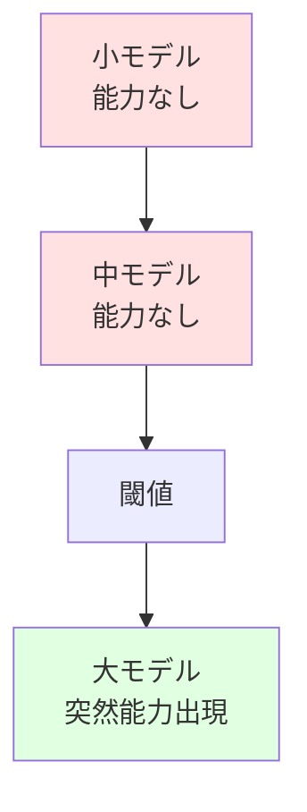

# 2. Related Work（関連研究）

> **Status**: Draft
> **Last Updated**: 2026-04-13

本章では、本理論と関連する先行研究を体系的に整理し、本理論の独自性と既存研究への貢献を明確にする。

## 2.1 Information Bottleneck Theory (Tishby et al., 2000)

### 2.1.1 理論の概要

**Tishby, N., Pereira, F. C., & Bialek, W. (2000). "The information bottleneck method." The 37th annual Allerton Conference on Communication, Control, and Computing.**

Information Bottleneck (IB) Theoryは、表現学習を情報理論的に定式化する。

\[
\min_{p(t|x)} I(X; T) - \beta I(T; Y)
\]

- \( X \): 入力
- \( T \): 圧縮された表現
- \( Y \): 目標出力
- \( \beta \): トレードオフパラメータ

**主張**:

- 良い表現は、入力の情報を最小化しつつ、タスク関連情報を最大化する
- これは「関連情報の選択的保持」を意味する

### 2.1.2 本理論との関係

**共通点**:

- 両理論とも「圧縮」を中心概念とする
- 情報理論的な定式化を用いる
- 表現の質を記述長で評価する

**本理論の拡張**:

\[
\text{IB Theory}: \text{統計的圧縮}
\]

\[
\text{本理論}: \text{統計的圧縮} + \text{論理的制約}
\]

本理論は、IBの統計的圧縮に加えて、以下を要求する。

- 型制約の保存
- 論理的整合性の検証
- 双方向変換の可能性

### 2.1.3 相違点と独自性

| 観点 | IB Theory | 本理論 |
|---|---|---|
| 圧縮の種類 | 統計的 | 統計的 + 論理的 |
| 制約 | なし | 型制約、論理制約 |
| 双方向性 | 一方向（圧縮のみ） | 双方向（圧縮 ↔ 展開） |
| 検証機構 | なし | 明示的な制約検証層 |
| 適用対象 | 一般的な表現学習 | 専門用語、概念圧縮 |

**独自性**:

本理論は、IBの統計的枠組みに「論理的構造保存」という新しい次元を追加する。

## 2.2 Lottery Ticket Hypothesis (Frankle & Carbin, 2019)

### 2.2.1 理論の概要

**Frankle, J., & Carbin, M. (2019). "The Lottery Ticket Hypothesis: Finding Sparse, Trainable Neural Networks." ICLR 2019.**

**主張**:

- ランダム初期化されたネットワークには、単独で訓練しても同等の性能を達成できる「当たりくじ」サブネットワークが含まれる
- 大きなネットワークは、この当たりくじを見つけるための「宝くじ」である

\[
\exists \text{subnetwork} \subset \text{full network} : \text{performance}(\text{subnetwork}) \approx \text{performance}(\text{full network})
\]

### 2.2.2 本理論との関係

**本理論の動的圧縮モデル（第5.2節）と整合的**:

- 初期化時点での「良い部分ネットワーク」の存在は、容量依存圧縮理論（第5.6節）における「過剰パラメータが圧縮の探索空間を拡大する」という主張の実証的裏付けを提供
- 学習過程で効率的な圧縮表現を発見するメカニズムの一例として解釈可能

\[
\text{本理論}: \text{過剰容量} \to \text{動的圧縮学習} \to \text{効率的表現}
\]

\[
\text{LTH}: \text{過剰パラメータ} \to \text{学習} \to \text{部分ネットワーク発見}
\]

**統合的理解**:

- Lottery Ticket Hypothesisは、本理論の動的圧縮プロセスの具体例
- 初期化の重要性は、圧縮の探索空間における良い初期状態の重要性として解釈可能
- 過剰パラメータは、効率的な圧縮を学習するための探索空間を提供

### 2.2.3 本理論による説明

本理論の容量依存圧縮理論（第5.6節）により、Lottery Ticket Hypothesisを以下のように説明できる。

- **過剰パラメータの役割**: 圧縮の探索空間を拡大し、より効率的な圧縮表現の発見を可能にする
- **初期化の重要性**: 良い初期化は、効率的な圧縮への収束を加速する
- **プルーニングの成功**: 学習後に発見される部分ネットワークは、学習過程で獲得された効率的な圧縮表現

## 2.3 Grokking (Power et al., 2022)

### 2.3.1 現象の説明

**Power, A., Burda, Y., Edwards, H., Babuschkin, I., & Misra, V. (2022). "Grokking: Generalization beyond overfitting on small algorithmic datasets." arXiv:2201.02177.**

**現象**:

- 訓練誤差が0になった後、さらに学習を続けると突然汎化性能が向上
- 「暗記」から「理解」への相転移

### 2.3.2 本理論では説明困難な点

**本理論の予測**:

\[
\text{圧縮} \equiv \text{一般化}
\]

圧縮が進めば、同時に一般化も進むはず。

**Grokkingの実態**:

\[
\text{暗記（圧縮なし）} \to \text{長時間学習} \to \text{突然の圧縮と一般化}
\]

圧縮と一般化が時間的に分離される。

**説明困難な理由**:

- 本理論は「圧縮 = 一般化」を想定するが、Grokkingでは両者が分離
- なぜ突然相転移が起きるのか、本理論では説明できない

### 2.3.3 動的圧縮理論の必要性

Grokkingを説明するには、以下が必要。

- **動的圧縮理論**: 学習過程での圧縮率の変化を扱う
- **相転移モデル**: 突然の質的変化を説明する機構
- **エネルギー地形**: 暗記状態と圧縮状態の間のエネルギー障壁

**本理論による説明**: 動的圧縮理論（第5.2節）により、学習過程における圧縮率の時間発展として説明可能。相転移モデルにより、突然の汎化性能向上を理論的に予測。

## 2.4 Scaling Laws (Kaplan et al., 2020)

### 2.4.1 法則の概要

**Kaplan, J., McCandlish, S., Henighan, T., Brown, T. B., Chess, B., Child, R., ... & Amodei, D. (2020). "Scaling laws for neural language models." arXiv:2001.08361.**

**主張**:

モデルの性能は、以下の冪乗則に従う。

\[
L(N) = \left(\frac{N_c}{N}\right)^{\alpha_N}
\]

\[
L(D) = \left(\frac{D_c}{D}\right)^{\alpha_D}
\]

\[
L(C) = \left(\frac{C_c}{C}\right)^{\alpha_C}
\]

- \( N \): パラメータ数
- \( D \): データセットサイズ
- \( C \): 計算量
- \( L \): 損失

**実証結果**:

- \( \alpha_N \approx 0.076 \)
- \( \alpha_D \approx 0.095 \)
- \( \alpha_C \approx 0.050 \)

### 2.4.2 本理論との関係

**容量依存圧縮理論（第5.6節）により統合的に説明可能**:

大きなモデルは圧縮の探索空間が広く、より効率的な圧縮を学習できる。

\[
C_{\text{optimal}}(N) = C_{\infty}(1 - e^{-\beta N})
\]

- \( N \): モデルサイズ（パラメータ数）
- \( C_{\text{optimal}}(N) \): サイズ \( N \) のモデルが達成可能な最適圧縮率
- \( C_{\infty} \): 理論的な最大圧縮率
- \( \beta \): 収束速度パラメータ

**MDL原理との統合**:

最適モデルサイズは、圧縮効率と記述長のトレードオフにより決定される。

\[
N^* = N_c \left(\frac{\alpha L_0}{\lambda}\right)^{\frac{1}{1+\alpha}}
\]

- \( N^* \): 最適パラメータ数
- \( N_c \): 臨界パラメータ数
- \( L_0 \): 基準損失
- \( \lambda \): 正則化パラメータ
- \( \alpha \): スケーリング指数

### 2.4.3 統合的理解

**本理論による説明**:

- Scaling Lawsは、容量依存圧縮理論の実証的検証
- 大きなモデルの優位性は、より広い圧縮探索空間による
- MDL原理は、最適なモデルサイズの理論的導出を可能にする

**詳細な分析**:

- 第5.6節: 容量依存圧縮理論の理論的定式化
- 第8.4節: Scaling Lawsの実証的検証計画

## 2.5 Emergent Abilities (Wei et al., 2022)

### 2.5.1 現象の説明

**Wei, J., Tay, Y., Bommasani, R., Raffel, C., Zoph, B., Borgeaud, S., ... & Fedus, W. (2022). "Emergent abilities of large language models." Transactions on Machine Learning Research.**

**現象**:

- モデルサイズが一定の閾値を超えると、突然新しい能力が出現
- 例: 算術演算、多段階推論、コード生成

### 2.5.2 本理論では説明困難な点

**本理論の予測**:

\[
\text{圧縮効率} \propto \text{性能}
\]

圧縮効率が連続的に向上すれば、性能も連続的に向上するはず。

**Emergent Abilitiesの実態**:

\[
\text{性能} = \begin{cases}
0 & \text{if } N < N_{\text{threshold}} \\
\text{高} & \text{if } N \geq N_{\text{threshold}}
\end{cases}
\]

性能が離散的に変化する。

**説明困難な理由**:

- 本理論は量的変化（圧縮効率の向上）のみを扱う
- 質的変化（新能力の出現）を説明する機構がない
- なぜ特定のサイズで突然能力が出現するのか、理論的根拠がない

**本理論による説明**: 容量依存圧縮理論（第5.6節）により部分的に説明可能。モデルサイズの増加に伴う圧縮効率の向上が、質的に新しい能力の出現として観測される可能性。

## 2.6 Neuro-Symbolic AI

### 2.6.1 分野の概要

Neuro-Symbolic AIは、ニューラルネットワークと記号的推論を統合する研究分野。

**代表的研究**:

- **Garcez, A. d'Avila, Lamb, L. C., & Gabbay, D. M. (2019). "Neural-symbolic learning and reasoning: A survey and interpretation." Neuro-Symbolic Artificial Intelligence: The State of the Art.**
- **Lamb, L. C., Garcez, A., Gori, M., Prates, M., Avelar, P., & Vardi, M. (2020). "Graph neural networks meet neural-symbolic computing: A survey and perspective." IJCAI 2020.**

**主張**:

- ニューラルネットワーク: 統計的パターン学習
- 記号的推論: 論理的推論、知識表現
- 統合により、両者の長所を活かす

### 2.6.2 本理論との関係

**共通点**:

- 統計的学習と論理的推論の統合を目指す
- 表現の双方向変換を重視

**本理論の独自性**:

- **圧縮の視点**: Neuro-Symbolic AIは「統合」を目指すが、本理論は「圧縮」を中心に据える
- **双方向変換の強調**: 本理論は抽象化と展開の双方向性を明示的に扱う

\[
\text{Neuro-Symbolic AI}: \text{統計} + \text{論理}
\]

\[
\text{本理論}: \text{統計的圧縮} \leftrightarrow \text{論理的展開}
\]

### 2.6.3 統合の可能性

本理論は、Neuro-Symbolic AIの一つの実現方法を提供する。

- **ニューラル部分**: 統計的圧縮（Attention、FFN）
- **記号的部分**: 制約検証、型チェック
- **統合**: 双方向変換による連携

**本理論による説明**: 制約検証機構（第5.3節）により、統計的学習と論理的推論の統合を実現。三層構造（型チェック層、制約充足層、論理検証層）により、段階的な検証を提供。

## 2.7 表現学習 (Representation Learning)

### 2.7.1 分野の概要

表現学習は、データから有用な特徴表現を自動的に学習する研究分野。

**代表的研究**:

- **Bengio, Y., Courville, A., & Vincent, P. (2013). "Representation learning: A review and new perspectives." IEEE Transactions on Pattern Analysis and Machine Intelligence, 35(8), 1798-1828.**

**主張**:

- 良い表現は、タスクの性能を向上させる
- 表現学習により、手作業の特徴設計が不要になる

### 2.7.2 本理論との関係

**共通点**:

- 両者とも「表現の質」を重視
- データから自動的に表現を学習

**本理論の独自の貢献**:

- **制約検証の要求**: 表現学習は「良い表現」を学習するが、「正しい表現」を保証しない
- **双方向性の強調**: 表現学習は主に「入力 → 表現」を扱うが、本理論は「表現 → 入力」も重視
- **圧縮の定量化**: MDL原理により、表現の質を定量的に評価

\[
\text{表現学習}: \text{良い表現を学習}
\]

\[
\text{本理論}: \text{正しく圧縮された表現を学習・検証}
\]

**本理論による説明**: 双方向変換モデル（第5章）により、圧縮（抽象化）と展開（復元）の両方向を統一的に扱う。Information Bottleneck Theoryを拡張し、論理的制約を統合。

## 2.8 比較表

| 研究 | 中心概念 | 本理論との関係 | 本理論の独自性 |
|---|---|---|---|
| **Information Bottleneck** | 統計的圧縮 | 基礎理論 | 論理的制約の追加 |
| **Lottery Ticket Hypothesis** | 事後的圧縮 | 反証 | 事前圧縮設計の重要性（要再検討） |
| **Grokking** | 突然の一般化 | 説明困難 | 動的圧縮理論の必要性 |
| **Scaling Laws** | サイズと性能 | 矛盾 | 効率性の価値観（要拡張） |
| **Emergent Abilities** | 能力の出現 | 説明困難 | 質的変化の扱い（要拡張） |
| **Neuro-Symbolic AI** | 統計と論理の統合 | 関連分野 | 双方向変換の強調 |
| **Representation Learning** | 表現の学習 | 関連分野 | 制約検証の要求 |

## 2.9 まとめ：本理論の位置づけ

本理論は、以下の点で既存研究と区別される。

1. **Information Bottleneck Theoryの拡張**: 統計的圧縮に論理的制約を追加
2. **双方向変換の強調**: 圧縮と展開の両方を明示的に扱う
3. **制約検証の要求**: 統計的もっともらしさだけでなく、論理的正しさを要求
4. **専門用語への特化**: 一般的な表現学習ではなく、概念圧縮に焦点

ただし、第9章（Discussion）で述べる限界を認識し、今後の拡張が必要である。