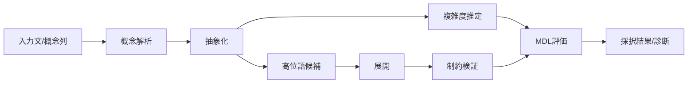

# 02. 要件定義

## 目次
- [1. 文書の目的](#1-文書の目的)
- [2. スコープ](#2-スコープ)
- [3. システム概要](#3-システム概要)
- [4. 機能要件](#4-機能要件)
- [5. 非機能要件](#5-非機能要件)
- [6. ユースケース](#6-ユースケース)
- [7. 制約事項](#7-制約事項)
- [8. 受入条件](#8-受入条件)
- [9. 後続設計へのトレーサビリティ](#9-後続設計へのトレーサビリティ)

## 1. 文書の目的
本書は、理論的基盤 [01_theoretical_foundation.md](./01_theoretical_foundation.md) に基づき、概念圧縮システムの要件を定義する。  
本システムは、専門用語を「制約付き圧縮概念」として扱い、入力文または概念表現に対して以下を行う。

- 高位概念への抽象化
- 低位概念への展開
- 制約違反の検証

## 2. スコープ
### 2.1 対象
本システムの対象は以下である。

- 自然言語文からの概念構造抽出
- 概念構造の高位語への圧縮
- 高位語の低位概念群への展開
- 圧縮・展開結果に対する型整合性・制約整合性判定
- 記述長に基づく候補評価

### 2.2 非対象
本フェーズでは以下を対象外とする。

- 大規模言語モデル自体の学習
- 大規模知識グラフの自動構築
- 汎用定理証明器の完全実装
- 分散推論基盤の詳細設計
- GUI フロントエンド実装

## 3. システム概要
本システムは、概念圧縮を行う中核エンジンとして設計される。  
入力は文、概念列、または中間表現であり、出力は以下のいずれか、または組合せである。

- 高位語候補
- 展開済み概念列
- 型検査結果
- 制約検証結果
- MDL ベースの評価スコア
- 失敗理由および診断情報



## 4. 機能要件
本節では、理論で導出された 3 要素を中核機能として定義する。

### 4.1 FR-1 抽象化機能
#### 概要
システムは、低位概念列または自然言語入力から、意味構造を保持しつつ高位語候補へ圧縮できなければならない。

#### 詳細要件
- **FR-1.1** 入力から概念特徴を抽出できること
- **FR-1.2** 概念特徴に基づき高位語候補を複数生成できること
- **FR-1.3** 候補ごとに圧縮利得を算出できること
- **FR-1.4** 候補に対応する型情報を付与できること
- **FR-1.5** 候補選択時に制約文脈を参照できること
- **FR-1.6** 不適切な一般化候補を除外できること

#### 入出力
- 入力: 文、概念列、制約文脈
- 出力: 高位語候補列、スコア、型注釈、選定理由

#### 成功条件
- 圧縮後表現が元概念の主要構造を保持している
- 制約違反コストが許容範囲内である
- MDL スコアが閾値を満たす

### 4.2 FR-2 展開機能
#### 概要
システムは、高位語または高位表現から、必要な低位概念・暗黙前提・推論可能性を復元できなければならない。

#### 詳細要件
- **FR-2.1** 高位語から関連概念群を列挙できること
- **FR-2.2** 暗黙前提を明示的要素として展開できること
- **FR-2.3** 展開粒度を指定できること
- **FR-2.4** 文脈に応じて複数の展開候補を生成できること
- **FR-2.5** 展開結果に型注釈を付与できること
- **FR-2.6** 展開に伴う情報欠損・曖昧性を診断できること

#### 入出力
- 入力: 高位語、制約文脈、展開粒度
- 出力: 低位概念列、前提集合、推論リンク、診断情報

#### 成功条件
- 必須前提が欠落していない
- 展開後概念列が型的に整合している
- 復元構造が元高位語の意味境界と矛盾しない

### 4.3 FR-3 制約検証機能
#### 概要
システムは、抽象化および展開の結果に対して、論理・型・ドメイン制約の整合性を検証できなければならない。

#### 詳細要件
- **FR-3.1** 型整合性を判定できること
- **FR-3.2** ドメイン制約違反を検出できること
- **FR-3.3** contradiction / entailment / consistency を判定できること
- **FR-3.4** 診断根拠を説明可能な形で返却できること
- **FR-3.5** 禁止操作や無効な展開経路を報告できること
- **FR-3.6** 検証結果を MDL 評価に反映できること

#### 入出力
- 入力: 抽象化結果または展開結果、型環境、制約集合
- 出力: 妥当/不妥当判定、違反一覧、説明、修正候補

#### 成功条件
- 誤った圧縮・展開を高精度で検出できる
- 検証理由が追跡可能である
- 検証不能時も不確実性が明示される

### 4.4 補助機能要件
- **FR-4** 複雑度推定機能  
  概念列・高位語・制約集合の近似記述長を推定する
- **FR-5** MDL 評価機能  
  モデル長とデータ説明長の和を算出し、候補順位を決定する
- **FR-6** トレーサビリティ機能  
  どの入力要素がどの高位語・低位概念へ対応したか記録する
- **FR-7** エラー診断機能  
  失敗した推論・型不一致・制約違反を分類して返す

## 5. 非機能要件
### 5.1 性能要件
- **NFR-1** 単一リクエストに対する評価時間は、概念数 \( n \) に対して多項式時間で近似的に動作すること
- **NFR-2** 候補生成数が増加した場合でも、枝刈りまたは上位 \( k \) 選択により処理量を制御できること
- **NFR-3** 型検証および制約検証は、候補評価パイプラインに統合され、ボトルネックを局所化できること
- **NFR-4** 実装はバッチ評価と逐次評価の両方に適用可能であること

### 5.2 拡張性要件
- **NFR-5** 新しい概念型・制約ルール・スコアリング関数をプラグイン的に追加できること
- **NFR-6** ドメイン語彙を差し替えても中核アルゴリズムが再利用可能であること
- **NFR-7** 抽象化器・展開器・検証器を独立に改善できること

### 5.3 保守性要件
- **NFR-8** モジュール境界が明確であること
- **NFR-9** 各判定に対してログ・根拠・中間表現が取得可能であること
- **NFR-10** API 仕様と内部実装仕様が対応付けられていること
- **NFR-11** テスト容易性のため、コンポーネントは副作用を最小化した設計であること

### 5.4 可観測性要件
- **NFR-12** 各候補に対して複雑度、MDL、制約違反数を取得可能であること
- **NFR-13** 失敗ケースの再現に必要な入力・文脈・設定が保存可能であること

## 6. ユースケース
### 6.1 UC-1 学術文の要約的抽象化
**目的**  
長い説明文から、適切な専門用語・高位概念を抽出する。

**基本フロー**
1. ユーザーが説明文を入力する
2. システムが概念構造を抽出する
3. 抽象化器が高位語候補を生成する
4. MDL 評価器が候補を順位付けする
5. 検証器が不正候補を除外する
6. ユーザーに上位候補を返す

**期待結果**
- 主要概念を適切に表現する高位語が得られる
- 候補ごとの根拠が提示される

### 6.2 UC-2 専門用語の説明展開
**目的**  
専門用語に内包された前提・構造・制約を明示化する。

**基本フロー**
1. ユーザーが高位語を入力する
2. システムが型と制約を取得する
3. 展開器が低位概念列を生成する
4. 検証器が整合性を確認する
5. 結果を階層構造で返す

**期待結果**
- 暗黙前提を含む説明が得られる
- どの粒度で展開されたかが明示される

### 6.3 UC-3 概念誤用の検出
**目的**  
ある文に含まれる専門用語使用が、型的・論理的に妥当か検査する。

**基本フロー**
1. ユーザーが文を入力する
2. システムが専門用語を検出する
3. 各語の期待型と文脈型を照合する
4. 制約違反があれば根拠付きで報告する

**期待結果**
- 誤用箇所と理由が説明される
- 修正候補が提示される

```mermaid
usecaseDiagram
    actor User as U
    rectangle System {
        usecase "抽象化する" as UC1
        usecase "展開する" as UC2
        usecase "制約を検証する" as UC3
        usecase "MDL で評価する" as UC4
        usecase "診断情報を返す" as UC5
    }
    U --> UC1
    U --> UC2
    U --> UC3
    UC1 --> UC4
    UC2 --> UC3
    UC3 --> UC5
```

## 7. 制約事項
### 7.1 理論的制約
- 真の Kolmogorov Complexity は計算不能であるため、近似推定のみを扱う
- 完全な意味保存は一般に保証できず、近似的復元を前提とする
- 文脈依存意味は外部知識なしに完全復元できない場合がある

### 7.2 実装上の制約
- 現時点では実装コードが未配置であり、本書は設計上の仕様定義である
- ドメイン辞書・型規則・制約ルールは初期状態では限定的である
- 計算量制御のため、候補探索は全探索でなくヒューリスティック探索を採用する

### 7.3 運用上の制約
- ドメインごとに専門用語の意味境界が異なる
- 誤検出を完全には排除できない
- 検証結果は「真理の保証」ではなく「設計された制約体系における妥当性」を返す

## 8. 受入条件
以下を満たすとき、本システム設計は要件充足とみなす。

1. 抽象化・展開・制約検証の 3 機能が仕様として独立に定義されている
2. 複雑度推定と MDL 評価が候補選定に統合されている
3. 各機能に入力・出力・成功条件・診断方針が定義されている
4. 非機能要件として性能・拡張性・保守性が明記されている
5. 後続のアーキテクチャ・実装・API 文書へ追跡可能である

## 9. 後続設計へのトレーサビリティ
| 要件ID | 要件概要 | 関連設計文書 |
|---|---|---|
| FR-1 | 抽象化機能 | [03_architecture.md](./03_architecture.md), [04_implementation_spec.md](./04_implementation_spec.md), [05_api_specification.md](./05_api_specification.md) |
| FR-2 | 展開機能 | [03_architecture.md](./03_architecture.md), [04_implementation_spec.md](./04_implementation_spec.md), [05_api_specification.md](./05_api_specification.md) |
| FR-3 | 制約検証機能 | [03_architecture.md](./03_architecture.md), [04_implementation_spec.md](./04_implementation_spec.md), [05_api_specification.md](./05_api_specification.md) |
| FR-4 | 複雑度推定機能 | [04_implementation_spec.md](./04_implementation_spec.md), [05_api_specification.md](./05_api_specification.md) |
| FR-5 | MDL 評価機能 | [04_implementation_spec.md](./04_implementation_spec.md), [05_api_specification.md](./05_api_specification.md) |
| NFR-1〜4 | 性能要件 | [03_architecture.md](./03_architecture.md), [04_implementation_spec.md](./04_implementation_spec.md) |
| NFR-5〜7 | 拡張性要件 | [03_architecture.md](./03_architecture.md), [04_implementation_spec.md](./04_implementation_spec.md) |
| NFR-8〜13 | 保守性・可観測性 | [03_architecture.md](./03_architecture.md), [05_api_specification.md](./05_api_specification.md) |