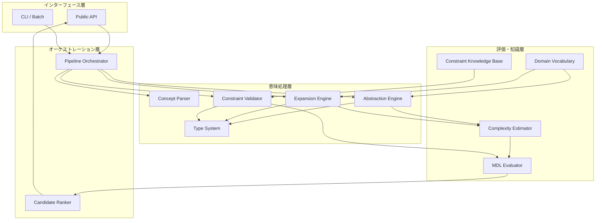
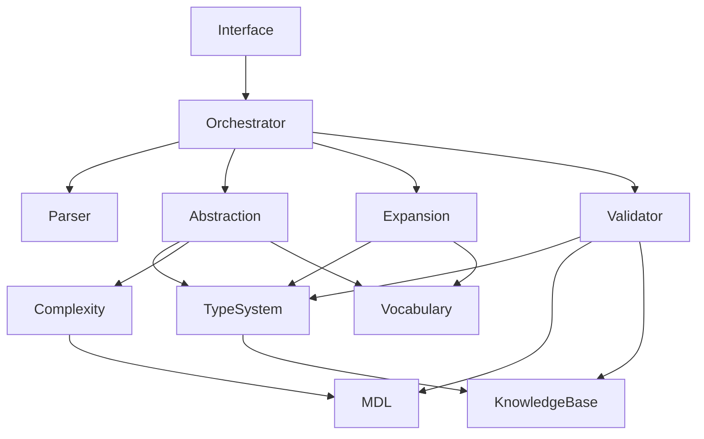
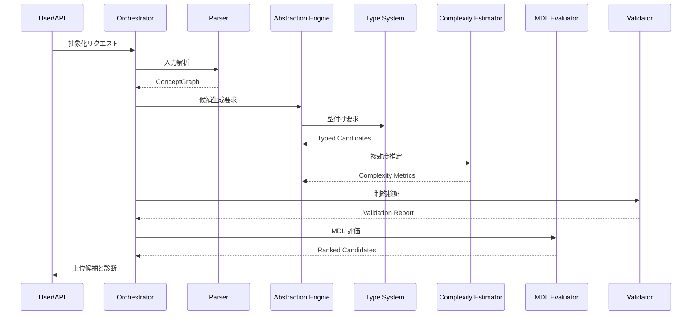
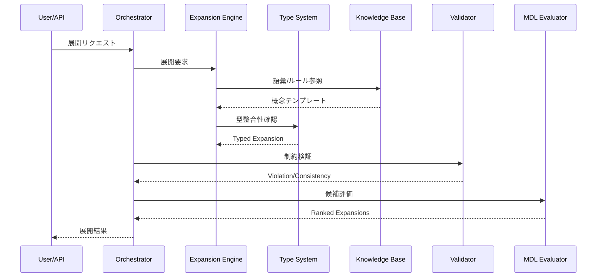

# 03. アーキテクチャ設計

## 目次
- [1. 文書の目的](#1-文書の目的)
- [2. 設計方針](#2-設計方針)
- [3. システム全体構成](#3-システム全体構成)
- [4. モジュール構成](#4-モジュール構成)
- [5. コンポーネント間の関係](#5-コンポーネント間の関係)
- [6. データフロー](#6-データフロー)
- [7. 技術スタック](#7-技術スタック)
- [8. 拡張ポイント](#8-拡張ポイント)
- [9. 要件との対応](#9-要件との対応)

## 1. 文書の目的
本書は、理論的基盤 [01_theoretical_foundation.md](./01_theoretical_foundation.md) および要件定義 [02_requirements.md](./02_requirements.md) を受けて、概念圧縮システムの全体アーキテクチャを定義する。  
本設計は、実装コード未配置の現段階における参照アーキテクチャであり、後続の実装仕様 [04_implementation_spec.md](./04_implementation_spec.md) および API 仕様 [05_api_specification.md](./05_api_specification.md) の上位設計に相当する。

## 2. 設計方針
### 2.1 基本方針
本システムは、以下の 5 原則に従って構成する。

1. **責務分離**  
   抽象化、展開、制約検証、複雑度推定、MDL 評価を独立モジュールに分離する。
2. **型中心設計**  
   高位語・低位概念・制約文脈を型付きオブジェクトとして扱う。
3. **説明可能性**  
   すべての主要判定に対し、根拠・スコア・違反情報を取得可能にする。
4. **拡張可能性**  
   ドメイン語彙・型規則・制約ルール・評価関数を差し替え可能にする。
5. **近似計算前提**  
   Kolmogorov Complexity の計算不能性を踏まえ、近似器とヒューリスティック探索を前提とする。

### 2.2 アーキテクチャの中核命題
システムは、以下の変換連鎖を実現する。

\[
入力 \rightarrow 概念表現 \rightarrow 高位語候補 \rightarrow 検証 \rightarrow 評価 \rightarrow 出力
\]

この連鎖の中で、抽象化と展開は双方向性を持ち、制約検証と MDL 評価がそれを統制する。

## 3. システム全体構成
### 3.1 論理レイヤ
アーキテクチャは、以下の 4 層から構成される。

1. **インターフェース層**
   - API
   - CLI
   - バッチ実行入口
2. **オーケストレーション層**
   - パイプライン制御
   - 候補探索管理
   - スコア統合
3. **意味処理層**
   - 概念解析
   - 抽象化器
   - 展開器
   - 型システム
   - 制約検証器
4. **評価・知識層**
   - 複雑度推定器
   - MDL 評価器
   - ドメイン語彙
   - 制約知識ベース

### 3.2 実行モード
システムは 3 種類のモードを想定する。

- **抽象化モード**  
  入力文または概念列から高位語候補を返す
- **展開モード**  
  高位語から低位概念列を返す
- **検証モード**  
  既存表現の妥当性と違反理由を返す

これらは API レベルでは個別エンドポイントとして公開される。詳細は [05_api_specification.md](./05_api_specification.md) を参照。

## 4. モジュール構成
### 4.1 Interface モジュール
責務:
- 外部入力の受理
- リクエスト形式の正規化
- レスポンス整形
- エラーコード変換

主な提供境界:
- Python API
- CLI
- バッチジョブ入口

### 4.2 Pipeline Orchestrator モジュール
責務:
- 処理フローの制御
- モードごとの分岐
- コンポーネント呼出順序の管理
- ログ・トレースの収集

依存:
- Concept Parser
- Abstraction Engine
- Expansion Engine
- Constraint Validator
- Candidate Ranker

### 4.3 Concept Parser モジュール
責務:
- 入力文の概念単位への分解
- 概念特徴の抽出
- 中間概念表現（Concept Graph / Concept Sequence）の構築

出力:
- `Concept`
- `ConceptRelation`
- `ConceptGraph`

### 4.4 Abstraction Engine モジュール
責務:
- 低位概念列から高位語候補を生成
- 候補ごとの圧縮利得を推定
- 型付き高位表現を構築

依存:
- Domain Vocabulary
- Type System
- Complexity Estimator
- MDL Evaluator

### 4.5 Expansion Engine モジュール
責務:
- 高位語から低位概念列を展開
- 暗黙前提の明示化
- 複数粒度の展開候補生成

依存:
- Domain Vocabulary
- Type System
- Constraint Knowledge Base

### 4.6 Type System モジュール
責務:
- 概念型定義
- 高位語の型付け
- 型推論・型照合
- 型エラー生成

依存:
- Constraint Knowledge Base

### 4.7 Constraint Validator モジュール
責務:
- 制約充足判定
- 矛盾検出
- entailment / consistency の判定
- 違反理由の説明生成

### 4.8 Complexity Estimator モジュール
責務:
- 近似記述長の算出
- 概念列・高位語・制約集合の複雑さ見積り
- 候補比較用特徴量生成

### 4.9 MDL Evaluator モジュール
責務:
- \( L(M) + L(D|M) \) の算出
- 候補順位付け
- ペナルティ項統合

### 4.10 Knowledge Base / Vocabulary モジュール
責務:
- ドメイン語彙管理
- 高位語と低位概念の対応保持
- 型ルールと制約ルールの格納
- 展開テンプレート保持

## 5. コンポーネント間の関係
### 5.1 依存関係

### 5.2 関係の解釈
- **Orchestrator** は制御の中心であり、ドメイン知識を直接持たない
- **Type System** は抽象化・展開・検証の共通基盤である
- **Complexity Estimator** は数量的指標を提供し、**MDL Evaluator** が最終採択を担う
- **Knowledge Base** は意味規則の保管庫であり、推論本体ではない

### 5.3 境界設計
各モジュールは、入出力 DTO または型付きエンティティを通じて接続される。  
これにより、以下を実現する。

- テスト時のモック差し替え
- ドメイン辞書の差し替え
- 部分的なアルゴリズム置換
- ログと診断の一貫取得

## 6. データフロー
### 6.1 抽象化フロー

### 6.2 展開フロー

### 6.3 検証フロー

### 6.4 データエンティティ
主要なデータ構造は以下である。

| エンティティ | 説明 |
|---|---|
| `Concept` | 基本概念単位 |
| `ConceptGraph` | 関係付き概念集合 |
| `TypedTerm` | 型付き高位語または低位概念 |
| `ConstraintContext` | 仮定・禁止操作・ドメイン制約 |
| `ComplexityProfile` | 複雑度推定結果 |
| `MDLScore` | MDL 評価結果 |
| `ValidationReport` | 検証結果と診断 |
| `CandidateSet` | 候補集合と順位 |

## 7. 技術スタック
### 7.1 実装言語
- **Python 3.11+**
  - 理由: 型注釈、データクラス、科学計算ライブラリ、プロトタイピング容易性

### 7.2 コアライブラリ候補
- `dataclasses` / `pydantic`
  - データモデル定義
- `typing`
  - 型注釈、プロトコル
- `networkx`
  - 概念グラフ表現
- `numpy`
  - スコア計算補助
- `sympy` または軽量論理評価器
  - 制約式表現
- `fastapi`
  - 公開 API 実装
- `pytest`
  - テスト

### 7.3 ドキュメント・可観測性
- Markdown + Mermaid
- OpenAPI
- 構造化ログ（JSON lines を想定）

### 7.4 技術選定理由
- 型付きデータモデルを素早く構築できる
- 数理評価ロジックをプロトタイプしやすい
- API 化とローカル実験の両立が容易
- 将来的な機械学習コンポーネント統合がしやすい

## 8. 拡張ポイント
### 8.1 語彙拡張
ドメインごとに高位語辞書を差し替え可能とする。

### 8.2 制約ルール拡張
新しい型規則や論理ルールを、`RuleProvider` 的なインターフェースで追加可能とする。

### 8.3 スコアリング拡張
MDL に加え、以下の指標統合を可能にする。

- ドメイン適合度
- 説明可能性スコア
- 曖昧性ペナルティ
- 学習済みモデル出力との整合度

### 8.4 実行基盤拡張
将来的には以下へ展開可能である。

- バッチ処理
- 非同期 API
- LLM 補助候補生成
- 外部知識ベース連携

## 9. 要件との対応
| 要件 | アーキテクチャ上の対応 |
|---|---|
| FR-1 抽象化 | `Abstraction Engine`, `Concept Parser`, `Candidate Ranker` |
| FR-2 展開 | `Expansion Engine`, `Knowledge Base`, `Type System` |
| FR-3 制約検証 | `Constraint Validator`, `Type System`, `Knowledge Base` |
| FR-4 複雑度推定 | `Complexity Estimator` |
| FR-5 MDL 評価 | `MDL Evaluator` |
| NFR-1〜4 性能 | オーケストレータによる枝刈り、上位 \( k \) 評価、段階的検証 |
| NFR-5〜7 拡張性 | モジュール分離、語彙/ルール差し替え、評価器差し替え |
| NFR-8〜13 保守性・可観測性 | DTO 設計、診断出力、構造化ログ、API 境界明確化 |

本アーキテクチャの具体的クラス構成、アルゴリズム、擬似コードは [04_implementation_spec.md](./04_implementation_spec.md) で定義する。