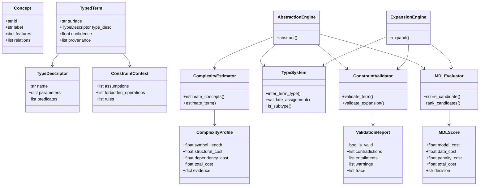
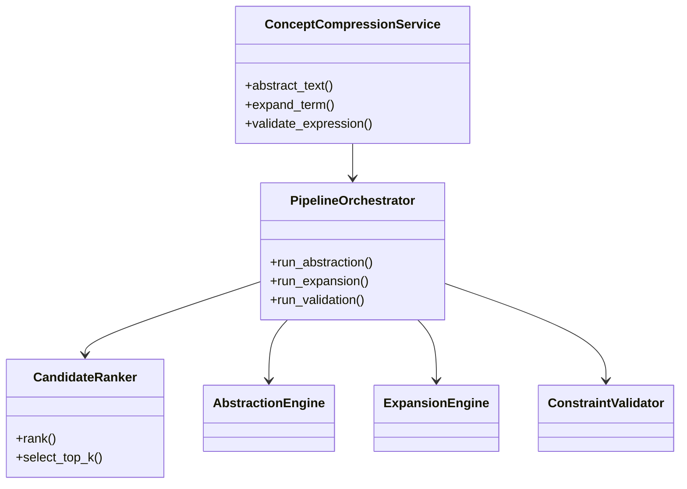

# 04. 実装仕様

## 目次
- [1. 文書の目的](#1-文書の目的)
- [2. 実装方針](#2-実装方針)
- [3. ドメインモデル](#3-ドメインモデル)
- [4. 複雑度推定器の詳細仕様](#4-複雑度推定器の詳細仕様)
- [5. 型システムの詳細仕様](#5-型システムの詳細仕様)
- [6. MDL 評価器の詳細仕様](#6-mdl-評価器の詳細仕様)
- [7. 抽象化器・展開器・検証器の動作仕様](#7-抽象化器展開器検証器の動作仕様)
- [8. クラス図](#8-クラス図)
- [9. アルゴリズムの疑似コード](#9-アルゴリズムの疑似コード)
- [10. 例外・障害時の挙動](#10-例外障害時の挙動)
- [11. テスト方針](#11-テスト方針)

## 1. 文書の目的
本書は、アーキテクチャ設計 [03_architecture.md](./03_architecture.md) を具体的なクラス、データ構造、アルゴリズム、評価式へ落とし込む。  
対象は特に以下の 3 中核コンポーネントである。

- 複雑度推定器
- 型システム
- MDL 評価器

加えて、抽象化器・展開器・検証器の接続仕様、および公開 API の背後にある内部処理の流れを定義する。公開 API の外部契約は [05_api_specification.md](./05_api_specification.md) を参照。

## 2. 実装方針
### 2.1 原則
- データ中心設計を採用し、入出力を明示的なモデルで表現する
- 各推定・判定は副作用を持たない関数またはステートレスサービスとして設計する
- 推定値は必ず根拠情報と一緒に返す
- 不確実性は例外で隠蔽せず、診断情報として構造化する
- 複雑度・MDL・制約検証を逐次ではなく統合パイプラインとして扱う

### 2.2 想定パッケージ構成
```text
high_tokenizer/
  core/
    models.py
    protocols.py
    errors.py
  parser/
    concept_parser.py
  abstraction/
    abstraction_engine.py
  expansion/
    expansion_engine.py
  typing/
    type_system.py
    constraint_context.py
  complexity/
    complexity_estimator.py
  mdl/
    mdl_evaluator.py
  validation/
    constraint_validator.py
  api/
    service.py
    schemas.py
```

## 3. ドメインモデル
### 3.1 主要データクラス
```python
from dataclasses import dataclass, field
from typing import Any, Dict, List, Optional

@dataclass
class Concept:
    id: str
    label: str
    features: Dict[str, Any] = field(default_factory=dict)
    relations: List[str] = field(default_factory=list)

@dataclass
class TypeDescriptor:
    name: str
    parameters: Dict[str, Any] = field(default_factory=dict)
    predicates: List[str] = field(default_factory=list)

@dataclass
class ConstraintContext:
    assumptions: List[str] = field(default_factory=list)
    forbidden_operations: List[str] = field(default_factory=list)
    rules: List[str] = field(default_factory=list)

@dataclass
class TypedTerm:
    surface: str
    type_desc: TypeDescriptor
    confidence: float
    provenance: List[str] = field(default_factory=list)

@dataclass
class ComplexityProfile:
    symbol_length: float
    structural_cost: float
    dependency_cost: float
    total_cost: float
    evidence: Dict[str, Any] = field(default_factory=dict)

@dataclass
class MDLScore:
    model_cost: float
    data_cost: float
    penalty_cost: float
    total_cost: float
    decision: str

@dataclass
class ValidationReport:
    is_valid: bool
    contradictions: List[str] = field(default_factory=list)
    entailments: List[str] = field(default_factory=list)
    warnings: List[str] = field(default_factory=list)
    trace: List[str] = field(default_factory=list)
```

### 3.2 モデル設計意図
- `Concept` は低位概念単位
- `TypedTerm` は高位語・低位概念双方の型付き表現
- `ConstraintContext` は文脈依存制約を保持
- `ComplexityProfile` は Kolmogorov Complexity の近似根拠
- `MDLScore` は候補採否を一元管理
- `ValidationReport` は説明可能性を担保する

## 4. 複雑度推定器の詳細仕様
### 4.1 目的
複雑度推定器は、概念列または型付き表現に対して、近似的な記述長を返す。  
真の Kolmogorov Complexity は計算不能であるため、本実装では複数の近似特徴量の加重和を採用する。

### 4.2 入力
- `Concept` の列または `ConceptGraph`
- `TypedTerm`
- `ConstraintContext`
- 推定設定 `ComplexityConfig`

### 4.3 出力
- `ComplexityProfile`

### 4.4 推定式
総コストを以下で定義する。

\[
C(x) = \alpha C_{sym}(x) + \beta C_{str}(x) + \gamma C_{dep}(x) + \delta C_{ctx}(x)
\]

ここで、
- \( C_{sym} \): 記号長コスト
- \( C_{str} \): 構造複雑度
- \( C_{dep} \): 依存関係コスト
- \( C_{ctx} \): 文脈依存補正
- \( \alpha, \beta, \gamma, \delta \): 重み

### 4.5 各要素の定義
#### 4.5.1 記号長コスト
概念ラベル・型名・特徴キー数に基づく表層的記述長。

\[
C_{sym}(x) = \sum_i \mathrm{len}(token_i)
\]

#### 4.5.2 構造複雑度
概念ノード数、エッジ数、階層深さに基づく構造コスト。

\[
C_{str}(G) = a|V| + b|E| + c\cdot depth(G)
\]

#### 4.5.3 依存関係コスト
前提依存や他概念参照の数に比例するコスト。

\[
C_{dep}(x) = d \cdot |\mathrm{dependencies}(x)|
\]

#### 4.5.4 文脈依存補正
同じ語が強い文脈を必要とするほどコストを増やす。

\[
C_{ctx}(t,\Gamma) = e \cdot |\mathrm{required\_assumptions}(t) \setminus \Gamma|
\]

### 4.6 推定アルゴリズム要件
- **CE-1** 概念列・概念グラフ・高位語のいずれにも適用できること
- **CE-2** 推定過程の寄与内訳を返せること
- **CE-3** 比較可能なスカラー値を返すこと
- **CE-4** ドメインごとの重み調整が可能であること

### 4.7 Python インターフェース例
```python
from typing import Sequence

class ComplexityEstimator:
    def estimate_concepts(
        self,
        concepts: Sequence[Concept],
        context: ConstraintContext,
    ) -> ComplexityProfile:
        ...

    def estimate_term(
        self,
        term: TypedTerm,
        context: ConstraintContext,
    ) -> ComplexityProfile:
        ...
```

## 5. 型システムの詳細仕様
### 5.1 目的
型システムは、高位語を単なる文字列でなく、制約付き意味オブジェクトとして扱うための基盤である。  
抽象化・展開・検証のすべてが型システムを共通基盤として利用する。

### 5.2 型モデル
型は次の情報を持つ。

- 型名
- 型パラメータ
- 必須述語
- 許可操作
- 禁止操作
- 上位型・下位型関係

### 5.3 型付け規則
高位語 \( t \) の型付けは次で表す。

\[
\Gamma \vdash t : T
\]

抽象化時:

\[
\Gamma \vdash X \Rightarrow \Gamma \vdash A(X) : T
\]

展開時:

\[
\Gamma \vdash t : T \Rightarrow \Gamma \vdash E(t) : \{x_1, \dots, x_n\}
\]

### 5.4 型整合性判定
型整合性は以下の 3 層で判定する。

1. **表層型一致**
   - 期待型と実際型の名前一致または部分型関係
2. **述語充足**
   - 必須述語がすべて満たされているか
3. **操作整合性**
   - 禁止操作が適用されていないか

### 5.5 型環境
型環境 `TypeEnvironment` は以下を提供する。

- 型定義の登録
- 部分型判定
- 述語評価
- 型推論
- 型エラー生成

### 5.6 Python インターフェース例
```python
class TypeSystem:
    def infer_term_type(
        self,
        term: TypedTerm,
        context: ConstraintContext,
    ) -> TypeDescriptor:
        ...

    def validate_assignment(
        self,
        term: TypedTerm,
        expected: TypeDescriptor,
        context: ConstraintContext,
    ) -> ValidationReport:
        ...

    def is_subtype(
        self,
        actual: TypeDescriptor,
        expected: TypeDescriptor,
    ) -> bool:
        ...
```

### 5.7 典型エラー
- `TypeMismatchError`
- `MissingPredicateError`
- `ForbiddenOperationError`
- `UnderspecifiedContextError`

## 6. MDL 評価器の詳細仕様
### 6.1 目的
MDL 評価器は、候補高位語または展開候補を、モデル長とデータ記述長の合計で評価し、最適候補を選定する。

### 6.2 入力
- 候補 `TypedTerm` または候補集合
- 元データの `ComplexityProfile`
- 候補データの `ComplexityProfile`
- `ValidationReport`
- `ConstraintContext`

### 6.3 出力
- `MDLScore`
- ランク済み候補列

### 6.4 評価式
基本式:

\[
L(M, D) = L(M) + L(D|M)
\]

本実装では以下に展開する。

\[
Score = C_{model}(t) + C_{data}(x \mid t) + \lambda V(t,\Gamma) + \mu A(t)
\]

- \( C_{model}(t) \): 候補語や型情報の複雑さ
- \( C_{data}(x \mid t) \): 元データを候補で説明する残差コスト
- \( V(t,\Gamma) \): 制約違反ペナルティ
- \( A(t) \): 曖昧性ペナルティ
- \( \lambda, \mu \): 重み

### 6.5 評価ルール
- 制約違反が重大な場合、`decision = "reject"` とする
- 同率時は、より曖昧性の低い候補を優先する
- 説明可能性が同等なら、より短い表現を優先する
- 必要に応じて top-\(k\) 候補を返す

### 6.6 Python インターフェース例
```python
from typing import Iterable, List, Tuple

class MDLEvaluator:
    def score_candidate(
        self,
        source_profile: ComplexityProfile,
        candidate_profile: ComplexityProfile,
        validation: ValidationReport,
        ambiguity_cost: float = 0.0,
    ) -> MDLScore:
        ...

    def rank_candidates(
        self,
        candidates: Iterable[Tuple[TypedTerm, ComplexityProfile, ValidationReport]],
        source_profile: ComplexityProfile,
    ) -> List[Tuple[TypedTerm, MDLScore]]:
        ...
```

## 7. 抽象化器・展開器・検証器の動作仕様
### 7.1 抽象化器
責務:
- 入力概念列を正規化する
- 語彙辞書から候補高位語を探索する
- 型付け・複雑度推定・MDL 評価を統合する

#### 処理ステップ
1. 概念特徴抽出
2. 候補語検索
3. 型付け
4. 複雑度推定
5. 制約検証
6. MDL 評価
7. ランキング

### 7.2 展開器
責務:
- 高位語に紐づく概念テンプレートを取得する
- 文脈に応じて展開粒度を調整する
- 展開候補の型整合性を確認する

#### 処理ステップ
1. 高位語の型取得
2. 展開テンプレート検索
3. 前提の補完
4. 粒度調整
5. 制約検証
6. 候補ランキング

### 7.3 制約検証器
責務:
- 型規則違反を検出する
- 文脈制約違反を検出する
- contradiction / entailment / consistency を返す
- 根拠のトレースを残す

#### 判定優先順位
1. 構文的妥当性
2. 型整合性
3. 必須述語充足
4. 禁止操作違反
5. 文脈矛盾
6. 含意・整合性

## 8. クラス図
### 8.1 中核クラス図


### 8.2 サービス層クラス図


## 9. アルゴリズムの疑似コード
### 9.1 抽象化アルゴリズム
```text
function ABSTRACT(input, context):
    concepts = parse_to_concepts(input)
    source_profile = complexity.estimate_concepts(concepts, context)

    candidates = generate_candidate_terms(concepts, context)
    results = []

    for candidate in candidates:
        typed = type_system.infer_term_type(candidate, context)
        candidate_profile = complexity.estimate_term(typed, context)
        validation = validator.validate_term(typed, context)
        mdl_score = mdl.score_candidate(
            source_profile,
            candidate_profile,
            validation
        )

        if mdl_score.decision != "reject":
            results.append((typed, mdl_score))

    return rank_by_total_cost(results)
```

### 9.2 展開アルゴリズム
```text
function EXPAND(term, context, granularity):
    typed_term = type_system.infer_term_type(term, context)
    templates = lookup_expansion_templates(typed_term)

    expansions = []
    for template in templates:
        expanded = instantiate(template, context, granularity)
        validation = validator.validate_expansion(expanded, context)

        if validation.is_valid:
            profile = complexity.estimate_concepts(expanded, context)
            score = evaluate_expansion(profile, validation)
            expansions.append((expanded, score))

    return sort_expansions(expansions)
```

### 9.3 制約検証アルゴリズム
```text
function VALIDATE(expression, context):
    typing_result = infer_types(expression, context)
    if typing_result has error:
        return invalid_report("type_error")

    predicates_ok = check_required_predicates(expression, context)
    forbidden_ok = check_forbidden_operations(expression, context)
    consistency = check_consistency(expression, context)

    return build_validation_report(
        predicates_ok,
        forbidden_ok,
        consistency
    )
```

### 9.4 MDL ランキングアルゴリズム
```text
function RANK_CANDIDATES(source_profile, candidates):
    scored = []
    for candidate in candidates:
        candidate_profile = complexity.estimate_term(candidate.term, candidate.context)
        score = mdl.score_candidate(
            source_profile,
            candidate_profile,
            candidate.validation,
            candidate.ambiguity_cost
        )
        scored.append((candidate.term, score))

    return sort_by(score.total_cost, ascending=True)
```

## 10. 例外・障害時の挙動
### 10.1 例外分類
| 例外名 | 発生条件 | 回復方針 |
|---|---|---|
| `ParseError` | 入力から概念構造を抽出できない | 入力位置付きで返却 |
| `TypeMismatchError` | 期待型と実際型が不一致 | 診断として返却 |
| `ConstraintViolationError` | 制約違反が重大 | 候補棄却 |
| `AmbiguousTermError` | 候補が過度に曖昧 | 候補再順位付け |
| `KnowledgeLookupError` | 辞書・ルール参照失敗 | 部分結果+警告返却 |

### 10.2 障害時原則
- 内部失敗でも可能なら部分結果を返す
- 候補棄却理由は必ず保持する
- 障害は API レベルで構造化レスポンスに変換する
- 未知語は即時失敗ではなく、低信頼候補として扱えるようにする

## 11. テスト方針
### 11.1 単体テスト
- 複雑度推定式の各項の寄与
- 型推論と部分型判定
- 制約違反検出
- MDL スコア計算

### 11.2 結合テスト
- 抽象化パイプライン
- 展開パイプライン
- 検証パイプライン
- API 層から内部サービスまでの流れ

### 11.3 性質ベーステスト
以下の性質を検証対象とする。

1. 妥当な圧縮は、無関係語より低い総コストを持つ傾向がある
2. 型違反候補は採択されない
3. 展開後に必須前提が欠けている候補は無効化される
4. 同一入力に対し、重みが一定ならランキングは再現可能である

### 11.4 テストデータ設計
- 正常系: 明確な専門用語が存在する例
- 境界系: 複数候補が競合する例
- 異常系: 型矛盾・文脈不足・禁止操作を含む例

本実装仕様に対応する外部公開 API は [05_api_specification.md](./05_api_specification.md) で定義する。