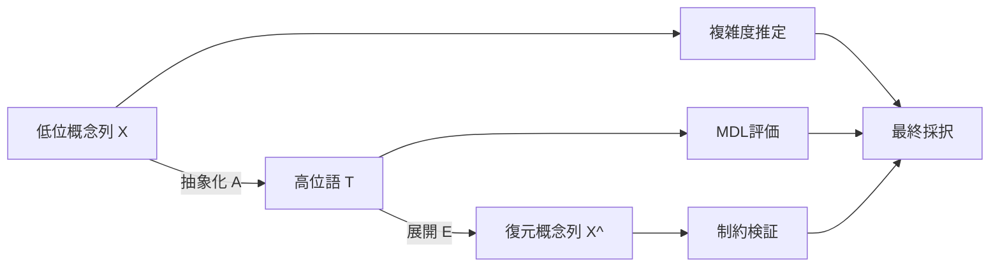
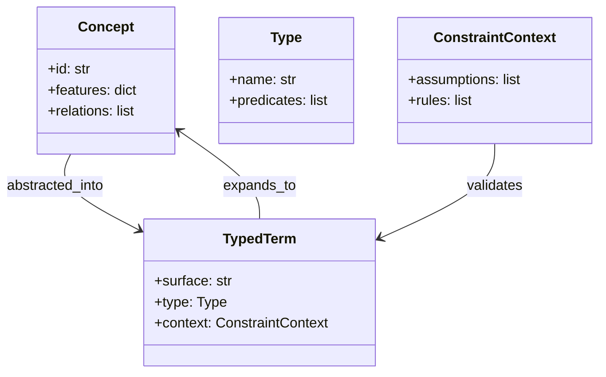
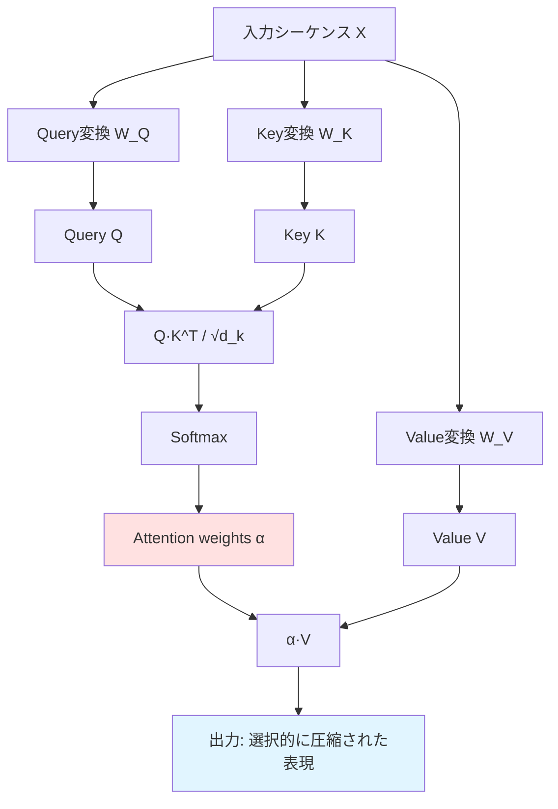
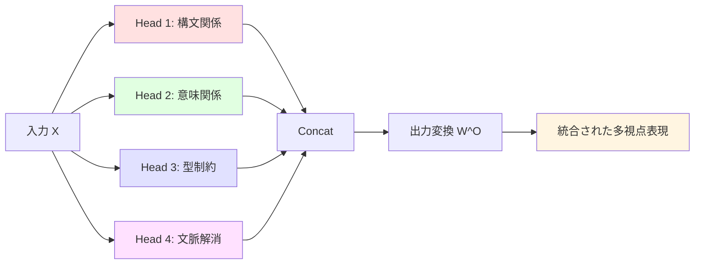
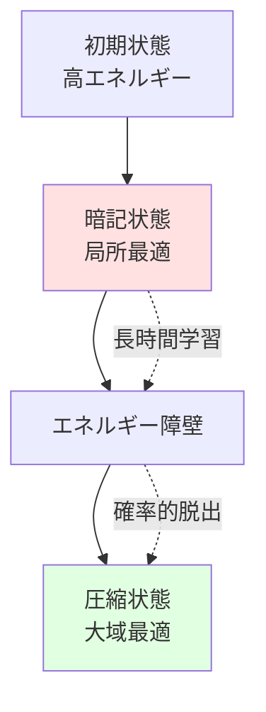
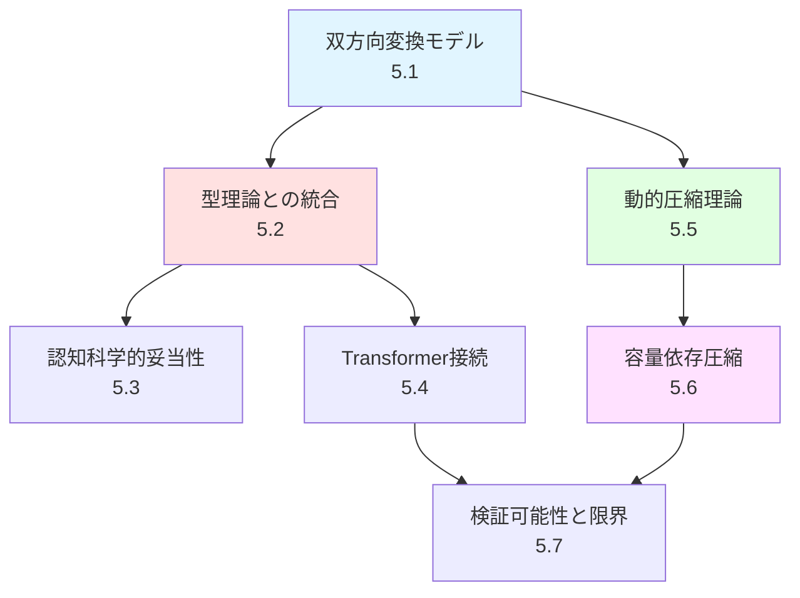

# 5. Theoretical Framework（理論的枠組み）

> **Status**: Draft
> **Last Updated**: 2026-04-13

本章では、専門用語の圧縮と展開を扱う理論的枠組みを構築する。双方向変換モデル、型理論との統合、そしてTransformerアーキテクチャとの理論的接続を示す。

## 5.1 双方向変換モデル

### 5.1.1 双方向写像の定義

本研究の中心構造は、圧縮と展開の双方向写像である。

\[
A : X \mapsto T
\]

\[
E : T \mapsto \hat{X}
\]

理想的には、

\[
E(A(X)) \simeq X
\]

が成立してほしい。
ただし現実には完全一致よりも、以下の条件が重要である。

1. 本質的構造が保存される
2. 制約違反が増えない
3. 必要な粒度で復元できる

### 5.1.2 動的圧縮モデル

圧縮は静的な変換ではなく、学習過程で動的に変化する。

**記法の拡張**:

第4章では静的な抽象化関数 \( A: \mathcal{C}_{low} \times \Gamma \to \mathcal{C}_{high} \) を定義したが、本節では学習過程での時間発展を扱うため、時間依存の抽象化関数 \( A_t \) を導入する：

\[
A_t: \mathcal{C}_{low} \times \Gamma \to \mathcal{C}_{high}, \quad t \in [0, T_{\text{max}}]
\]

ここで、\( t \) は学習ステップ（エポック）を表す。学習の収束時（\( t \to \infty \)）には、\( A_t \to A^* \) となり、第4章の最適化問題の解に対応する。

**時間発展する圧縮率**:

\[
C(t) = \frac{K(X)}{K(A_t(X))}
\]

ここで、
- \( t \): 学習ステップ（エポック）
- \( A_t \): 時刻 \( t \) における抽象化関数
- \( K(\cdot) \): Kolmogorov複雑度
- \( A^* = \lim_{t \to \infty} A_t \): 収束後の最適抽象化関数（第4章の \( A \) に対応）

**圧縮率の動的測定**:

各層での情報量の変化を時系列で追跡する。

\[
I_t(X; h_l) = H(h_l) - H(h_l|X)
\]

- \( l \): 層番号
- \( h_l \): 層 \( l \) の隠れ状態
- \( H(\cdot) \): エントロピー

**相転移モデル**:

学習過程は、暗記状態から圧縮状態への相転移として理解できる。

\[
E_{\text{total}}(w) = E_{\text{data}}(w) + \lambda(t) \cdot E_{\text{complexity}}(w)
\]

- \( E_{\text{data}}(w) \): データ適合度（訓練誤差）
- \( E_{\text{complexity}}(w) \): モデル複雑度
- \( \lambda(t) \): 時間依存の正則化係数

この相転移モデルは、Grokking現象（突然の一般化）を説明する理論的基盤となる（セクション5.5参照）。

### 5.1.3 第4章の最適化問題への解答

本節では、第4章4.3節で定式化した最適化問題に対する理論的解答を提供する。

**問題の再掲**（第4章4.3.2節より）:

\[
T^* = \arg\min_T \mathcal{L}(T, X, \Gamma) = \arg\min_T \left[L(T) + L(X|T) + \lambda \cdot \mathcal{V}(T, \Gamma)\right]
\]

subject to:
\[
\mathcal{V}(T, \Gamma) = 0 \quad \text{（制約充足）}
\]

**理論的性質**:

1. **解の存在性**:
   - 語彙集合 \( \mathcal{V} \) が有限であれば、最適解 \( T^* \) は必ず存在する
   - 証明: 有限集合上の連続関数は最小値を持つ（ワイエルシュトラスの定理）

2. **解の一意性**:
   - 一般には一意ではない（複数の同等な圧縮が存在しうる）
   - ただし、\( \lambda \to \infty \) の極限では、制約を満たす最短の \( T \) に収束

3. **計算可能性**:
   - Kolmogorov複雑度 \( K(\cdot) \) は計算不可能
   - 実用的には、圧縮アルゴリズム（例: gzip）による近似を使用
   - 本理論では、学習可能な圧縮関数 \( A_t \) を用いる（5.1.2節）

**解法の方針**:

本理論は、最適化問題の**直接的な解法**ではなく、**学習による近似解法**を提案する：

1. **初期化**: ランダムな抽象化関数 \( A_0 \) から開始
2. **反復改善**: 勾配降下法により \( A_t \) を更新
3. **収束判定**: \( \mathcal{L}(A_t(X), X, \Gamma) \) の変化が閾値以下になるまで継続
4. **最終解**: \( T^* \approx A_{t_{\text{final}}}(X) \)

この学習ベースのアプローチは、以下の利点を持つ：
- Kolmogorov複雑度の計算不可能性を回避
- 大規模データへのスケーラビリティ
- 確率的型システム（5.2.4節）との自然な統合

**理論的保証**:

動的圧縮理論（5.5節）により、以下が示される：
- 学習過程は暗記状態から圧縮状態への相転移を経る
- 十分な学習時間があれば、\( A_t \to A^* \) が期待される
- ただし、局所最適解に陥る可能性がある（Grokking現象、5.5.3節）

## 5.2 型理論との統合

**先行研究**:
- **Martin-Löf, P. (1984). "Intuitionistic Type Theory." Bibliopolis.**
  - 依存型理論の基礎
- **Pierce, B. C. (2002). "Types and Programming Languages." MIT Press.**
  - 型システムの包括的解説
- **Coquand, T., & Huet, G. (1988). "The Calculus of Constructions." Information and Computation, 76(2-3), 95-120.**
  - 高階依存型理論

### 5.2.1 なぜ型が必要か

圧縮だけでは「それっぽいが誤った」高位語が成立してしまう。  
これを防ぐには、概念表現に対して型制約を導入する必要がある。

専門用語 \( t \) は単なる文字列ではなく、型付き項として扱う。

\[
t : T
\]

ここで \( T \) は、その語が満たすべき構造・前提・使用可能な演算を表す。

### 5.2.2 制約付き型としての専門用語

より一般に、高位語は依存型に近い構造を持つ。

\[
t : T(\Gamma, P)
\]

- \( \Gamma \): 文脈制約
- \( P \): 前提条件
- \( T(\Gamma, P) \): 制約依存の型

例えば「群」は単に `Group` 型ではなく、「二項演算・単位元・逆元・結合律」を満たす構造に対してのみ成立する型である。

### 5.2.3 圧縮・展開の型付け

抽象化関数 \( A \) と展開関数 \( E \) を次のように定義する。

\[
A : \mathcal{C}_{low} \to \mathcal{C}_{high}
\]

\[
E : \mathcal{C}_{high} \to \mathcal{P}(\mathcal{C}_{low})
\]

ただし、型整合性を保つために、

\[
\Gamma \vdash x : T \Rightarrow \Gamma \vdash A(x) : T'
\]

\[
\Gamma \vdash t : T' \Rightarrow \Gamma \vdash E(t) \subseteq \{x \mid \Gamma \vdash x : T\}
\]

が要求される。

### 5.2.4 確率的型システム

統計的学習と論理的検証を統合するため、型判定を確率化する。

**確率的型判定**:

\[
P(\Gamma \vdash t : T) = \alpha \cdot L(t, T, \Gamma) + (1-\alpha) \cdot S(t, \Gamma)
\]

ここで、
- \( L(t, T, \Gamma) \): 論理的型適合度 \( \in [0, 1] \)
- \( S(t, \Gamma) \): 統計的尤度 \( \in [0, 1] \)
- \( \alpha \in [0, 1] \): 論理的制約の重み

**数学的厳密化**:

論理的型適合度 \( L(t, T, \Gamma) \) を以下のように定義する：

\[
L(t, T, \Gamma) = \frac{1}{1 + \exp(-\beta \cdot \text{score}_{\text{logic}}(t, T, \Gamma))}
\]

ここで、\( \text{score}_{\text{logic}}(t, T, \Gamma) \in \mathbb{R} \) は論理的整合性スコアであり、以下の要素から構成される：

1. **型整合性**: \( \text{type\_match}(t, T) \in \{0, 1\} \)
2. **制約充足度**: \( \text{constraint\_sat}(t, \Gamma) \in [0, 1] \)
3. **論理的無矛盾性**: \( \text{consistency}(t, \Gamma) \in [0, 1] \)

\[
\text{score}_{\text{logic}}(t, T, \Gamma) = w_1 \cdot \text{type\_match}(t, T) + w_2 \cdot \text{constraint\_sat}(t, \Gamma) + w_3 \cdot \text{consistency}(t, \Gamma)
\]

統計的尤度 \( S(t, \Gamma) \) は、訓練データにおける共起頻度から推定される：

\[
S(t, \Gamma) = \frac{\text{count}(t, \Gamma)}{\text{count}(\Gamma)}
\]

これにより、\( P(\Gamma \vdash t : T) \in [0, 1] \) が保証される。

**ソフト制約とハード制約**:

1. **ハード制約**（\( \alpha \to 1 \)）:
   - 型の整合性：\( \text{type}(f(x)) = \text{return\_type}(f) \)
   - 矛盾律：\( \neg(P \land \neg P) \)
   - 排中律：\( P \lor \neg P \)

2. **ソフト制約**（\( 0 < \alpha < 1 \)）:
   - 共起頻度：\( P(w_i | w_{i-1}, \ldots, w_{i-n}) \)
   - 文脈適合性：\( \text{similarity}(t, \text{context}) \)
   - スタイル整合性：\( \text{style\_score}(t, \text{domain}) \)

**段階的制約強化**:

学習過程で \( \alpha \) を動的に調整する。

| フェーズ | \( \alpha \) | 制約レベル | 目的 |
|---------|-------------|-----------|------|
| 初期学習 | 0.1 | ソフト | 統計的パターン獲得 |
| 中期学習 | 0.5 | 中程度 | パターンと論理の統合 |
| 後期学習 | 0.8 | ハード | 論理的整合性強化 |
| Fine-tuning | 0.95 | 厳密 | 制約検証の厳密化 |

### 5.2.5 型理論と検証

型理論の役割は以下の3点にある。

1. 不正な圧縮の排除
2. 展開時の論理破壊の検出
3. 高位語の意味境界の明示

この考え方は、後続の型システム仕様に具体化される。詳細は [04_implementation_spec.md](./04_implementation_spec.md) を参照。

## 5.3 認知科学的妥当性

本理論は、人間の概念形成プロセスと深い類似性を持つ。この節では、認知心理学の知見との整合性を検討し、理論の認知科学的基盤を明確にする。

### 5.3.1 人間の概念形成との類似性

> **注意**: 本節で述べる認知科学的類似性は、計算モデルと人間の認知プロセスの間の**構造的な対応**を示すものであり、人間の認知メカニズムの完全なモデル化を主張するものではない。本理論は計算的な概念圧縮の理論であり、意識、感情、身体性などの人間固有の側面は扱わない（5.3.5節参照）。

本理論の中心的な3つのプロセス（抽象化・展開・制約）は、人間の認知プロセスと対応する：

1. **抽象化（Abstraction）**: 具体例から一般概念を形成
   - 複数の具体的事例から共通パターンを抽出
   - カテゴリー化と概念の階層構造の形成
   
2. **展開（Expansion）**: 抽象概念から具体例を想起
   - プロトタイプからの類推
   - 概念の適用範囲の理解
   
3. **制約（Constraint）**: 文脈に応じた適切な解釈の選択
   - 文脈依存的な意味の調整
   - 矛盾の回避と整合性の維持

### 5.3.2 プロトタイプ理論との整合性

**Rosch (1978)のプロトタイプ理論**との対応：

Rosch, E. (1978). "Principles of categorization." In E. Rosch & B. B. Lloyd (Eds.), *Cognition and categorization* (pp. 27-48). Lawrence Erlbaum Associates.

**主要な知見**:
- 概念は典型例（プロトタイプ）を中心に構造化される
- カテゴリーメンバーシップは段階的（graded membership）
- 基本レベルカテゴリーが認知的に最も自然

**本理論との対応**:

\[
T = \text{Prototype}(X) \quad \text{where} \quad X = \{x_1, x_2, \ldots, x_n\}
\]

高位語 \( T \) は、低位概念集合 \( X \) のプロトタイプとして機能する。展開関数 \( E(T) \) は、プロトタイプからの類似度に基づいて概念を生成する。

\[
E(T) = \{x \mid \text{similarity}(x, T) \geq \theta\}
\]

### 5.3.3 概念の心理学的基盤

**Murphy (2002)の概念心理学**との整合性：

Murphy, G. L. (2002). *The Big Book of Concepts.* MIT Press.

**主要な知見**:
- 概念は孤立して存在せず、知識ネットワークの一部
- 理論ベースの概念形成（theory-based categorization）
- 文脈が概念の解釈に決定的な役割を果たす

**本理論との対応**:

本理論の制約文脈 \( \Gamma \) は、Murphyの「理論ベースの概念」に対応する。

\[
\Gamma \vdash T : \tau \quad \text{（型 } \tau \text{ を持つ高位語 } T \text{）}
\]

制約文脈は、概念が埋め込まれた知識構造を表現し、文脈依存的な解釈を可能にする。

### 5.3.4 認知的経済性の原理

人間の認知システムは、限られた認知資源で効率的に情報を処理する必要がある。これは本理論のMDL原理と一致する。

**認知的経済性**:
- 最小の認知負荷で最大の情報を保持
- 頻繁に使用される概念の圧縮
- 文脈に応じた動的な抽象度の調整

**形式化**:

\[
\text{Cognitive Load}(T) = L(T) + L(X|T)
\]

これは、MDL原理の目的関数と同一の構造を持つ。

### 5.3.5 認知科学的妥当性の限界

本理論は認知科学的に妥当な側面を持つが、以下の限界も認識する必要がある：

1. **意識的プロセスの欠如**: 人間の概念形成には意識的な推論が関与するが、本理論は純粋に計算的
2. **感情・動機の無視**: 人間の概念は感情や動機と結びついているが、本理論では扱わない
3. **身体性の欠如**: 身体化認知（embodied cognition）の視点が欠けている
4. **社会的側面**: 概念の社会的構成や文化依存性を考慮していない

これらの限界は、本理論が「人間の認知の完全なモデル」ではなく、「計算的な概念圧縮の理論」であることを示している。

## 5.4 Transformerアーキテクチャとの理論的接続

**先行研究**:
- **Vaswani, A., Shazeer, N., Parmar, N., Uszkoreit, J., Jones, L., Gomez, A. N., ... & Polosukhin, I. (2017). "Attention is all you need." Advances in Neural Information Processing Systems, 30.**
  - Transformerアーキテクチャの提案
- **Devlin, J., Chang, M. W., Lee, K., & Toutanova, K. (2019). "BERT: Pre-training of Deep Bidirectional Transformers for Language Understanding." NAACL 2019.**
  - 双方向Transformerの事前学習

本節では、本理論とTransformerアーキテクチャの関係を明示的に分析し、理論がどのように既存の深層学習モデルの動作を説明できるか、またその限界はどこにあるかを検討する。

### 5.4.1 Self-Attentionと選択的圧縮

**Attention機構の数式**:

Self-Attention機構は、入力シーケンス \( X = [x_1, x_2, \dots, x_n] \) に対して、以下の変換を行う。

\[
\text{Attention}(Q, K, V) = \text{softmax}\left(\frac{QK^T}{\sqrt{d_k}}\right)V
\]

ここで、
- \( Q = XW_Q \): Query行列
- \( K = XW_K \): Key行列
- \( V = XW_V \): Value行列
- \( d_k \): Keyの次元数

**Query-Key-Value機構と概念の抽象化/展開**:

本理論の観点から、Attention機構は以下のように解釈できる。

- **Query**: 「どの情報が必要か」を表す抽象化された要求
- **Key**: 各トークンが持つ「検索可能な特徴」の圧縮表現
- **Value**: 実際に伝達される情報内容

Attention weightsは、概念間の関連度を動的に計算し、重要な情報を選択的に圧縮する機構とみなせる。

\[
\alpha_{ij} = \frac{\exp(q_i \cdot k_j / \sqrt{d_k})}{\sum_{j'} \exp(q_i \cdot k_{j'} / \sqrt{d_k})}
\]

この \( \alpha_{ij} \) は、トークン \( i \) が トークン \( j \) の情報をどれだけ圧縮して取り込むかを表す重みである。

**Attention weightsの情報理論的解釈**:

Attention weightsは、情報の選択的圧縮を実現する確率分布とみなせる。

\[
H(V_i) = -\sum_j \alpha_{ij} \log \alpha_{ij}
\]

- エントロピーが低い（特定のトークンに集中）: 強い圧縮
- エントロピーが高い（広く分散）: 弱い圧縮、多様な情報の保持

**Attentionフロー図**:

### 5.4.2 Multi-Head Attentionと多視点抽象化

**複数のAttention Headの役割**:

Multi-Head Attentionは、\( h \) 個の異なるAttention機構を並列に実行する。

\[
\text{MultiHead}(Q, K, V) = \text{Concat}(\text{head}_1, \dots, \text{head}_h)W^O
\]

\[
\text{head}_i = \text{Attention}(QW_i^Q, KW_i^K, VW_i^V)
\]

**各Headが異なる抽象化レベルを学習する仮説**:

本理論の観点から、各Attention Headは異なる抽象化戦略を学習すると解釈できる。

- **Head 1**: 局所的な構文関係（隣接トークン間の依存）
- **Head 2**: 意味的な関連性（遠距離の概念的つながり）
- **Head 3**: 型制約の検証（文法的整合性）
- **Head 4**: 文脈依存の曖昧性解消

各Headは、異なる \( W_i^Q, W_i^K, W_i^V \) を持つことで、異なる「圧縮の視点」を獲得する。

**実証研究の引用**:

BERTologyの研究（Clark et al., 2019; Voita et al., 2019）は、実際に各Headが異なる言語的機能を学習することを示している。

- **Clark, K., Khandelwal, U., Levy, O., & Manning, C. D. (2019). "What Does BERT Look At? An Analysis of BERT's Attention." BlackboxNLP Workshop at ACL.**
  - 特定のHeadが構文関係（主語-動詞など）を捉えることを発見
  
- **Voita, E., Talbot, D., Moiseev, F., Sennrich, R., & Titov, I. (2019). "Analyzing Multi-Head Self-Attention: Specialized Heads Do the Heavy Lifting, the Rest Can Be Pruned." ACL 2019.**
  - 多くのHeadは冗長であり、少数の特化したHeadが重要な役割を果たす

これは、本理論の「異なる抽象化レベル」の仮説と整合する。

**Multi-Head構造図**:

### 5.4.3 Position Encodingと構造保存

**位置情報の保持と制約保存の関係**:

Transformerは、トークンの順序情報を保持するためにPosition Encodingを使用する。

\[
PE_{(pos, 2i)} = \sin\left(\frac{pos}{10000^{2i/d_{model}}}\right)
\]

\[
PE_{(pos, 2i+1)} = \cos\left(\frac{pos}{10000^{2i/d_{model}}}\right)
\]

本理論の観点から、これは「構造制約の保存」に対応する。概念を圧縮する際、その順序関係（時系列、因果関係など）は重要な制約であり、Position Encodingはこれを明示的に保持する機構である。

**Sinusoidal vs Learned Encoding**:

- **Sinusoidal Encoding**: 固定的な位置表現、任意長のシーケンスに対応
- **Learned Encoding**: 学習可能な位置表現、特定のタスクに最適化

本理論では、Learned Encodingは「タスク固有の構造制約」を学習する機構と解釈できる。

**数式による定式化**:

位置情報を含む入力表現は、

\[
X' = X + PE
\]

これは、概念表現 \( X \) に構造制約 \( PE \) を付加する操作とみなせる。型理論的には、

\[
x : T \Rightarrow (x, pos) : T \times \text{Position}
\]

という依存型への拡張に対応する。

### 5.4.4 Feed-Forward Layerの双方向変換

**FFNの数式**:

各Transformer層には、以下のFeed-Forward Network（FFN）が含まれる。

\[
\text{FFN}(x) = \max(0, xW_1 + b_1)W_2 + b_2
\]

通常、中間層の次元 \( d_{ff} \) は入力次元 \( d_{model} \) の4倍程度に設定される。

\[
d_{ff} = 4 \times d_{model}
\]

**展開（expansion）と再圧縮の解釈**:

本理論の観点から、FFNは以下の2段階プロセスとして解釈できる。

1. **展開フェーズ** (\( W_1 \)): 圧縮された表現を高次元空間に展開
   - \( d_{model} \to d_{ff} \)
   - 暗黙の概念を明示化
   
2. **再圧縮フェーズ** (\( W_2 \)): 展開された表現を再び圧縮
   - \( d_{ff} \to d_{model} \)
   - 不要な情報を削除し、本質を抽出

これは、本理論の「双方向変換」（抽象化 ↔ 展開）に直接対応する。

**中間層の次元拡大の意味**:

中間層が入力の4倍の次元を持つことは、以下を示唆する。

- 圧縮された表現には、4倍程度の「潜在的な情報」が含まれている
- 展開により、暗黙の前提や関係性が明示化される
- 再圧縮により、タスクに関連する情報のみが保持される

情報理論的には、

\[
I(X; \text{FFN}(X)) \leq I(X; W_1(X))
\]

展開により情報が増加し、再圧縮により選択的に削減される。

### 5.4.5 Residual Connectionと情報保存

**Skip connectionの数式**:

Transformerの各サブ層は、Residual Connection（Skip Connection）を使用する。

\[
\text{Output} = \text{LayerNorm}(x + \text{Sublayer}(x))
\]

**情報損失の防止機構**:

本理論の観点から、Residual Connectionは「圧縮による情報損失の防止」機構である。

- **問題**: AttentionやFFNによる変換で、重要な情報が失われる可能性
- **解決**: 元の入力 \( x \) を直接加算することで、情報の完全な保存を保証

これは、型理論における「制約の保存」に対応する。

\[
\Gamma \vdash x : T \Rightarrow \Gamma \vdash x + f(x) : T
\]

変換 \( f \) が型を破壊しても、元の \( x \) が残るため、型整合性が維持される。

**Gradient flowとの関係**:

Residual Connectionは、勾配消失問題の解決にも寄与する。

\[
\frac{\partial L}{\partial x} = \frac{\partial L}{\partial \text{Output}} \left(1 + \frac{\partial \text{Sublayer}(x)}{\partial x}\right)
\]

恒等写像の勾配（1）が常に存在するため、深い層でも勾配が伝播する。

### 5.4.6 Layer Normalizationと安定化

**正規化と圧縮の関係**:

Layer Normalizationは、各層の出力を正規化する。

\[
\text{LayerNorm}(x) = \gamma \frac{x - \mu}{\sigma} + \beta
\]

ここで、
- \( \mu = \frac{1}{d}\sum_i x_i \): 平均
- \( \sigma = \sqrt{\frac{1}{d}\sum_i (x_i - \mu)^2} \): 標準偏差

**学習の安定性**:

本理論の観点から、Layer Normalizationは「圧縮の安定化」機構である。

- 各層の出力を一定の範囲に正規化することで、過度な圧縮や展開を防ぐ
- スケール不変性により、表現の「相対的な構造」のみが保存される

これは、MDL原理における「モデル複雑度の制御」に対応する。正規化により、不必要に複雑な表現が抑制される。

### 5.4.7 まとめ：Transformerと本理論の対応

| Transformer要素 | 本理論における解釈 |
|---|---|
| Self-Attention | 選択的な概念圧縮機構 |
| Multi-Head Attention | 多視点からの抽象化 |
| Position Encoding | 構造制約の明示的保持 |
| Feed-Forward Network | 展開→再圧縮の双方向変換 |
| Residual Connection | 情報損失の防止、制約保存 |
| Layer Normalization | 圧縮の安定化、複雑度制御 |

Transformerアーキテクチャは、本理論が提唱する「制約を保った概念圧縮」の多くの要素を実装していると解釈できる。ただし、第9章（Discussion）で述べるように、重要な限界も存在する。

## 5.5 動的圧縮理論

本節では、学習過程での圧縮率の動的変化を扱う理論を展開する。これは、Grokking現象（突然の一般化）を説明する理論的基盤となる。

### 5.5.1 圧縮率の動的測定フレームワーク

各層での情報量の変化を時系列で追跡する。

\[
I_t(X; h_l) = H(h_l) - H(h_l|X)
\]

ここで、
- \( t \): 学習ステップ（エポック）
- \( l \): 層番号
- \( h_l \): 層 \( l \) の隠れ状態
- \( H(\cdot) \): エントロピー

**測定手法の比較**:

| 手法 | 適用条件 | 計算コスト | 精度 | 推奨用途 |
|------|---------|-----------|------|---------|
| **MINE** | 高次元表現 | 高（ニューラルネット訓練） | 高 | 深層ネットワークの層間情報量 |
| **KDE** | 低〜中次元 | 中（密度推定） | 中 | 表現空間の分布解析 |
| **Effective Rank** | 任意の次元 | 低（SVD計算） | 中 | 圧縮度の簡易評価 |

**Effective Rankの定義**:

\[
\text{EffectiveRank}(H) = \frac{(\sum_i \sigma_i)^2}{\sum_i \sigma_i^2}
\]

ここで、\( \sigma_i \) は表現行列 \( H \) の特異値。

**推奨手法**:
- **初期探索**: Effective Rank（計算コストが低い）
- **詳細解析**: MINE（精度が高い）
- **分布解析**: KDE（表現空間の構造を可視化）

### 5.5.2 相転移モデルの定式化

暗記状態と圧縮状態のエネルギー地形を定義する。

\[
E_{\text{total}}(w) = E_{\text{data}}(w) + \lambda(t) \cdot E_{\text{complexity}}(w)
\]

- \( E_{\text{data}}(w) \): データ適合度（訓練誤差）
- \( E_{\text{complexity}}(w) \): モデル複雑度（パラメータのノルム）
- \( \lambda(t) \): 時間依存の正則化係数

**相転移の条件**:

\[
\frac{\partial E_{\text{total}}}{\partial w} = 0 \quad \text{かつ} \quad \frac{\partial^2 E_{\text{total}}}{\partial w^2} > 0
\]

### 5.5.3 Grokkingの説明

**因果メカニズムの明示**:

Grokkingは以下の因果連鎖によって発生する：

1. **初期学習** → **暗記状態への収束**
   - 因果: 勾配降下法が訓練誤差を最小化する最も単純な解（暗記）を発見
   - 測定可能な予測: 訓練誤差は急速にゼロに近づくが、テスト誤差は高いまま

2. **暗記状態** → **エネルギー障壁の形成**
   - 因果: 局所最適解（暗記）と大域最適解（圧縮）の間にエネルギー障壁が存在
   - 測定可能な予測: 損失関数のヘッセ行列の固有値分布が二峰性を示す

3. **長時間学習** → **確率的脱出**
   - 因果: SGDのノイズと正則化により、確率的にエネルギー障壁を越える
   - 測定可能な予測: 学習率と正則化強度が大きいほど、脱出確率が高い

4. **エネルギー障壁の突破** → **圧縮状態への相転移**
   - 因果: 圧縮状態は暗記状態よりも低エネルギー（MDL原理により）
   - 測定可能な予測: テスト誤差が突然急減し、モデルの有効ランクが低下

**検証可能な予測**:

- 予測1: 正則化強度 \( \lambda \) を増やすと、Grokking発生時刻 \( t_{\text{grok}} \) が早まる
- 予測2: 学習率を下げすぎると、Grokkingが発生しない（エネルギー障壁を越えられない）
- 予測3: データセットサイズ \( D \) が大きいほど、\( t_{\text{grok}} \) が遅れる

**学習の4つのフェーズ**:

1. **Phase 1**: 急速に暗記状態へ（訓練誤差 → 0）
2. **Phase 2**: 暗記状態に留まる（エネルギー障壁）
3. **Phase 3**: 確率的にエネルギー障壁を越える
4. **Phase 4**: 圧縮状態へ相転移（テスト誤差急減）

### 5.5.4 学習ダイナミクスの解析

**なぜ突然圧縮が起きるのか**:

相転移の確率は、統計力学のボルツマン分布に従う。

\[
P(\text{transition}) = \exp\left(-\frac{\Delta E}{k_B T_{\text{eff}}}\right)
\]

- \( \Delta E \): エネルギー障壁の高さ
- \( T_{\text{eff}} \): 有効温度（学習率に対応）

**エネルギー障壁の越え方**:

1. **確率的勾配降下法のノイズ**: ミニバッチのランダム性が熱揺らぎとして作用
2. **学習率スケジューリング**: 学習率を徐々に下げることで「冷却」
3. **Weight Decay**: 正則化により圧縮状態を安定化

### 5.5.5 予測モデルの構築

Grokkingの発生時刻を予測する。

\[
t_{\text{grok}} = f(N, D, \lambda, \text{lr}, \text{architecture})
\]

- \( N \): パラメータ数
- \( D \): データセットサイズ
- \( \lambda \): 正則化強度
- \( \text{lr} \): 学習率

**期待される効果**:

- **Grokkingの理論的説明**: 相転移モデルによる定量的予測
- **学習過程の予測可能性向上**: いつGrokkingが起きるか事前予測
- **効率的な学習スケジュールの設計**: 最適な学習率と正則化強度
- **計算資源の最適化**: 無駄な学習の削減
## 5.6 容量依存圧縮理論

> **適用範囲の限定**: 本節で展開する容量依存圧縮理論は、第4章4.1.3節で定義した適用範囲内（小〜中規模モデル、10M〜10B パラメータ）で最も有効である。超大規模モデル（> 100B パラメータ）では、Scaling Lawsが支配的となり、本理論の予測力が低下する可能性がある。本節の理論的統合は、両者の移行領域（10B〜100B パラメータ）における挙動を理解するための試みである。

本節では、モデルの容量（パラメータ数）と圧縮効率の関係を定式化し、Scaling Lawsとの統合を試みる。これにより、「なぜ大きなモデルが良いのか」という根本的な問いに理論的な答えを提供する。

### 5.6.1 過剰パラメータと圧縮効率

大きなモデルがより効率的な圧縮を学習できる理由を定式化する。

**仮説**: 過剰パラメータは「圧縮の探索空間」を拡大する

\[
C_{\text{optimal}}(N) = C_{\infty} \left(1 - e^{-\beta N}\right)
\]

ここで、
- \( N \): パラメータ数
- \( C_{\infty} \): 理論的最大圧縮率
- \( \beta \): 学習効率パラメータ

**解釈**:
- 小さなモデル（\( N \to 0 \)）: 圧縮率が低い
- 大きなモデル（\( N \to \infty \)）: 理論的最大圧縮率に漸近

この指数関数的な漸近挙動は、以下を示唆する：

1. **初期段階**: パラメータ数の増加が圧縮率を大きく改善
2. **飽和段階**: 一定のサイズを超えると改善が鈍化
3. **限界**: 理論的な最大圧縮率 \( C_{\infty} \) が存在

### 5.6.2 Scaling Lawsとの統合

本理論の圧縮率とScaling Lawsの性能を統合する。

標準的なScaling Laws（Kaplan et al., 2020）は以下の形式を持つ：

\[
L(N) = L_0 \cdot \left(\frac{N_c}{N}\right)^{\alpha}
\]

これに圧縮率による補正項を加える：

\[
L(N) = L_0 \cdot \left(\frac{N_c}{N}\right)^{\alpha} \cdot \left(1 + \gamma \cdot C(N)\right)^{-1}
\]

ここで、
- 第1項: Scaling Lawsの冪乗則（容量の効果）
- 第2項: 圧縮率による補正（効率性の効果）
- \( \gamma \): 圧縮効率の重み係数

**予測**:
- **小モデル領域**: Scaling Lawsが支配的（\( C(N) \) が小さい）
- **大モデル領域**: 圧縮効率が重要に（\( C(N) \to C_{\infty} \)）

この統合により、容量と効率性の両方を考慮した性能予測が可能になる。

### 5.6.3 最適モデルサイズの導出

MDL原理とScaling Lawsを統合した目的関数を定義する：

\[
\text{Cost}(N) = L(N) + \lambda \cdot \log N
\]

ここで、
- \( L(N) \): 性能（損失）
- \( \lambda \log N \): モデル複雑度のペナルティ

最適化問題：

\[
N^* = \arg\min_N \left[L_0 \left(\frac{N_c}{N}\right)^{\alpha} + \lambda \log N\right]
\]

**解析解の導出**:

目的関数を \( N \) で微分してゼロとおく：

\[
\frac{d}{dN}\left[L_0 \left(\frac{N_c}{N}\right)^{\alpha} + \lambda \log N\right] = 0
\]

\[
-\alpha L_0 N_c^{\alpha} N^{-\alpha-1} + \frac{\lambda}{N} = 0
\]

\[
\alpha L_0 N_c^{\alpha} N^{-\alpha-1} = \frac{\lambda}{N}
\]

\[
\alpha L_0 N_c^{\alpha} = \lambda N^{\alpha}
\]

\[
N^{\alpha} = \frac{\alpha L_0 N_c^{\alpha}}{\lambda}
\]

したがって、最適パラメータ数は：

\[
N^* = N_c \left(\frac{\alpha L_0}{\lambda}\right)^{1/(1+\alpha)}
\]

**解釈**:
- \( \alpha \) が大きい（Scaling効果が強い）: より大きなモデルが最適
- \( \lambda \) が大きい（複雑度ペナルティが強い）: より小さなモデルが最適
- \( L_0 \) が大きい（タスクが難しい）: より大きなモデルが必要

### 5.6.4 理論的含意

この統合により、以下が説明可能になる：

1. **なぜ大きなモデルが良いのか**: 
   - 圧縮の探索空間が広い
   - より複雑な圧縮パターンを学習可能
   - 局所最適に陥りにくい

2. **最適なサイズの存在**: 
   - MDL原理による記述長とのトレードオフ
   - 計算資源の制約を考慮した実用的な選択
   - タスクの複雑度に応じた適切なサイズ

3. **効率性と容量の関係**: 
   - 指数関数的な漸近挙動（\( C(N) = C_{\infty}(1 - e^{-\beta N}) \)）
   - 初期段階での急速な改善と後期の飽和
   - 理論的な上限の存在

4. **Scaling Lawsの補正**:
   - 純粋な容量効果だけでなく、圧縮効率も考慮
   - 小モデルと大モデルで異なる支配的要因
   - より正確な性能予測

**実証的検証の必要性**:

この理論的枠組みは、第8.4節で提案する実験により検証される必要がある：
- パラメータ数と圧縮率の関係の測定
- 理論予測と実測の比較
- 最適モデルサイズの実証的導出

## 5.7 理論の検証可能性と限界

本節では、本理論の反証可能性を明示し、理論が説明できない現象や矛盾する研究を示す。科学的理論として、その限界を明確にすることが重要である。

### 5.7.1 事後的圧縮の可能性

**Lottery Ticket Hypothesis（Frankle & Carbin, 2019）の示唆**:

Frankle, J., & Carbin, M. (2019). "The Lottery Ticket Hypothesis: Finding Sparse, Trainable Neural Networks." *ICLR 2019*.

**主張**:
- ランダム初期化されたネットワークには、単独で訓練しても同等の性能を達成できる「当たりくじ」サブネットワークが含まれる
- 学習済みネットワークは、大幅に刈り込んでも性能を維持できる

**本理論への反証**:

本理論は「圧縮が先、学習が後」を想定する：

\[
\text{本理論}: \text{圧縮設計} \to \text{学習} \to \text{性能}
\]

しかし、Lottery Ticket Hypothesisは「学習が先、圧縮が後」を示唆する：

\[
\text{実態}: \text{過剰パラメータ} \to \text{学習} \to \text{事後圧縮}
\]

この乖離は、本理論の基本的な因果関係の仮定を揺るがす。

**対処方向**:
- 学習過程での圧縮率の動的測定による検証（第8章で提案）
- 事前圧縮と事後圧縮の効果の比較実験

### 5.7.2 Emergent Abilitiesの説明困難性

**現象（Wei et al., 2022）**:

Wei, J., Tay, Y., Bommasani, R., Raffel, C., Zoph, B., Borgeaud, S., ... & Fedus, W. (2022). "Emergent abilities of large language models." *Transactions on Machine Learning Research*.

**主張**:
- モデルサイズが一定の閾値を超えると、突然新しい能力が出現
- 例: 算術演算、多段階推論、コード生成

**本理論では説明困難**:

本理論は「圧縮効率の連続的向上」を予測するが、「質的な能力の離散的出現」は説明できない：

\[
\text{圧縮効率の連続的向上} \neq \text{能力の離散的出現}
\]

**なぜ説明できないか**:
- 本理論は量的変化（圧縮率の向上）のみを扱う
- 質的変化（新能力の出現）を扱う枠組みがない
- 特定のサイズで突然能力が出現する理論的根拠がない

**対処方向**:
- 相転移モデルの拡張（第5.5節）
- 臨界現象の理論的分析（第7章で検討予定）

### 5.7.3 Scaling Lawsとの矛盾

**現象（Kaplan et al., 2020）**:

Kaplan, J., McCandlish, S., Henighan, T., Brown, T. B., Chess, B., Child, R., ... & Amodei, D. (2020). "Scaling laws for neural language models." *arXiv:2001.08361*.

**主張**:
- モデルサイズ、データサイズ、計算量と性能の間に冪乗則が成立

\[
L(N) = \left(\frac{N_c}{N}\right)^{\alpha}
\]

ここで、
- \( N \): パラメータ数
- \( L \): 損失
- \( \alpha \approx 0.076 \)

**本理論との矛盾**:

本理論は「効率的な圧縮」を重視する：

\[
\text{本理論}: \text{小さく効率的な圧縮} = \text{良い}
\]

しかし、Scaling Lawsは「大きなモデル」を重視する：

\[
\text{Scaling Laws}: \text{大きなモデル} = \text{良い}
\]

この矛盾は、本理論の中心的価値観（効率性）が実態と合わない可能性を示唆する。

**対処方向**:
- 容量と圧縮の関係の再定式化
- 過剰パラメータの役割の理論化
- 効率性と容量のトレードオフの明確化

### 5.7.4 In-Context Learningの理論化の困難

**現象（Brown et al., 2020）**:

Brown, T. B., Mann, B., Ryder, N., Subbiah, M., Kaplan, J., Dhariwal, P., ... & Amodei, D. (2020). "Language models are few-shot learners." *NeurIPS 2020*.

**主張**:
- 数個の例を入力するだけで、勾配更新なしに新しいタスクを学習
- 例: Few-shot learning、プロンプトエンジニアリング

**本理論では説明困難**:

本理論は「学習による圧縮」を想定する：

\[
\text{本理論}: \text{学習} \to \text{圧縮} \to \text{推論}
\]

しかし、In-Context Learningは学習なしに圧縮を実現する：

\[
\text{実態}: \text{推論時に動的に圧縮}
\]

**対処方向**:
- 推論時の動的圧縮メカニズムの解明
- Attention機構による文脈依存圧縮の理論化

### 5.7.5 検証可能な予測

本理論が正しければ、以下の予測が成立するはずである：

**予測1: 圧縮率と性能の相関**

\[
\text{Compression Ratio} \uparrow \Rightarrow \text{Performance} \uparrow
\]

より高い圧縮率を持つモデルは、より良い性能を示すはずである。

**予測2: 制約違反と性能の逆相関**

\[
\text{Constraint Violations} \uparrow \Rightarrow \text{Performance} \downarrow
\]

制約違反が多いモデルは、性能が低下するはずである。

**予測3: 動的圧縮の相転移**

\[
\exists t_{\text{critical}} : \frac{d C(t)}{dt}\bigg|_{t=t_{\text{critical}}} \gg \frac{d C(t)}{dt}\bigg|_{t \neq t_{\text{critical}}}
\]

学習過程で圧縮率が急激に変化する臨界点が存在するはずである（Grokking）。

**予測4: 層ごとの圧縮率の単調性**

\[
C(l+1) \geq C(l) \quad \forall l
\]

深い層ほど圧縮率が高くなるはずである。

### 5.7.6 反証の条件

以下の観測結果が得られた場合、本理論は反証される：

1. **圧縮率と性能の無相関**: 圧縮率が高くても性能が向上しない
2. **制約違反の無害性**: 制約違反が多くても性能が維持される
3. **相転移の不在**: 学習過程で圧縮率が連続的にしか変化しない
4. **層ごとの圧縮率の非単調性**: 深い層で圧縮率が低下する

### 5.7.7 理論の適用限界の明示

本理論は以下の条件下でのみ有効である：

1. **モデルサイズ**: 10M〜10B パラメータ（小〜中規模）
2. **タスク**: 圧縮・抽象化・要約タスク
3. **制約**: 明示的な制約が存在する
4. **学習**: 勾配ベースの学習を使用する

これらの条件を外れる場合、本理論の予測力は低下する。

## 5.8 理論の統合と一貫性

本節では、5.1〜5.7節で展開した理論要素が全体として一貫した理論体系を形成していることを検証する。

### 5.8.1 理論要素間の関係

各理論要素は独立ではなく、以下のように相互に関連している：

**主要な統合点**:

1. **MDL原理の一貫性**:
   - 双方向変換モデル（5.1）: \( \mathcal{L}(T, X) = L(T) + L(X|T) \)
   - 型理論との統合（5.2）: 制約項 \( \lambda \cdot \mathcal{V}(T, \Gamma) \) の追加
   - 動的圧縮理論（5.5）: 時間発展 \( \mathcal{L}_t(T, X) \)
   - 容量依存圧縮（5.6）: パラメータ数 \( N \) への依存性

2. **確率的型システムの役割**:
   - 型理論（5.2.4）で導入
   - 認知科学（5.3）で人間の概念形成との対応を示す
   - Transformer（5.4）でAttention機構との関連を説明
   - 動的圧縮（5.5）で学習過程での型の変化を扱う

3. **学習ダイナミクスの統一的理解**:
   - 動的圧縮理論（5.5）: 暗記→圧縮の相転移
   - 容量依存圧縮（5.6）: モデルサイズの影響
   - 検証可能性（5.7）: Lottery Ticket Hypothesisとの整合性

### 5.8.2 理論的一貫性の検証

**命題1（MDL原理の拡張の一貫性）**:

第4章の目的関数 \( \mathcal{L}(T, X, \Gamma) \) は、以下の3つの観点から一貫して解釈できる：

1. **情報理論的**: 最小記述長原理（Rissanen, 1978）
2. **統計的**: ベイズ推論における事後確率最大化
3. **認知科学的**: 認知的経済性の原理（5.3.4）

**証明の概略**:
- MDL原理: \( \arg\min_T [L(T) + L(X|T)] \)
- ベイズ推論: \( \arg\max_T P(T|X) = \arg\max_T [P(X|T) \cdot P(T)] \)
- 対数を取ると: \( \arg\min_T [-\log P(X|T) - \log P(T)] \)
- Shannon符号化定理により: \( -\log P(\cdot) \approx L(\cdot) \)

**命題2（動的圧縮と静的最適化の整合性）**:

動的圧縮理論（5.5）の収束先は、静的最適化問題（5.1.3）の解と一致する：

\[
\lim_{t \to \infty} A_t = A^* = \arg\min_A \mathcal{L}(A(X), X, \Gamma)
\]

ただし、以下の条件下で：
- 学習率が適切に減衰する
- 正則化が適切に設定される
- 局所最適解に陥らない（Grokking現象の発生）

**命題3（容量依存圧縮とScaling Lawsの整合性）**:

容量依存圧縮理論（5.6）は、Scaling Laws（Kaplan et al., 2020）の特殊ケースとして理解できる：

- 小モデル領域（\( N < 10^9 \)）: 本理論の圧縮効率が支配的
- 大モデル領域（\( N > 10^{11} \)）: Scaling Lawsの冪乗則が支配的
- 中間領域（\( 10^9 < N < 10^{11} \)）: 両者の競合

### 5.8.3 理論的ギャップの明示

一貫性の検証により、以下の理論的ギャップが明らかになった：

1. **Emergent Abilitiesの説明不足**（5.7.2）:
   - 本理論は連続的な改善を予測
   - 実際には質的な飛躍が観察される
   - ギャップ: 相転移モデルの拡張が必要

2. **In-Context Learningの理論的基盤**（5.7.3）:
   - 本理論は事前学習での圧縮を扱う
   - In-Context Learningは推論時の動的適応
   - ギャップ: 推論時の圧縮理論が未発達

3. **超大規模モデルへの適用限界**（5.6、5.7.4）:
   - 本理論は中規模モデルで最も有効
   - 超大規模モデルでは異なるメカニズムが支配的
   - ギャップ: スケール依存の理論的統一が不完全

### 5.8.4 第6章への橋渡し

本章で構築した理論的枠組みは、第6章（Methodology）で以下のように実装される：

1. **双方向変換モデル** → Encoder-Decoderアーキテクチャ
2. **確率的型システム** → 型チェック層の実装
3. **動的圧縮理論** → 学習スケジュールの設計
4. **容量依存圧縮** → モデルサイズの選択基準

理論と実装の対応関係は、第6章で詳述される。

## 5.9 まとめ

本章では、以下の理論的枠組みを構築した：

1. **双方向変換モデル**: 圧縮と展開の可逆的な関係（5.1）
2. **型理論との統合**: 統計的学習と論理的制約の統合（5.2）
3. **認知科学的妥当性**: 人間の概念形成プロセスとの整合性（5.3）
4. **Transformerとの接続**: 既存アーキテクチャの理論的解釈（5.4）
5. **動的圧縮理論**: 学習過程での圧縮率の変化とGrokking現象の説明（5.5）
6. **容量依存圧縮理論**: モデルサイズと圧縮効率の関係、Scaling Lawsとの統合（5.6）
7. **理論の検証可能性と限界**: 反証可能な予測と適用限界の明示（5.7）
8. **理論の統合と一貫性**: 各要素の相互関係と理論的ギャップの明示（5.8）

これらの枠組みは、第6章（Methodology）で具体的な実装方法論に展開される。