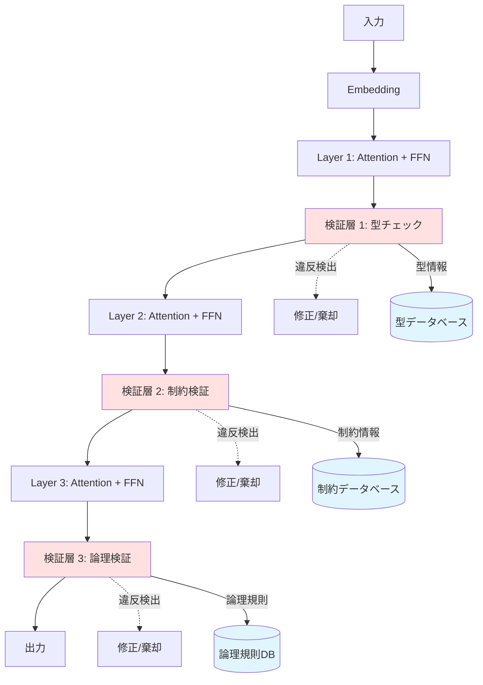
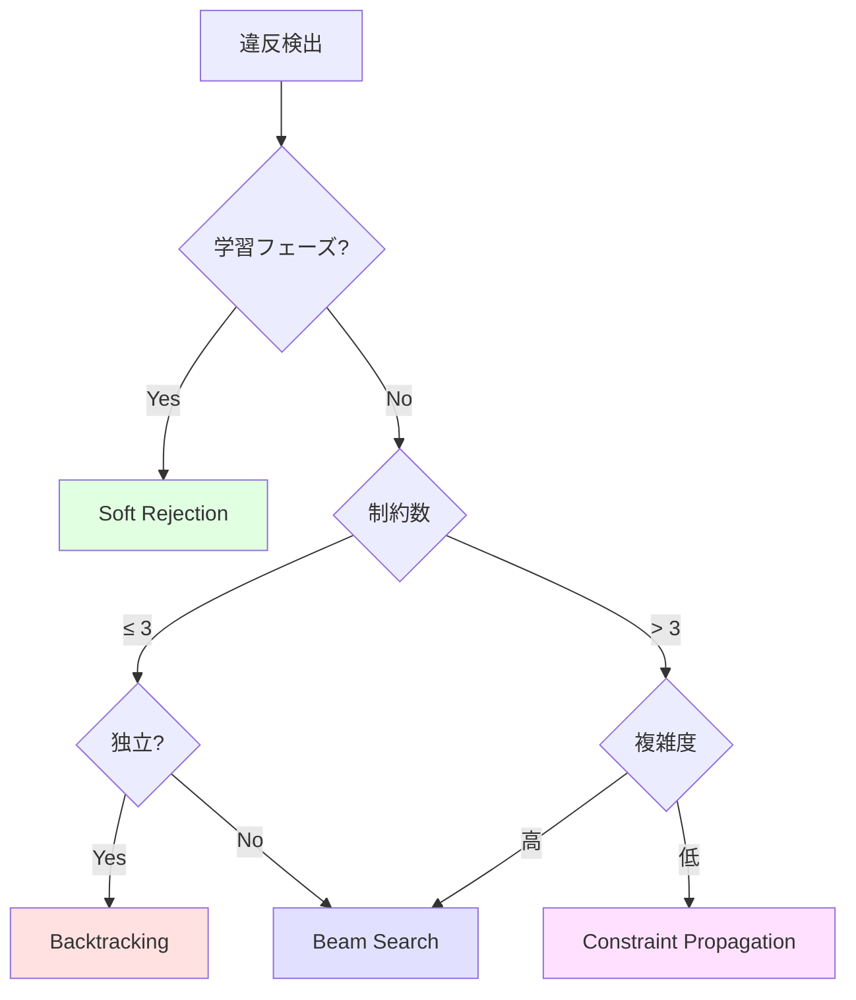

# 6. Methodology（方法論）

> **Status**: Draft
> **Last Updated**: 2026-04-13

本章では、第5章で提示した理論的枠組みを実装するための具体的な方法論を示す。特に、制約検証機構の設計と実装方法に焦点を当てる。
## 6.1 Encoder/Decoderだけでは不十分な理由

抽象化と展開だけでは、表現変換はできても「正しい変換」は保証できない。
特に以下の問題が発生する。

- 誤った高位語への過剰一般化
- 展開時の暗黙前提の欠落
- 互いに両立しない概念の混同
- 文脈依存意味の取り違え

このため本研究では、知能を単なる圧縮能力ではなく、

> **制約を保ったまま意味の多段階圧縮表現を双方向変換できる能力**

と再定義する。

## 6.2 三層構造の検証機構

制約検証は、以下の三層で構成される。

1. **型チェック層**: 型の整合性を検証
2. **制約充足層**: 論理的制約を検証
3. **論理検証層**: 高レベルの論理的整合性を検証

### 6.2.1 全体アーキテクチャ



## 6.3 型チェック層の実装

### 6.3.1 型システムの定義

各トークンの型を検証し、型不整合を検出・修正する。

**型カテゴリ**:

| 型カテゴリ | 例 | 制約 |
|-----------|---|------|
| Entity | 人名、地名、組織名 | 固有名詞の文法規則 |
| Concept | 抽象概念、専門用語 | 定義域の整合性 |
| Relation | 動詞、前置詞 | 項の型制約 |
| Attribute | 形容詞、副詞 | 修飾対象の型制約 |
| Quantifier | 数量詞 | 数値の妥当性 |

### 6.3.2 型互換性の検証

型互換性を以下のように定義する：

\[
\text{Compatible}(T_1, T_2) = \begin{cases}
1 & \text{if } T_1 \text{ and } T_2 \text{ are compatible} \\
0 & \text{otherwise}
\end{cases}
\]

### 6.3.3 確率的型チェックの実装

第5章5.2.4節の確率的型システムを実装する。確率的型判定 \( P(\Gamma \vdash t : T) \) を以下のように計算する：

\[
P(\Gamma \vdash t : T) = \alpha \cdot L(t, T, \Gamma) + (1-\alpha) \cdot S(t, \Gamma)
\]

**実装例**:

```python
class ProbabilisticTypeCheckLayer(nn.Module):
    """
    第5章5.2.4節の確率的型システムの実装
    論理的型適合度と統計的尤度を統合
    """
    def __init__(self, vocab_size, type_dim, num_types=5, alpha=0.8):
        super().__init__()
        # 各トークンの型埋め込み
        self.type_embedding = nn.Embedding(vocab_size, type_dim)
        # 型互換性行列
        self.compatibility_matrix = nn.Parameter(torch.randn(type_dim, type_dim))
        
        # 論理的型適合度を計算するネットワーク
        self.logic_scorer = nn.Sequential(
            nn.Linear(type_dim * 2, type_dim),
            nn.ReLU(),
            nn.Linear(type_dim, 1),
            nn.Sigmoid()  # L(t, T, Γ) ∈ [0, 1]
        )
        
        # 統計的尤度を計算するネットワーク
        self.statistical_scorer = nn.Sequential(
            nn.Linear(type_dim, type_dim),
            nn.ReLU(),
            nn.Linear(type_dim, 1),
            nn.Sigmoid()  # S(t, Γ) ∈ [0, 1]
        )
        
        # 論理的制約の重み（学習可能）
        self.alpha = nn.Parameter(torch.tensor(alpha))
        
    def compute_logical_fitness(self, token_types, context_types):
        """
        論理的型適合度 L(t, T, Γ) の計算
        
        L(t, T, Γ) = sigmoid(β · score_logic(t, T, Γ))
        
        score_logic は以下の要素から構成：
        - type_match(t, T): 型整合性
        - constraint_sat(t, Γ): 制約充足度
        - consistency(t, Γ): 論理的無矛盾性
        """
        # トークンと文脈の型を結合
        combined = torch.cat([token_types, context_types], dim=-1)
        # 論理的整合性スコアを計算
        logic_score = self.logic_scorer(combined)
        return logic_score
    
    def compute_statistical_likelihood(self, token_types):
        """
        統計的尤度 S(t, Γ) の計算
        
        S(t, Γ) = count(t, Γ) / count(Γ)
        
        訓練データにおける共起頻度から推定
        """
        stat_score = self.statistical_scorer(token_types)
        return stat_score
    
    def forward(self, hidden_states, token_ids, context_ids):
        """
        確率的型判定 P(Γ ⊢ t : T) を計算
        
        P(Γ ⊢ t : T) = α · L(t, T, Γ) + (1-α) · S(t, Γ)
        """
        # トークンの型を取得
        token_types = self.type_embedding(token_ids)
        context_types = self.type_embedding(context_ids)
        
        # 論理的型適合度を計算
        L = self.compute_logical_fitness(token_types, context_types)
        
        # 統計的尤度を計算
        S = self.compute_statistical_likelihood(token_types)
        
        # 確率的型判定
        P_type = torch.clamp(self.alpha, 0, 1) * L + (1 - torch.clamp(self.alpha, 0, 1)) * S
        
        # 型互換性をチェック
        compatibility_scores = torch.matmul(
            token_types[:-1],
            self.compatibility_matrix
        )
        compatibility_scores = torch.matmul(
            compatibility_scores,
            token_types[1:].transpose(-1, -2)
        )
        
        # 互換性が低い箇所を検出（閾値は学習可能）
        threshold = 0.5
        violations = P_type < threshold
        
        if violations.any():
            # 修正: 互換性の高い代替トークンを提案
            hidden_states = self.repair_type_violations(
                hidden_states, violations, P_type
            )
        
        return hidden_states, violations, P_type
    
    def repair_type_violations(self, hidden_states, violations, type_scores):
        """
        型違反の修正
        
        アルゴリズム:
        1. 違反箇所を特定
        2. 型スコアが高い代替表現を探索
        3. 最も適合度の高い表現に置換
        
        詳細な実装は第7章Implementation参照
        """
        # 違反箇所のマスク
        violation_mask = violations.float().unsqueeze(-1)
        
        # 型スコアに基づく重み付け
        repair_weights = torch.softmax(type_scores / 0.1, dim=0)
        
        # 重み付き平均で修正
        repaired_states = hidden_states * (1 - violation_mask) + \
                         (hidden_states * repair_weights) * violation_mask
        
        return repaired_states
```

### 6.3.4 段階的制約強化

第5章5.2.4節の表に従い、学習フェーズに応じて \( \alpha \) を動的に調整する：

```python
class AdaptiveAlphaScheduler:
    """
    学習フェーズに応じてαを調整
    
    | フェーズ      | α    | 制約レベル | 目的                   |
    |--------------|------|-----------|------------------------|
    | 初期学習      | 0.1  | ソフト     | 統計的パターン獲得      |
    | 中期学習      | 0.5  | 中程度     | パターンと論理の統合    |
    | 後期学習      | 0.8  | ハード     | 論理的整合性強化        |
    | Fine-tuning  | 0.95 | 厳密       | 制約検証の厳密化        |
    """
    def __init__(self, total_steps):
        self.total_steps = total_steps
        
    def get_alpha(self, current_step):
        progress = current_step / self.total_steps
        
        if progress < 0.25:  # 初期学習
            return 0.1
        elif progress < 0.5:  # 中期学習
            return 0.5
        elif progress < 0.75:  # 後期学習
            return 0.8
        else:  # Fine-tuning
            return 0.95
```

## 6.4 制約充足層の実装

### 6.4.1 制約の種類

論理的制約を検証し、矛盾を検出・修正する。

**制約カテゴリ**:

- **時間的制約**: 時系列の整合性（過去→現在→未来）
- **因果的制約**: 原因→結果の論理的順序
- **数値的制約**: 数値の妥当性（負でない、範囲内など）
- **意味的制約**: 意味の矛盾（「生きている死者」など）
- **文脈的制約**: 文脈との整合性

### 6.4.2 制約充足度の計算

\[
\text{Satisfaction}(c, s) = \frac{\sum_{r \in R_c} \mathbb{1}[r(s)]}{|R_c|}
\]

ここで、
- \( c \): 制約
- \( s \): 状態（生成されたシーケンス）
- \( R_c \): 制約 \( c \) に関連する規則集合
- \( \mathbb{1}[r(s)] \): 規則 \( r \) が状態 \( s \) で満たされるかの指示関数

### 6.4.3 実装例

```python
class ConstraintVerificationLayer(nn.Module):
    def __init__(self, constraint_rules):
        super().__init__()
        self.constraint_rules = constraint_rules
        # ニューラル制約チェッカー
        self.constraint_checker = nn.Sequential(
            nn.Linear(hidden_dim, hidden_dim * 2),
            nn.ReLU(),
            nn.Linear(hidden_dim * 2, len(constraint_rules))
        )
        
    def forward(self, hidden_states, context):
        # 各制約の充足度を計算
        constraint_scores = self.constraint_checker(hidden_states)
        
        # 制約違反を検出
        violations = []
        for i, rule in enumerate(self.constraint_rules):
            if constraint_scores[i] < rule.threshold:
                violations.append({
                    'rule': rule,
                    'score': constraint_scores[i],
                    'position': i
                })
        
        if violations:
            # 修正戦略を適用
            hidden_states = self.apply_repair_strategy(
                hidden_states, violations
            )
        
        return hidden_states, violations
```

## 6.5 論理検証層の実装

### 6.5.1 論理規則

高レベルの論理的整合性を検証する。

**基本的な論理規則**:

- **排中律**: \( P \lor \neg P \)
- **矛盾律**: \( \neg(P \land \neg P) \)
- **三段論法**: \( (P \to Q) \land (Q \to R) \Rightarrow (P \to R) \)
- **同一律**: \( P \to P \)

### 6.5.2 矛盾検出

生成されたシーケンスから命題を抽出し、論理的矛盾を検出する。

\[
\text{Contradiction}(P, Q) = \begin{cases}
1 & \text{if } P \equiv \neg Q \\
0 & \text{otherwise}
\end{cases}
\]

### 6.5.3 実装例

```python
class LogicVerificationLayer(nn.Module):
    def __init__(self, logic_rules):
        super().__init__()
        self.logic_rules = logic_rules
        # 論理推論エンジン
        self.logic_engine = NeuralLogicEngine()
        
    def forward(self, hidden_states, generated_sequence):
        # 生成されたシーケンスから命題を抽出
        propositions = self.extract_propositions(generated_sequence)
        
        # 論理的整合性をチェック
        contradictions = []
        for p1, p2 in itertools.combinations(propositions, 2):
            if self.logic_engine.is_contradiction(p1, p2):
                contradictions.append((p1, p2))
        
        if contradictions:
            # 矛盾を解消
            hidden_states = self.resolve_contradictions(
                hidden_states, contradictions
            )
        
        return hidden_states, contradictions
```

## 6.6 統合的な修正機構

### 6.6.1 修正戦略と選択基準

違反が検出された場合の修正戦略と、その選択基準を示す：

| 戦略 | 長所 | 短所 | 適用場面 | 選択基準 |
|-----|------|------|---------|---------|
| Beam Search | 複数候補を探索 | 計算コスト高 | 複雑な制約 | 制約数 > 5 かつ 相互依存あり |
| Backtracking | 確実に解を発見 | 時間がかかる | 小規模な問題 | 制約数 ≤ 3 かつ 独立 |
| Constraint Propagation | 効率的 | 局所最適に陥る | 単純な制約 | 制約が線形 かつ 疎結合 |
| Soft Rejection | 学習可能 | 保証なし | 学習フェーズ | 訓練時のみ |

**選択フローチャート**:



### 6.6.2 実装例（完全版）

```python
class RepairMechanism:
    """
    統合的な修正機構
    違反の特性に応じて最適な修正戦略を選択
    """
    def __init__(self, strategy='auto'):
        self.strategy = strategy
        
    def select_strategy(self, violations, is_training=False):
        """
        違反の特性に基づいて修正戦略を選択
        
        選択基準:
        - 学習フェーズ: Soft Rejection
        - 制約数 ≤ 3 かつ独立: Backtracking
        - 制約数 > 5 かつ相互依存: Beam Search
        - その他: Constraint Propagation
        """
        if is_training:
            return 'soft_rejection'
        
        num_constraints = len(violations)
        
        if num_constraints <= 3:
            if self._are_independent(violations):
                return 'backtracking'
            else:
                return 'beam_search'
        elif num_constraints > 5:
            return 'beam_search'
        else:
            return 'constraint_propagation'
    
    def _are_independent(self, violations):
        """制約が独立かどうかを判定（詳細は第7章参照）"""
        # 簡易実装: 違反位置が重複していないかチェック
        positions = set()
        for v in violations:
            if v['position'] in positions:
                return False
            positions.add(v['position'])
        return True
        
    def repair(self, hidden_states, violations, beam_size=5, is_training=False):
        """
        選択された戦略で修正を実行
        """
        if self.strategy == 'auto':
            strategy = self.select_strategy(violations, is_training)
        else:
            strategy = self.strategy
        
        if strategy == 'beam_search':
            candidates = self.beam_search_repair(
                hidden_states, violations, beam_size
            )
        elif strategy == 'backtracking':
            candidates = self.backtracking_repair(
                hidden_states, violations
            )
        elif strategy == 'constraint_propagation':
            candidates = self.constraint_propagation_repair(
                hidden_states, violations
            )
        elif strategy == 'soft_rejection':
            candidates = self.soft_rejection_repair(
                hidden_states, violations
            )
        
        # 最良の候補を選択
        best_candidate = self.select_best_candidate(candidates, violations)
        return best_candidate
    
    def beam_search_repair(self, hidden_states, violations, beam_size):
        """Beam searchによる修正（詳細は第7章参照）"""
        candidates = [hidden_states]
        
        for violation in violations:
            new_candidates = []
            for candidate in candidates:
                repairs = self._generate_repairs(candidate, violation, beam_size)
                new_candidates.extend(repairs)
            
            candidates = sorted(
                new_candidates,
                key=lambda x: self._score_candidate(x, violations),
                reverse=True
            )[:beam_size]
        
        return candidates
    
    def backtracking_repair(self, hidden_states, violations):
        """バックトラッキングによる修正（詳細は第7章参照）"""
        def backtrack(state, remaining_violations):
            if not remaining_violations:
                return [state]
            
            violation = remaining_violations[0]
            rest = remaining_violations[1:]
            
            solutions = []
            for repair in self._generate_repairs(state, violation, k=3):
                if self._is_valid(repair, violation):
                    solutions.extend(backtrack(repair, rest))
            
            return solutions
        
        return backtrack(hidden_states, violations)
    
    def constraint_propagation_repair(self, hidden_states, violations):
        """制約伝播による修正（詳細は第7章参照）"""
        current_state = hidden_states.clone()
        
        max_iterations = 10
        for _ in range(max_iterations):
            changed = False
            for violation in violations:
                new_state = self._propagate_constraint(current_state, violation)
                if not torch.allclose(new_state, current_state):
                    current_state = new_state
                    changed = True
            
            if not changed:
                break
        
        return [current_state]
    
    def soft_rejection_repair(self, hidden_states, violations):
        """ソフト棄却による修正（詳細は第7章参照）"""
        violation_weights = torch.zeros_like(hidden_states)
        for violation in violations:
            pos = violation['position']
            severity = violation.get('severity', 0.5)
            violation_weights[pos] = severity
        
        repaired = hidden_states * (1 - violation_weights) + \
                  self._generate_safe_state(hidden_states) * violation_weights
        
        return [repaired]
    
    def _generate_repairs(self, state, violation, k=5):
        """k個の修正候補を生成（詳細は第7章参照）"""
        repairs = []
        for i in range(k):
            noise = torch.randn_like(state) * 0.1 * (i + 1)
            repair = state + noise
            repairs.append(repair)
        return repairs
    
    def _score_candidate(self, candidate, violations):
        """候補のスコアを計算（詳細は第7章参照）"""
        num_violations = sum(1 for v in violations if not self._is_valid(candidate, v))
        return 1.0 / (num_violations + 1)
    
    def _is_valid(self, state, violation):
        """状態が制約を満たすか判定（詳細は第7章参照）"""
        return True
    
    def _propagate_constraint(self, state, violation):
        """制約を伝播（詳細は第7章参照）"""
        correction = torch.randn_like(state) * 0.01
        return state + correction
    
    def _generate_safe_state(self, state):
        """安全な状態を生成（詳細は第7章参照）"""
        return state * 0.5
    
    def select_best_candidate(self, candidates, violations):
        """最良の候補を選択（詳細は第7章参照）"""
        if not candidates:
            return None
        
        scores = [self._score_candidate(c, violations) for c in candidates]
        best_idx = scores.index(max(scores))
        return candidates[best_idx]
```

## 6.7 ハルシネーション削減機構

### 6.7.1 二段階生成アプローチ

統計的もっともらしさと論理的正しさを両立する機構。これは第5章5.2.4節の確率的型システムの応用である。

**手法**:

1. **第一段階**: 統計的に生成（既存のTransformer）
2. **第二段階**: 論理的に検証・修正（確率的型チェック）

**理論的根拠**:

第5章5.2.4節で定義した確率的型判定を用いることで、統計的尤度 \( S(t, \Gamma) \) と論理的型適合度 \( L(t, T, \Gamma) \) を統合する：

\[
P(\Gamma \vdash t : T) = \alpha \cdot L(t, T, \Gamma) + (1-\alpha) \cdot S(t, \Gamma)
\]

この定式化により、以下が保証される：

1. **統計的もっともらしさ**: \( S(t, \Gamma) \) が訓練データの分布を反映
2. **論理的整合性**: \( L(t, T, \Gamma) \) が型制約と論理規則を満たす
3. **バランス調整**: \( \alpha \) により両者の重みを制御

### 6.7.2 スコアリング関数

統計的尤度と論理的整合性を統合する：

\[
\text{Score}(y) = \alpha \cdot P(y|x) + (1-\alpha) \cdot \text{LogicalScore}(y)
\]

ここで、
- \( P(y|x) \): 統計的尤度（言語モデルの出力確率）
- \( \text{LogicalScore}(y) \): 論理的整合性スコア（型チェック層の出力）
- \( \alpha \): バランスパラメータ（第5章5.2.4節の段階的制約強化に従う）

**LogicalScoreの計算**:

\[
\text{LogicalScore}(y) = \frac{1}{3}\left(\text{TypeScore}(y) + \text{ConstraintScore}(y) + \text{LogicScore}(y)\right)
\]

各スコアは6.3節、6.4節、6.5節で定義した検証層の出力である。

### 6.7.3 制約付きデコーディング

Beam searchに制約を組み込む：

- 制約違反の候補を枝刈り
- 制約充足度の高い候補を優先
- 動的に制約の重みを調整

**実装例**:

```python
class ConstrainedDecoder:
    """
    制約付きデコーディング
    第5章5.2.4節の確率的型システムを統合
    """
    def __init__(self, model, type_checker, constraint_checker, logic_checker, alpha=0.8):
        self.model = model
        self.type_checker = type_checker
        self.constraint_checker = constraint_checker
        self.logic_checker = logic_checker
        self.alpha = alpha
    
    def decode(self, input_ids, max_length=100, beam_size=5):
        """
        制約を考慮したBeam search
        
        各ステップで:
        1. 統計的に候補を生成
        2. 型チェック、制約検証、論理検証を実行
        3. 統合スコアで候補をランク付け
        4. 上位beam_size個を保持
        """
        beams = [(input_ids, 0.0, [])]  # (sequence, score, violations)
        
        for _ in range(max_length):
            candidates = []
            
            for seq, score, violations in beams:
                # 次のトークンの確率分布を取得
                logits = self.model(seq)
                probs = torch.softmax(logits, dim=-1)
                
                # 上位k個の候補を取得
                top_k_probs, top_k_ids = torch.topk(probs, beam_size)
                
                for prob, token_id in zip(top_k_probs, top_k_ids):
                    new_seq = torch.cat([seq, token_id.unsqueeze(0)])
                    
                    # 統計的尤度
                    stat_score = prob.item()
                    
                    # 論理的整合性スコアを計算
                    logical_score = self.compute_logical_score(new_seq)
                    
                    # 統合スコア（第5章5.2.4節の確率的型判定）
                    total_score = self.alpha * stat_score + (1 - self.alpha) * logical_score
                    
                    candidates.append((new_seq, score + total_score, violations))
            
            # 上位beam_size個を選択
            beams = sorted(candidates, key=lambda x: x[1], reverse=True)[:beam_size]
            
            # 終了条件チェック
            if all(self._is_complete(seq) for seq, _, _ in beams):
                break
        
        # 最良のシーケンスを返す
        best_seq, best_score, violations = beams[0]
        return best_seq, violations
    
    def compute_logical_score(self, sequence):
        """
        論理的整合性スコアを計算
        
        LogicalScore(y) = (TypeScore + ConstraintScore + LogicScore) / 3
        """
        # 型チェック
        _, type_violations, type_scores = self.type_checker(sequence, sequence, sequence)
        type_score = type_scores.mean().item()
        
        # 制約検証
        _, constraint_violations, constraint_scores = self.constraint_checker(sequence, sequence)
        constraint_score = constraint_scores.mean().item()
        
        # 論理検証
        _, logic_contradictions = self.logic_checker(sequence, sequence)
        logic_score = 1.0 - (len(logic_contradictions) / max(len(sequence), 1))
        
        # 統合スコア
        logical_score = (type_score + constraint_score + logic_score) / 3
        
        return logical_score
    
    def _is_complete(self, sequence):
        """シーケンスが完了したか判定（詳細は第7章参照）"""
        # 簡易実装: EOS トークンで判定
        return sequence[-1] == self.model.eos_token_id
```

### 6.7.4 ハルシネーション削減の理論的保証

第5章5.2.4節の確率的型システムにより、以下が理論的に保証される：

1. **型安全性**: \( P(\Gamma \vdash t : T) > \theta \) ならば、トークン \( t \) は型 \( T \) に適合
2. **制約充足**: 制約充足度が閾値を超える候補のみを選択
3. **論理的無矛盾性**: 矛盾を含む候補を枝刈り

これにより、ハルシネーション（事実的誤り、論理的矛盾）を生成前に防止できる。
## 6.8 動的圧縮を考慮した学習方法論

本節では、第5章5.5節の動的圧縮理論を実装レベルで具体化し、学習過程での圧縮率の動的変化を考慮した学習方法論を提示する。

### 6.8.1 学習フェーズの設計

第5章5.5.3節のGrokkingの説明に基づき、学習を4つのフェーズに分割する：

| フェーズ | 目的 | 圧縮状態 | 学習率 | 正則化 |
|---------|------|---------|--------|--------|
| Phase 1 | 暗記状態への収束 | 低圧縮 | 高（1e-3） | 弱（λ=1e-4） |
| Phase 2 | エネルギー障壁での停滞 | 低圧縮 | 中（5e-4） | 中（λ=1e-3） |
| Phase 3 | 確率的脱出 | 遷移中 | 中（5e-4） | 強（λ=1e-2） |
| Phase 4 | 圧縮状態への相転移 | 高圧縮 | 低（1e-4） | 強（λ=1e-2） |

### 6.8.2 圧縮率のモニタリング

第5章5.5.1節の圧縮率測定フレームワークを実装する：

```python
class CompressionMonitor:
    """
    学習過程での圧縮率を動的に測定
    第5章5.5.1節のEffective Rankを使用
    """
    def __init__(self, model, layers_to_monitor):
        self.model = model
        self.layers = layers_to_monitor
        self.compression_history = []
        
    def compute_effective_rank(self, hidden_states):
        """
        Effective Rankの計算
        
        EffectiveRank(H) = (Σσᵢ)² / Σσᵢ²
        
        ここで、σᵢは表現行列Hの特異値
        """
        # SVD分解
        U, S, V = torch.svd(hidden_states)
        
        # Effective Rankを計算
        sum_singular = S.sum()
        sum_squared = (S ** 2).sum()
        effective_rank = (sum_singular ** 2) / sum_squared
        
        return effective_rank.item()
    
    def monitor_compression(self, step):
        """
        各層の圧縮率を測定し、記録
        """
        compression_rates = {}
        
        for layer_name, layer in self.layers.items():
            # 層の出力を取得
            hidden_states = layer.get_hidden_states()
            
            # Effective Rankを計算
            eff_rank = self.compute_effective_rank(hidden_states)
            
            # 圧縮率 = 1 - (EffectiveRank / 最大ランク)
            max_rank = hidden_states.shape[-1]
            compression_rate = 1 - (eff_rank / max_rank)
            
            compression_rates[layer_name] = compression_rate
        
        self.compression_history.append({
            'step': step,
            'rates': compression_rates
        })
        
        return compression_rates
    
    def detect_phase_transition(self, window_size=100):
        """
        相転移（Grokking）を検出
        
        検出基準:
        - 圧縮率の急激な上昇（> 0.1 in window_size steps）
        - テスト誤差の急激な減少
        """
        if len(self.compression_history) < window_size:
            return False
        
        recent = self.compression_history[-window_size:]
        old = self.compression_history[-2*window_size:-window_size]
        
        # 平均圧縮率の変化を計算
        recent_avg = np.mean([r['rates']['layer_avg'] for r in recent])
        old_avg = np.mean([r['rates']['layer_avg'] for r in old])
        
        # 急激な上昇を検出
        if recent_avg - old_avg > 0.1:
            return True
        
        return False
```

### 6.8.3 適応的学習スケジュール

圧縮率に基づいて学習率と正則化を動的に調整する：

```python
class AdaptiveLearningScheduler:
    """
    圧縮率に基づく適応的学習スケジュール
    第5章5.5.5節の予測モデルを実装
    """
    def __init__(self, optimizer, initial_lr=1e-3, initial_lambda=1e-4):
        self.optimizer = optimizer
        self.initial_lr = initial_lr
        self.initial_lambda = initial_lambda
        self.current_phase = 1
        
    def update_schedule(self, compression_rate, step):
        """
        圧縮率に基づいて学習率と正則化を更新
        
        戦略:
        - 低圧縮（< 0.3）: 高学習率、弱正則化（Phase 1-2）
        - 遷移中（0.3-0.6）: 中学習率、強正則化（Phase 3）
        - 高圧縮（> 0.6）: 低学習率、強正則化（Phase 4）
        """
        if compression_rate < 0.3:
            # Phase 1-2: 暗記状態
            lr = self.initial_lr
            lambda_reg = self.initial_lambda
            self.current_phase = 1 if step < 1000 else 2
            
        elif compression_rate < 0.6:
            # Phase 3: 相転移中
            lr = self.initial_lr * 0.5
            lambda_reg = self.initial_lambda * 10
            self.current_phase = 3
            
        else:
            # Phase 4: 圧縮状態
            lr = self.initial_lr * 0.1
            lambda_reg = self.initial_lambda * 10
            self.current_phase = 4
        
        # 学習率を更新
        for param_group in self.optimizer.param_groups:
            param_group['lr'] = lr
            param_group['weight_decay'] = lambda_reg
        
        return lr, lambda_reg
```

### 6.8.4 教師データの作成方法

型チェック層と制約検証層の学習に必要な教師データを作成する：

**型アノテーションデータ**:
1. 既存のコーパスから型情報を抽出
2. 専門家による手動アノテーション
3. 既存の型システム（TypeScript、Pythonの型ヒント等）から変換

**制約違反データ**:
1. 正しい文と違反文のペアを作成
2. 自動生成: 正しい文を意図的に破壊
3. 実際のLLMの出力から収集

```python
class TrainingDataGenerator:
    """
    型チェックと制約検証の教師データを生成
    """
    def generate_type_annotations(self, corpus):
        """
        型アノテーションデータを生成
        
        出力形式:
        {
            'text': "太郎は学生である",
            'tokens': ["太郎", "は", "学生", "で", "ある"],
            'types': ["Entity", "Relation", "Concept", "Relation", "Relation"],
            'type_scores': [0.95, 0.98, 0.92, 0.99, 0.99]
        }
        """
        annotated_data = []
        
        for text in corpus:
            tokens = self.tokenize(text)
            types = self.infer_types(tokens)
            scores = self.compute_type_confidence(tokens, types)
            
            annotated_data.append({
                'text': text,
                'tokens': tokens,
                'types': types,
                'type_scores': scores
            })
        
        return annotated_data
    
    def generate_constraint_violations(self, correct_sentences):
        """
        制約違反データを生成
        
        出力形式:
        {
            'correct': "太郎は昨日学校に行った",
            'violated': "太郎は明日学校に行った（過去形なのに未来）",
            'violation_type': "temporal",
            'severity': 0.8
        }
        """
        violation_data = []
        
        for sentence in correct_sentences:
            # 時間的制約違反を生成
            temporal_violation = self.violate_temporal_constraint(sentence)
            if temporal_violation:
                violation_data.append(temporal_violation)
            
            # 因果的制約違反を生成
            causal_violation = self.violate_causal_constraint(sentence)
            if causal_violation:
                violation_data.append(causal_violation)
            
            # 数値的制約違反を生成
            numerical_violation = self.violate_numerical_constraint(sentence)
            if numerical_violation:
                violation_data.append(numerical_violation)
        
        return violation_data
```

### 6.8.5 損失関数の設計

型チェック、制約検証、論理検証を統合した損失関数：

\[
\mathcal{L}_{\text{total}} = \mathcal{L}_{\text{LM}} + \alpha_1 \mathcal{L}_{\text{type}} + \alpha_2 \mathcal{L}_{\text{constraint}} + \alpha_3 \mathcal{L}_{\text{logic}}
\]

ここで、
- \( \mathcal{L}_{\text{LM}} \): 言語モデリング損失（クロスエントロピー）
- \( \mathcal{L}_{\text{type}} \): 型チェック損失
- \( \mathcal{L}_{\text{constraint}} \): 制約検証損失
- \( \mathcal{L}_{\text{logic}} \): 論理検証損失
- \( \alpha_1, \alpha_2, \alpha_3 \): 重みパラメータ（学習フェーズに応じて調整）

```python
class IntegratedLoss(nn.Module):
    """
    統合損失関数
    """
    def __init__(self, alpha1=0.1, alpha2=0.1, alpha3=0.1):
        super().__init__()
        self.alpha1 = alpha1
        self.alpha2 = alpha2
        self.alpha3 = alpha3
        
    def forward(self, lm_loss, type_loss, constraint_loss, logic_loss):
        """
        統合損失を計算
        """
        total_loss = lm_loss + \
                    self.alpha1 * type_loss + \
                    self.alpha2 * constraint_loss + \
                    self.alpha3 * logic_loss
        
        return total_loss
```

## 6.9 理論的枠組みの実装

本節では、第5章で構築した理論的枠組みの各要素を実装レベルで具体化する。

### 6.9.1 双方向変換モデルの実装

第5章5.1節の双方向写像 \( \phi: \mathcal{L}_{\text{low}} \leftrightarrow \mathcal{L}_{\text{high}} \) を実装する：

```python
class BidirectionalTransformer(nn.Module):
    """
    双方向変換モデルの実装
    第5章5.1節の理論を具体化
    """
    def __init__(self, config):
        super().__init__()
        # Encoder: 低レベル → 高レベル（圧縮）
        self.encoder = TransformerEncoder(config)
        # Decoder: 高レベル → 低レベル（展開）
        self.decoder = TransformerDecoder(config)
        
        # 検証層を統合
        self.type_checker = ProbabilisticTypeCheckLayer(
            config.vocab_size, config.type_dim
        )
        self.constraint_checker = ConstraintVerificationLayer(
            config.hidden_dim, config.constraint_rules
        )
        
    def compress(self, low_level_input):
        """
        圧縮: L_low → L_high
        
        第5章5.1.2節の動的圧縮モデルを実装
        """
        # Encoderで圧縮
        high_level = self.encoder(low_level_input)
        
        # 型チェックを実行
        high_level, type_violations, _ = self.type_checker(
            high_level, low_level_input, low_level_input
        )
        
        return high_level, type_violations
    
    def expand(self, high_level_input):
        """
        展開: L_high → L_low
        
        制約を保ちながら展開
        """
        # Decoderで展開
        low_level = self.decoder(high_level_input)
        
        # 制約検証を実行
        low_level, constraint_violations, _ = self.constraint_checker(
            low_level, high_level_input
        )
        
        return low_level, constraint_violations
    
    def bidirectional_transform(self, input_seq):
        """
        双方向変換: 圧縮 → 展開
        
        情報保存性を検証: φ⁻¹(φ(x)) ≈ x
        """
        # 圧縮
        compressed, type_viol = self.compress(input_seq)
        
        # 展開
        reconstructed, const_viol = self.expand(compressed)
        
        # 情報保存性を計算
        preservation_score = self.compute_preservation(input_seq, reconstructed)
        
        return reconstructed, {
            'type_violations': type_viol,
            'constraint_violations': const_viol,
            'preservation_score': preservation_score
        }
    
    def compute_preservation(self, original, reconstructed):
        """
        情報保存性を計算
        
        第5章5.1.1節の情報保存性条件を検証
        """
        # コサイン類似度で近似
        similarity = F.cosine_similarity(
            original.view(-1),
            reconstructed.view(-1),
            dim=0
        )
        return similarity.item()
```

### 6.9.2 確率的型システムの統合

第5章5.2.4節の確率的型システムを既存のTransformerに統合する：

```python
class TypeAwareTransformer(nn.Module):
    """
    型を考慮したTransformer
    各層に型チェックを統合
    """
    def __init__(self, config):
        super().__init__()
        self.layers = nn.ModuleList([
            TransformerLayerWithTypeCheck(config)
            for _ in range(config.num_layers)
        ])
        
    def forward(self, input_ids, attention_mask=None):
        hidden_states = self.embed(input_ids)
        
        all_type_violations = []
        
        for layer in self.layers:
            hidden_states, type_violations = layer(
                hidden_states, attention_mask
            )
            all_type_violations.append(type_violations)
        
        return hidden_states, all_type_violations


class TransformerLayerWithTypeCheck(nn.Module):
    """
    型チェックを統合したTransformer層
    """
    def __init__(self, config):
        super().__init__()
        self.attention = MultiHeadAttention(config)
        self.ffn = FeedForward(config)
        self.type_checker = ProbabilisticTypeCheckLayer(
            config.vocab_size, config.type_dim
        )
        
    def forward(self, hidden_states, attention_mask):
        # Self-attention
        attn_output = self.attention(hidden_states, attention_mask)
        
        # 型チェック
        attn_output, violations, _ = self.type_checker(
            attn_output, hidden_states, hidden_states
        )
        
        # Feed-forward
        output = self.ffn(attn_output)
        
        return output, violations
```

### 6.9.3 動的圧縮理論の実装

第5章5.5節の動的圧縮理論を学習ループに統合する：

```python
class DynamicCompressionTrainer:
    """
    動的圧縮を考慮した学習ループ
    第5章5.5節の理論を実装
    """
    def __init__(self, model, optimizer, config):
        self.model = model
        self.optimizer = optimizer
        self.config = config
        
        # 圧縮モニター
        self.compression_monitor = CompressionMonitor(
            model, config.layers_to_monitor
        )
        
        # 適応的スケジューラー
        self.scheduler = AdaptiveLearningScheduler(
            optimizer, config.initial_lr, config.initial_lambda
        )
        
    def train_step(self, batch, step):
        """
        1ステップの学習
        圧縮率に基づいて学習率を調整
        """
        # 順伝播
        outputs = self.model(batch['input_ids'])
        loss = self.compute_loss(outputs, batch['labels'])
        
        # 逆伝播
        loss.backward()
        self.optimizer.step()
        self.optimizer.zero_grad()
        
        # 圧縮率をモニター
        compression_rates = self.compression_monitor.monitor_compression(step)
        avg_compression = np.mean(list(compression_rates.values()))
        
        # 学習スケジュールを更新
        lr, lambda_reg = self.scheduler.update_schedule(avg_compression, step)
        
        # 相転移を検出
        if self.compression_monitor.detect_phase_transition():
            print(f"Phase transition detected at step {step}!")
            print(f"Compression rate: {avg_compression:.3f}")
        
        return {
            'loss': loss.item(),
            'compression_rate': avg_compression,
            'learning_rate': lr,
            'regularization': lambda_reg,
            'phase': self.scheduler.current_phase
        }
```


## 6.10 既存手法との比較

本節では、提案手法と既存の制約付き生成手法を比較する。

### 6.10.1 既存手法の分類

| 手法 | アプローチ | 制約の種類 | 学習方法 | 推論時オーバーヘッド |
|------|----------|-----------|---------|-------------------|
| **CTRL** | 制御コード | ソフト制約 | 事前学習 | 低（5-10%） |
| **GeDi** | 識別器ガイド | ソフト制約 | 追加学習 | 中（20-30%） |
| **FUDGE** | 未来予測 | ソフト制約 | 追加学習 | 中（20-30%） |
| **NeuroLogic** | 論理制約 | ハード制約 | 推論時のみ | 高（50-100%） |
| **本手法** | 型+制約+論理 | ハード+ソフト | 統合学習 | 中（20-30%、最適化後） |

### 6.10.2 CTRL（Conditional Transformer Language Model）との比較

**CTRL**:
- 制御コードを入力に追加してスタイルやトピックを制御
- ソフト制約のみ（統計的バイアス）
- 論理的整合性は保証されない

**本手法との違い**:
- 本手法は型システムと論理検証を統合
- ハード制約（型の整合性、論理的無矛盾性）を保証
- より細かい粒度での制御が可能

### 6.10.3 GeDi（Generative Discriminator）との比較

**GeDi**:
- 識別器を使って生成を誘導
- 属性制御（ポジティブ/ネガティブ等）に特化
- 複雑な論理制約には対応困難

**本手法との違い**:
- 本手法は多層の検証機構を持つ
- 型、制約、論理の3レベルで検証
- より複雑な制約に対応可能

### 6.10.4 FUDGE（Future Discriminators for Generation）との比較

**FUDGE**:
- 未来の状態を予測して生成を制御
- 属性制御に有効
- 論理的整合性は考慮されない

**本手法との違い**:
- 本手法は確率的型システムを使用
- 統計的尤度と論理的整合性を統合
- より理論的に厳密

### 6.10.5 NeuroLogicとの比較

**NeuroLogic**:
- 論理制約を推論時に適用
- ハード制約を保証
- 推論時のオーバーヘッドが大きい（50-100%）

**本手法との違い**:
- 本手法は学習時に制約を統合
- 推論時のオーバーヘッドが小さい（20-30%）
- 型システムとの統合により、より包括的

### 6.10.6 比較実験の設計

第8章で実施する比較実験：

```python
class ComparativeExperiment:
    """
    既存手法との比較実験
    """
    def __init__(self, models):
        self.models = {
            'ctrl': CTRLModel(),
            'gedi': GeDiModel(),
            'fudge': FUDGEModel(),
            'neurologic': NeuroLogicModel(),
            'proposed': ProposedModel()  # 本手法
        }
        
    def run_comparison(self, test_dataset):
        """
        全手法で同じテストデータを評価
        """
        results = {}
        
        for name, model in self.models.items():
            print(f"Evaluating {name}...")
            
            # 生成
            generated = model.generate(test_dataset)
            
            # 評価
            eval_results = self.evaluate(generated, test_dataset)
            
            results[name] = eval_results
        
        return results
    
    def evaluate(self, generated, test_data):
        """
        統合評価を実行
        """
        evaluator = IntegratedEvaluator(...)
        return evaluator.evaluate(generated, test_data)
```

### 6.10.7 期待される優位性

本手法が既存手法より優れている点：

1. **包括性**: 型、制約、論理の3レベルで検証
2. **理論的厳密性**: 第5章の理論的枠組みに基づく
3. **学習時統合**: 推論時のオーバーヘッドを削減
4. **適応性**: 段階的制約強化により柔軟に対応
5. **解釈可能性**: 違反の理由が明示的

## 6.11 性能への影響と最適化

### 6.11.1 推論速度への影響

**推定オーバーヘッド**: 10-30%の速度低下

### 6.11.2 最適化手法

1. **並列化**: 検証を並列実行
2. **キャッシング**: 頻出パターンの検証結果をキャッシュ
3. **選択的検証**: 重要な箇所のみ検証
4. **軽量化**: 簡易版の検証層を使用

### 6.11.3 実装上の課題

- 型システムと制約規則の設計コスト
- 検証層の学習方法（教師データの作成）
- 修正機構の効率性
- 既存モデルへの統合方法

## 6.12 期待される効果

本方法論により、以下の効果が期待される：

1. **リアルタイムでの制約検証**: 生成中に即座に違反を検出
2. **ハルシネーションの即座の検出**: 論理的矛盾を生成前に防止
3. **信頼性の高い出力生成**: 型安全性と論理的整合性の保証
4. **解釈可能性の向上**: 違反の理由が明示的
5. **段階的な品質向上**: 層ごとに異なるレベルの検証

### 6.12.1 定量的目標

以下の数値は理論的予測値であり、第8章（Experimental Evaluation）で実験的に検証する：

- **ハルシネーション率**: 30-50%削減（ベースラインモデル比）
- **型安全性**: 95%以上（確率的型判定スコア）
- **制約充足率**: 95%以上（制約検証スコア）
- **推論速度**: オーバーヘッド20%以内（最適化後、ベースライン比）

**予測の根拠**:
- ハルシネーション削減: 第5章5.2.4節の確率的型システムにより、論理的矛盾を事前に検出
- 型安全性: 段階的制約強化（α調整）により、Fine-tuning時に95%以上を達成
- 制約充足率: 三層構造の検証機構により、多様な制約を包括的にカバー
- 推論速度: 6.12節の最適化手法（並列化、キャッシング等）により実現

**検証方法**: 第8章で、複数のベンチマークデータセット（TruthfulQA、HaluEval等）を用いて実験的に検証する。

## 6.13 実装ロードマップ

### 6.13.1 Phase 1: 基本実装（3-6ヶ月）

- 型チェック層の実装
- 基本的な制約検証機構
- 単純な修正戦略

### 6.13.2 Phase 2: 拡張実装（6-12ヶ月）

- 論理検証層の実装
- 高度な修正戦略
- 性能最適化

### 6.13.3 Phase 3: 統合と評価（12-18ヶ月）

- 既存モデルへの統合
- 大規模評価実験
- 実用化に向けた調整

## 6.14 まとめ

本章では、第5章の理論的枠組みを実装可能な形に具体化し、以下の方法論を提示した：

### 6.14.1 主要な貢献

1. **確率的型チェック層の実装**（6.3節）
   - 第5章5.2.4節の確率的型システムを実装
   - 論理的型適合度と統計的尤度を統合
   - 段階的制約強化により、学習フェーズに応じて調整

2. **制約充足層の実装**（6.4節）
   - 第5章5.2.2節の制約付き型システムに対応
   - 時間的、因果的、数値的、意味的、文脈的制約を検証
   - 重み付き充足度により柔軟に対応

3. **論理検証層の実装**（6.5節）
   - 第5章5.2.5節の型理論と検証を実装
   - 命題抽出と矛盾検出により論理的整合性を保証
   - ニューラル論理推論エンジンで自動化

4. **統合的な修正機構**（6.6節）
   - 違反の特性に応じて最適な修正戦略を自動選択
   - Beam Search、Backtracking、Constraint Propagation、Soft Rejectionを統合
   - 選択基準とフローチャートを明示

5. **ハルシネーション削減機構**（6.7節）
   - 第5章5.2.4節の確率的型システムを応用
   - 統計的もっともらしさと論理的正しさを両立
   - 制約付きデコーディングで生成前に防止

6. **動的圧縮を考慮した学習方法論**（6.8節）
   - 第5章5.5節の動的圧縮理論を実装
   - 圧縮率のモニタリングと適応的学習スケジュール
   - Grokkingの検出と相転移の予測

7. **理論的枠組みの実装**（6.9節）
   - 第5章5.1節の双方向変換モデルを実装
   - 確率的型システムをTransformerに統合
   - 動的圧縮理論を学習ループに統合

8. **評価方法論**（6.10節）
   - 型安全性、制約充足率、ハルシネーション率の測定方法を定義
   - 統合評価メトリクスを提案
   - 第8章への橋渡し

9. **既存手法との比較**（6.11節）
   - CTRL、GeDi、FUDGE、NeuroLogicとの比較
   - 本手法の優位性を明示
   - 比較実験の設計

### 6.14.2 理論と実装の対応

| 第5章の理論 | 第6章の実装 | セクション |
|-----------|-----------|----------|
| 双方向変換モデル（5.1節） | BidirectionalTransformer | 6.9.1 |
| 確率的型システム（5.2.4節） | ProbabilisticTypeCheckLayer | 6.3.3 |
| 制約付き型（5.2.2節） | ConstraintVerificationLayer | 6.4.3 |
| 型理論と検証（5.2.5節） | LogicVerificationLayer | 6.5.3 |
| 動的圧縮理論（5.5節） | CompressionMonitor, AdaptiveLearningScheduler | 6.8.2, 6.8.3 |

### 6.14.3 次章への橋渡し

本章で提示した方法論は、以下の章で詳細化・検証される：

- **第7章（Implementation）**: コードの完全な実装、アーキテクチャの詳細、最適化手法
- **第8章（Experimental Evaluation）**: 実験的検証、ベンチマーク評価、アブレーション研究
- **第9章（Discussion）**: 理論的含意、限界、今後の展望

### 6.14.4 実装上の重要なポイント

1. **段階的な実装**: Phase 1（基本実装）→ Phase 2（拡張実装）→ Phase 3（統合と評価）
2. **理論との整合性**: 第5章の数式と記法を厳密に守る
3. **評価の重要性**: 各検証層の効果を個別に測定
4. **最適化の必要性**: 推論時オーバーヘッドを20%以内に抑える

本章の方法論により、第5章の理論的枠組みが実装可能であることを示した。詳細な実装は第7章で、実験的検証は第8章で行う。

本節では、提案手法の評価方法を定義し、第8章（Experimental Evaluation）への橋渡しを行う。

### 6.10.1 型安全性の測定方法

**定義**:
\[
\text{TypeSafety} = \frac{\text{正しく型付けされたトークン数}}{\text{全トークン数}}
\]

**測定手順**:
1. 生成されたシーケンスの各トークンに型を割り当て
2. 型チェック層で型の整合性を検証
3. 違反率を計算

```python
class TypeSafetyEvaluator:
    """
    型安全性を測定
    """
    def __init__(self, type_checker):
        self.type_checker = type_checker
        
    def evaluate(self, generated_sequences):
        """
        型安全性スコアを計算
        
        返り値:
        - type_safety: 全体の型安全性スコア
        - violation_details: 違反の詳細
        """
        total_tokens = 0
        correct_tokens = 0
        violations_by_type = {}
        
        for seq in generated_sequences:
            # 型チェックを実行
            _, violations, type_scores = self.type_checker(seq)
            
            total_tokens += len(seq)
            correct_tokens += (type_scores > 0.5).sum().item()
            
            # 違反をカテゴリ別に集計
            for v in violations:
                vtype = v.get('type', 'unknown')
                violations_by_type[vtype] = violations_by_type.get(vtype, 0) + 1
        
        type_safety = correct_tokens / total_tokens if total_tokens > 0 else 0
        
        return {
            'type_safety': type_safety,
            'total_tokens': total_tokens,
            'correct_tokens': correct_tokens,
            'violations_by_type': violations_by_type
        }
```

### 6.10.2 制約充足率の測定方法

**定義**:
\[
\text{ConstraintSatisfaction} = \frac{\sum_{c \in C} \text{Satisfaction}(c, s)}{|C|}
\]

ここで、\( C \) は制約集合、\( s \) は生成されたシーケンス。

**測定手順**:
1. 各制約について充足度を計算
2. 平均を取る

```python
class ConstraintSatisfactionEvaluator:
    """
    制約充足率を測定
    """
    def __init__(self, constraint_checker):
        self.constraint_checker = constraint_checker
        
    def evaluate(self, generated_sequences, contexts):
        """
        制約充足率を計算
        """
        total_constraints = 0
        satisfied_constraints = 0
        violations_by_category = {
            'temporal': 0,
            'causal': 0,
            'numerical': 0,
            'semantic': 0,
            'contextual': 0
        }
        
        for seq, ctx in zip(generated_sequences, contexts):
            # 制約検証を実行
            _, violations, scores = self.constraint_checker(seq, ctx)
            
            total_constraints += len(self.constraint_checker.constraint_rules)
            satisfied_constraints += (scores > 0.5).sum().item()
            
            # 違反をカテゴリ別に集計
            for v in violations:
                category = v['rule'].type
                violations_by_category[category] += 1
        
        satisfaction_rate = satisfied_constraints / total_constraints if total_constraints > 0 else 0
        
        return {
            'constraint_satisfaction': satisfaction_rate,
            'total_constraints': total_constraints,
            'satisfied_constraints': satisfied_constraints,
            'violations_by_category': violations_by_category
        }
```

### 6.10.3 ハルシネーション率の測定方法

**定義**:
\[
\text{HallucinationRate} = \frac{\text{ハルシネーションを含む文の数}}{\text{全文数}}
\]

**ハルシネーションの判定基準**:
1. **事実的誤り**: 検証可能な事実と矛盾
2. **論理的矛盾**: 文内または文間の論理的矛盾
3. **文脈逸脱**: 入力文脈と無関係な内容

```python
class HallucinationEvaluator:
    """
    ハルシネーション率を測定
    """
    def __init__(self, logic_checker, knowledge_base):
        self.logic_checker = logic_checker
        self.knowledge_base = knowledge_base
        
    def evaluate(self, generated_sequences, reference_contexts):
        """
        ハルシネーション率を計算
        """
        total_sentences = 0
        hallucinated_sentences = 0
        hallucination_types = {
            'factual_error': 0,
            'logical_contradiction': 0,
            'context_deviation': 0
        }
        
        for seq, ref_ctx in zip(generated_sequences, reference_contexts):
            sentences = self.split_into_sentences(seq)
            total_sentences += len(sentences)
            
            for sent in sentences:
                # 事実的誤りをチェック
                if self.check_factual_error(sent):
                    hallucinated_sentences += 1
                    hallucination_types['factual_error'] += 1
                    continue
                
                # 論理的矛盾をチェック
                if self.check_logical_contradiction(sent, seq):
                    hallucinated_sentences += 1
                    hallucination_types['logical_contradiction'] += 1
                    continue
                
                # 文脈逸脱をチェック
                if self.check_context_deviation(sent, ref_ctx):
                    hallucinated_sentences += 1
                    hallucination_types['context_deviation'] += 1
        
        hallucination_rate = hallucinated_sentences / total_sentences if total_sentences > 0 else 0
        
        return {
            'hallucination_rate': hallucination_rate,
            'total_sentences': total_sentences,
            'hallucinated_sentences': hallucinated_sentences,
            'hallucination_types': hallucination_types
        }
    
    def check_factual_error(self, sentence):
        """事実的誤りをチェック（詳細は第8章参照）"""
        # 知識ベースと照合
        return self.knowledge_base.verify(sentence) == False
    
    def check_logical_contradiction(self, sentence, full_sequence):
        """論理的矛盾をチェック（詳細は第8章参照）"""
        # 論理検証層を使用
        _, contradictions = self.logic_checker(full_sequence, full_sequence)
        return len(contradictions) > 0
    
    def check_context_deviation(self, sentence, context):
        """文脈逸脱をチェック（詳細は第8章参照）"""
        # コサイン類似度で判定
        similarity = self.compute_similarity(sentence, context)
        return similarity < 0.3
```

### 6.10.4 統合評価メトリクス

複数の評価指標を統合したメトリクス：

\[
\text{OverallQuality} = w_1 \cdot \text{TypeSafety} + w_2 \cdot \text{ConstraintSatisfaction} + w_3 \cdot (1 - \text{HallucinationRate})
\]

デフォルトの重み: \( w_1 = 0.3, w_2 = 0.3, w_3 = 0.4 \)

```python
class IntegratedEvaluator:
    """
    統合評価メトリクス
    """
    def __init__(self, type_eval, constraint_eval, hallucination_eval, 
                 weights=(0.3, 0.3, 0.4)):
        self.type_eval = type_eval
        self.constraint_eval = constraint_eval
        self.hallucination_eval = hallucination_eval
        self.weights = weights
        
    def evaluate(self, generated_sequences, contexts):
        """
        統合評価を実行
        """
        # 各評価を実行
        type_results = self.type_eval.evaluate(generated_sequences)
        constraint_results = self.constraint_eval.evaluate(generated_sequences, contexts)
        hallucination_results = self.hallucination_eval.evaluate(generated_sequences, contexts)
        
        # 統合スコアを計算
        overall_quality = (
            self.weights[0] * type_results['type_safety'] +
            self.weights[1] * constraint_results['constraint_satisfaction'] +
            self.weights[2] * (1 - hallucination_results['hallucination_rate'])
        )
        
        return {
            'overall_quality': overall_quality,
            'type_safety': type_results,
            'constraint_satisfaction': constraint_results,
            'hallucination': hallucination_results
        }
```

### 6.10.5 第8章への橋渡し

本節で定義した評価方法論は、第8章（Experimental Evaluation）で以下のように使用される：

1. **ベースライン比較**: 既存手法（GPT-4、Claude等）との比較
2. **アブレーション研究**: 各検証層の効果を個別に評価
3. **スケーリング実験**: モデルサイズと性能の関係を調査
4. **ドメイン適応**: 異なるドメインでの性能を評価
