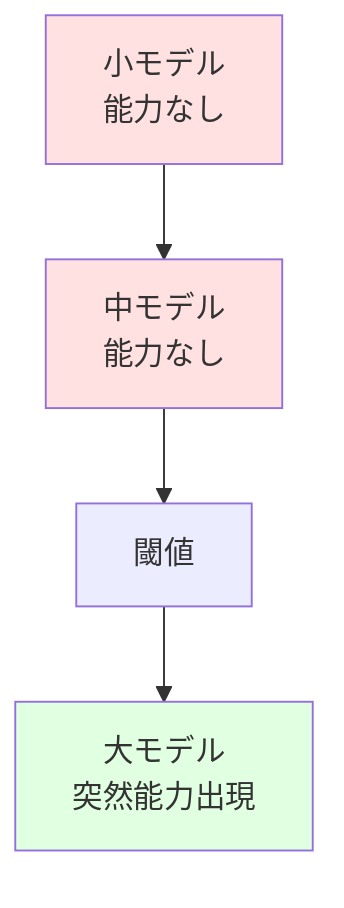
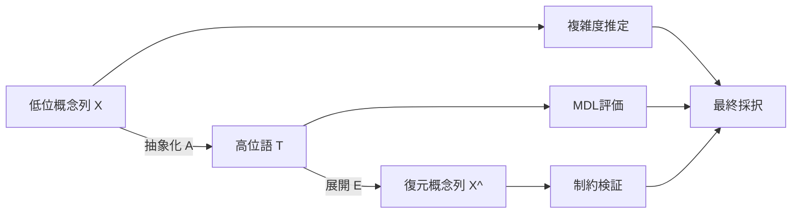
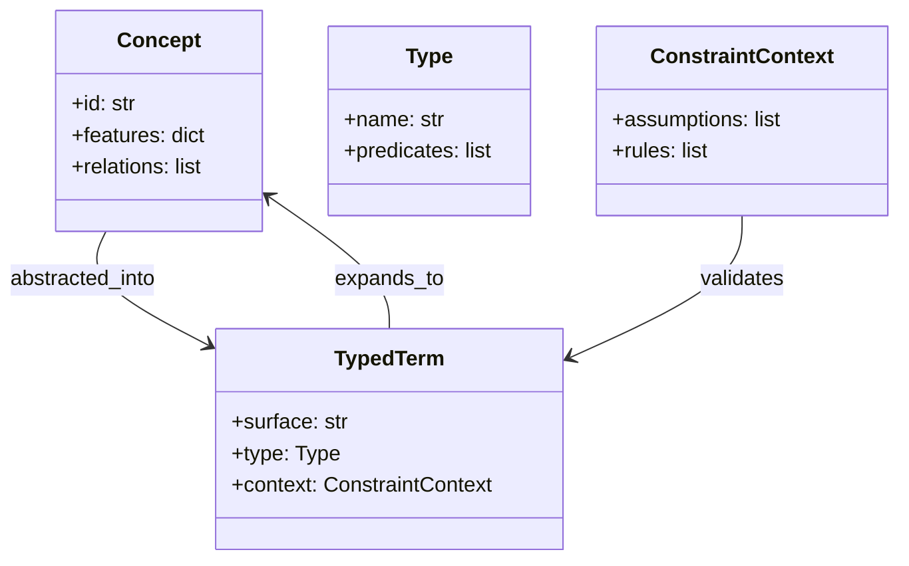
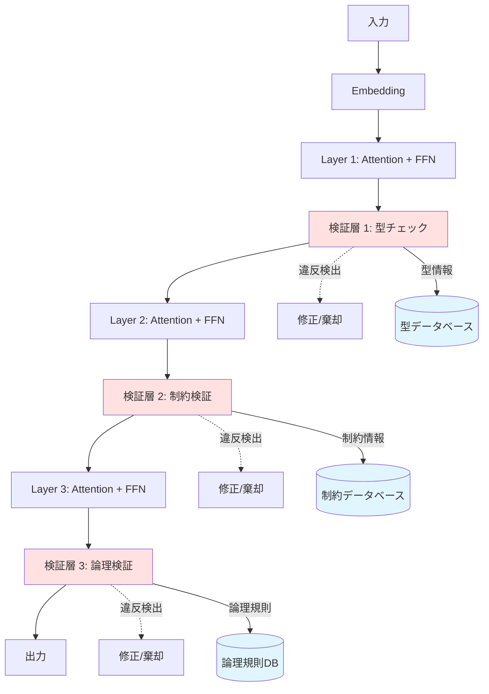
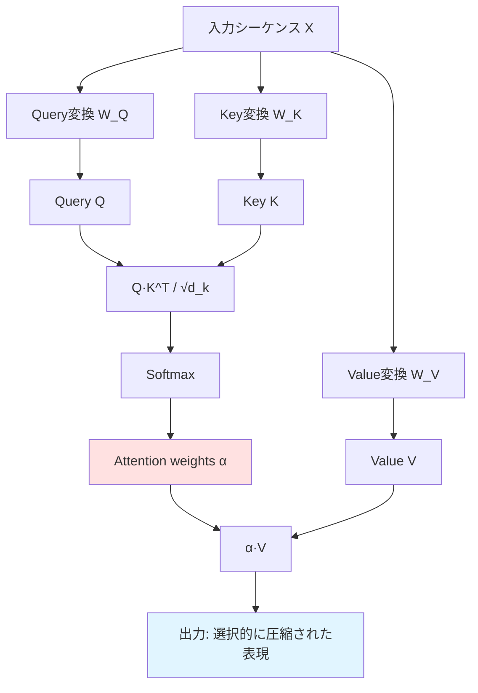
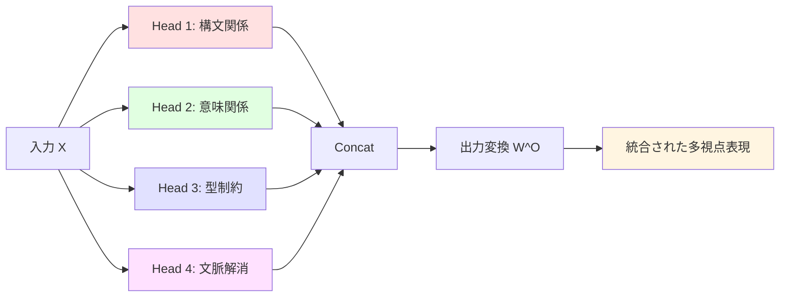
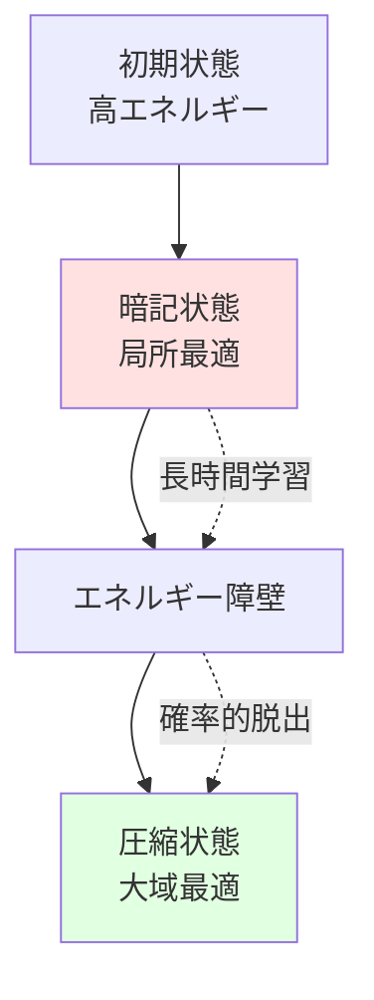

# 01. 理論的基盤

## 目次
- [1. 文書の目的](#1-文書の目的)
- [2. 中心仮説](#2-中心仮説)
  - [2.1 仮説](#21-仮説)
  - [2.2 統計的圧縮と論理的圧縮の統合](#22-統計的圧縮と論理的圧縮の統合)
  - [2.3 知能の再定義](#23-知能の再定義)
- [3. 先行研究との位置づけ](#3-先行研究との位置づけ)
- [4. 概念圧縮としての専門用語](#4-概念圧縮としての専門用語)
- [5. Kolmogorov Complexity との関係](#5-kolmogorov-complexity-との関係)
- [6. MDL 原理の適用](#6-mdl-原理の適用)
- [7. 情報理論的定式化](#7-情報理論的定式化)
- [8. 双方向変換モデル](#8-双方向変換モデル)
  - [8.1 双方向写像の定義](#81-双方向写像の定義)
  - [8.2 動的圧縮モデル](#82-動的圧縮モデル)
- [9. 型理論との統合](#9-型理論との統合)
  - [9.1 なぜ型が必要か](#91-なぜ型が必要か)
  - [9.2 制約付き型としての専門用語](#92-制約付き型としての専門用語)
  - [9.3 圧縮・展開の型付け](#93-圧縮展開の型付け)
  - [9.4 確率的型システム](#94-確率的型システム)
  - [9.5 型理論と検証](#95-型理論と検証)
- [10. 制約検証機構](#10-制約検証機構)
  - [10.1 Encoder / Decoder だけでは足りない理由](#101-encoder--decoder-だけでは足りない理由)
  - [10.2 三層構造の検証機構](#102-三層構造の検証機構)
  - [10.3 拡張アーキテクチャ](#103-拡張アーキテクチャ)
  - [10.4 型チェック層](#104-型チェック層)
  - [10.5 制約充足層](#105-制約充足層)
  - [10.6 論理検証層](#106-論理検証層)
  - [10.7 統合的な修正機構](#107-統合的な修正機構)
- [11. Transformerアーキテクチャとの理論的接続](#11-transformerアーキテクチャとの理論的接続)
  - [11.1 Self-Attentionと選択的圧縮](#111-self-attentionと選択的圧縮)
  - [11.2 Multi-Head Attentionと多視点抽象化](#112-multi-head-attentionと多視点抽象化)
  - [11.3 Position Encodingと構造保存](#113-position-encodingと構造保存)
  - [11.4 Feed-Forward Layerの双方向変換](#114-feed-forward-layerの双方向変換)
  - [11.5 Residual Connectionと情報保存](#115-residual-connectionと情報保存)
  - [11.6 Layer Normalizationと安定化](#116-layer-normalizationと安定化)
  - [11.7 まとめ：Transformerと本理論の対応](#117-まとめtransformerと本理論の対応)
  - [11.8 動的圧縮理論](#118-動的圧縮理論)
- [12. 批判的検証と限界](#12-批判的検証と限界)
- [13. 今後の研究課題](#13-今後の研究課題)
  - [13.1 実証実験の提案](#131-実証実験の提案)
  - [13.2 実装への示唆](#132-実装への示唆)
  - [13.3 学術的貢献の明確化](#133-学術的貢献の明確化)
  - [13.4 まとめ：研究の展望](#134-まとめ研究の展望)
- [14. 本理論が要件・設計へ与える含意](#14-本理論が要件設計へ与える含意)

## 1. 文書の目的
以下の研究仮説を学術的・工学的に再構成し、後続の要件定義・アーキテクチャ設計・実装仕様・API 仕様の理論的根拠を与えるものである。  
特に、以下の主張を中心に据える。

> **専門用語とは、複数の概念・前提・制約を、論理構造を保ったまま短い記号列へ圧縮した表現である。**

関連文書:
- 要件定義: [02_requirements.md](./02_requirements.md)
- アーキテクチャ設計: [03_architecture.md](./03_architecture.md)
- 実装仕様: [04_implementation_spec.md](./04_implementation_spec.md)
- API 仕様: [05_api_specification.md](./05_api_specification.md)

## 2. 中心仮説
### 2.1 仮説
研究仮説は次のように表現できる。

> **専門用語 = 概念の論理的圧縮**

ここでいう「論理的圧縮」とは、単なる文字列短縮ではない。
ある高位語 \( t \) が、その背後にある概念集合 \( C = \{c_1, c_2, \dots, c_n\} \)、前提 \( P \)、推論規則 \( R \)、制約 \( \Gamma \) を保持したまま記述長を短縮する作用を指す。

### 2.2 統計的圧縮と論理的圧縮の統合
本理論は、統計的圧縮と論理的圧縮を統一的に扱う枠組みを提供する。

\[
\text{圧縮} = \text{統計的圧縮} \times \text{論理的制約}
\]

**確率的型システム**:

型制約を確率的に扱うことで、統計的学習と論理的検証を統合する。

\[
P(\Gamma \vdash t : T) = \alpha \cdot \text{LogicalScore}(t) + (1-\alpha) \cdot \text{StatisticalScore}(t)
\]

ここで、
- \( \alpha \): 論理的制約の重み（学習段階に応じて動的に調整）
- \( \text{LogicalScore}(t) \): 型制約の充足度
- \( \text{StatisticalScore}(t) \): 統計的尤度

**ソフト制約とハード制約の区別**:

- **ハード制約**: 論理的必然性（\( \alpha \to 1 \)）
  - 例：型の整合性、矛盾律、排中律
- **ソフト制約**: 統計的傾向（\( \alpha \to 0 \)）
  - 例：共起頻度、文脈適合性、スタイル

学習過程での \( \alpha \) の動的調整により、初期は統計的パターン獲得を優先し、後期は論理的整合性を強化する。

### 2.3 知能の再定義
この仮説に基づくと、知能は次の能力の組合せとして定義できる。

1. **抽象化能力**
   低位概念列から、適切な高位概念表現へ圧縮する能力
2. **展開能力**
   高位概念表現から、必要な低位概念・暗黙前提・含意を復元する能力
3. **制約検証能力**
   圧縮・展開のいずれにおいても、論理破壊や型不整合を検出する能力

この 3 要素は後続の機能要件の直接的根拠となる。詳細は [02_requirements.md](./02_requirements.md) を参照。

## 3. 先行研究との位置づけ

本章では、本理論と関連する先行研究を体系的に整理し、本理論の独自性と既存研究への貢献を明確にする。

### 3.1 Information Bottleneck Theory (Tishby et al., 2000)

#### 3.1.1 理論の概要

**Tishby, N., Pereira, F. C., & Bialek, W. (2000). "The information bottleneck method." The 37th annual Allerton Conference on Communication, Control, and Computing.**

Information Bottleneck (IB) Theoryは、表現学習を情報理論的に定式化する。

\[
\min_{p(t|x)} I(X; T) - \beta I(T; Y)
\]

- \( X \): 入力
- \( T \): 圧縮された表現
- \( Y \): 目標出力
- \( \beta \): トレードオフパラメータ

**主張**:

- 良い表現は、入力の情報を最小化しつつ、タスク関連情報を最大化する
- これは「関連情報の選択的保持」を意味する

#### 3.1.2 本理論との関係

**共通点**:

- 両理論とも「圧縮」を中心概念とする
- 情報理論的な定式化を用いる
- 表現の質を記述長で評価する

**本理論の拡張**:

\[
\text{IB Theory}: \text{統計的圧縮}
\]

\[
\text{本理論}: \text{統計的圧縮} + \text{論理的制約}
\]

本理論は、IBの統計的圧縮に加えて、以下を要求する。

- 型制約の保存
- 論理的整合性の検証
- 双方向変換の可能性

#### 3.1.3 相違点と独自性

| 観点 | IB Theory | 本理論 |
|---|---|---|
| 圧縮の種類 | 統計的 | 統計的 + 論理的 |
| 制約 | なし | 型制約、論理制約 |
| 双方向性 | 一方向（圧縮のみ） | 双方向（圧縮 ↔ 展開） |
| 検証機構 | なし | 明示的な制約検証層 |
| 適用対象 | 一般的な表現学習 | 専門用語、概念圧縮 |

**独自性**:

本理論は、IBの統計的枠組みに「論理的構造保存」という新しい次元を追加する。

### 3.2 Lottery Ticket Hypothesis (Frankle & Carbin, 2019)

#### 3.2.1 理論の概要

**Frankle, J., & Carbin, M. (2019). "The Lottery Ticket Hypothesis: Finding Sparse, Trainable Neural Networks." ICLR 2019.**

**主張**:

- ランダム初期化されたネットワークには、単独で訓練しても同等の性能を達成できる「当たりくじ」サブネットワークが含まれる
- 大きなネットワークは、この当たりくじを見つけるための「宝くじ」である

\[
\exists \text{subnetwork} \subset \text{full network} : \text{performance}(\text{subnetwork}) \approx \text{performance}(\text{full network})
\]

#### 3.2.2 本理論への示唆

**事後的圧縮の可能性**:

- Lottery Ticket Hypothesisは、圧縮が学習後に発見されることを示唆
- これは本理論の「圧縮が先、学習が後」という仮定と矛盾

\[
\text{本理論}: \text{圧縮設計} \to \text{学習}
\]

\[
\text{LTH}: \text{過剰パラメータ} \to \text{学習} \to \text{圧縮発見}
\]

**本理論への影響**:

- 圧縮は設計時ではなく、学習過程で動的に発見される可能性
- 本理論は「静的な圧縮」を想定するが、「動的な圧縮」が必要かもしれない

#### 3.2.3 反証となる点

Lottery Ticket Hypothesisは、本理論の以下の主張に反証を与える。

- **主張**: 効率的な圧縮設計が重要
- **反証**: 過剰パラメータから始めて、学習後に圧縮を発見する方が効果的

### 3.3 Grokking (Power et al., 2022)

#### 3.3.1 現象の説明

**Power, A., Burda, Y., Edwards, H., Babuschkin, I., & Misra, V. (2022). "Grokking: Generalization beyond overfitting on small algorithmic datasets." arXiv:2201.02177.**

**現象**:

- 訓練誤差が0になった後、さらに学習を続けると突然汎化性能が向上
- 「暗記」から「理解」への相転移


#### 3.3.2 本理論では説明困難な点

**本理論の予測**:

\[
\text{圧縮} \equiv \text{一般化}
\]

圧縮が進めば、同時に一般化も進むはず。

**Grokkingの実態**:

\[
\text{暗記（圧縮なし）} \to \text{長時間学習} \to \text{突然の圧縮と一般化}
\]

圧縮と一般化が時間的に分離される。

**説明困難な理由**:

- 本理論は「圧縮 = 一般化」を想定するが、Grokkingでは両者が分離
- なぜ突然相転移が起きるのか、本理論では説明できない

#### 3.3.3 動的圧縮理論の必要性

Grokkingを説明するには、以下が必要。

- **動的圧縮理論**: 学習過程での圧縮率の変化を扱う
- **相転移モデル**: 突然の質的変化を説明する機構
- **エネルギー地形**: 暗記状態と圧縮状態の間のエネルギー障壁

これらは本理論の現在の枠組みでは扱えない。

### 3.4 Scaling Laws (Kaplan et al., 2020)

#### 3.4.1 法則の概要

**Kaplan, J., McCandlish, S., Henighan, T., Brown, T. B., Chess, B., Child, R., ... & Amodei, D. (2020). "Scaling laws for neural language models." arXiv:2001.08361.**

**主張**:

モデルの性能は、以下の冪乗則に従う。

\[
L(N) = \left(\frac{N_c}{N}\right)^{\alpha_N}
\]

\[
L(D) = \left(\frac{D_c}{D}\right)^{\alpha_D}
\]

\[
L(C) = \left(\frac{C_c}{C}\right)^{\alpha_C}
\]

- \( N \): パラメータ数
- \( D \): データセットサイズ
- \( C \): 計算量
- \( L \): 損失

**実証結果**:

- \( \alpha_N \approx 0.076 \)
- \( \alpha_D \approx 0.095 \)
- \( \alpha_C \approx 0.050 \)

#### 3.4.2 本理論との矛盾

**本理論の価値観**:

\[
\text{効率的な圧縮} = \text{小さく強力なモデル}
\]

MDL原理により、モデルの記述長を最小化すべき。

**Scaling Lawsの示唆**:

\[
\text{大きなモデル} = \text{常に良い}
\]

パラメータ数が多いほど、性能が向上する。

**矛盾**:

- 本理論: 圧縮効率を最大化 → 小さなモデル
- Scaling Laws: 性能を最大化 → 大きなモデル

\[
\arg\min_M L(M) + L(D|M) \neq \arg\max_N \text{performance}(N)
\]

#### 3.4.3 理論の拡張の必要性

Scaling Lawsを説明するには、本理論の拡張が必要。

- **容量と圧縮の関係**: 大きなモデルがより効率的な圧縮を学習できる可能性
- **過剰パラメータの役割**: 学習の容易さと最終的な圧縮の質の関係
- **スケーリングと一般化**: なぜ大きなモデルが一般化するのか

これらは現在の理論では説明できない。

### 3.5 Emergent Abilities (Wei et al., 2022)

#### 3.5.1 現象の説明

**Wei, J., Tay, Y., Bommasani, R., Raffel, C., Zoph, B., Borgeaud, S., ... & Fedus, W. (2022). "Emergent abilities of large language models." Transactions on Machine Learning Research.**

**現象**:

- モデルサイズが一定の閾値を超えると、突然新しい能力が出現
- 例: 算術演算、多段階推論、コード生成



#### 3.5.2 本理論では説明困難な点

**本理論の予測**:

\[
\text{圧縮効率} \propto \text{性能}
\]

圧縮効率が連続的に向上すれば、性能も連続的に向上するはず。

**Emergent Abilitiesの実態**:

\[
\text{性能} = \begin{cases}
0 & \text{if } N < N_{\text{threshold}} \\
\text{高} & \text{if } N \geq N_{\text{threshold}}
\end{cases}
\]

性能が離散的に変化する。

**説明困難な理由**:

- 本理論は量的変化（圧縮効率の向上）のみを扱う
- 質的変化（新能力の出現）を説明する機構がない
- なぜ特定のサイズで突然能力が出現するのか、理論的根拠がない

### 3.6 Neuro-Symbolic AI

#### 3.6.1 分野の概要

Neuro-Symbolic AIは、ニューラルネットワークと記号的推論を統合する研究分野。

**代表的研究**:

- **Garcez, A. d'Avila, Lamb, L. C., & Gabbay, D. M. (2019). "Neural-symbolic learning and reasoning: A survey and interpretation." Neuro-Symbolic Artificial Intelligence: The State of the Art.**
- **Lamb, L. C., Garcez, A., Gori, M., Prates, M., Avelar, P., & Vardi, M. (2020). "Graph neural networks meet neural-symbolic computing: A survey and perspective." IJCAI 2020.**

**主張**:

- ニューラルネットワーク: 統計的パターン学習
- 記号的推論: 論理的推論、知識表現
- 統合により、両者の長所を活かす

#### 3.6.2 本理論との関係

**共通点**:

- 統計的学習と論理的推論の統合を目指す
- 表現の双方向変換を重視

**本理論の独自性**:

- **圧縮の視点**: Neuro-Symbolic AIは「統合」を目指すが、本理論は「圧縮」を中心に据える
- **双方向変換の強調**: 本理論は抽象化と展開の双方向性を明示的に扱う

\[
\text{Neuro-Symbolic AI}: \text{統計} + \text{論理}
\]

\[
\text{本理論}: \text{統計的圧縮} \leftrightarrow \text{論理的展開}
\]

#### 3.6.3 統合の可能性

本理論は、Neuro-Symbolic AIの一つの実現方法を提供する。

- **ニューラル部分**: 統計的圧縮（Attention、FFN）
- **記号的部分**: 制約検証、型チェック
- **統合**: 双方向変換による連携

### 3.7 表現学習 (Representation Learning)

#### 3.7.1 分野の概要

表現学習は、データから有用な特徴表現を自動的に学習する研究分野。

**代表的研究**:

- **Bengio, Y., Courville, A., & Vincent, P. (2013). "Representation learning: A review and new perspectives." IEEE Transactions on Pattern Analysis and Machine Intelligence, 35(8), 1798-1828.**

**主張**:

- 良い表現は、タスクの性能を向上させる
- 表現学習により、手作業の特徴設計が不要になる

#### 3.7.2 本理論との関係

**共通点**:

- 両者とも「表現の質」を重視
- データから自動的に表現を学習

**本理論の独自の貢献**:

- **制約検証の要求**: 表現学習は「良い表現」を学習するが、「正しい表現」を保証しない
- **双方向性の強調**: 表現学習は主に「入力 → 表現」を扱うが、本理論は「表現 → 入力」も重視
- **圧縮の定量化**: MDL原理により、表現の質を定量的に評価

\[
\text{表現学習}: \text{良い表現を学習}
\]

\[
\text{本理論}: \text{正しく圧縮された表現を学習・検証}
\]

### 3.8 比較表

| 研究 | 中心概念 | 本理論との関係 | 本理論の独自性 |
|---|---|---|---|
| **Information Bottleneck** | 統計的圧縮 | 基礎理論 | 論理的制約の追加 |
| **Lottery Ticket Hypothesis** | 事後的圧縮 | 反証 | 事前圧縮設計の重要性（要再検討） |
| **Grokking** | 突然の一般化 | 説明困難 | 動的圧縮理論の必要性 |
| **Scaling Laws** | サイズと性能 | 矛盾 | 効率性の価値観（要拡張） |
| **Emergent Abilities** | 能力の出現 | 説明困難 | 質的変化の扱い（要拡張） |
| **Neuro-Symbolic AI** | 統計と論理の統合 | 関連分野 | 双方向変換の強調 |
| **Representation Learning** | 表現の学習 | 関連分野 | 制約検証の要求 |

### 3.9 まとめ：本理論の位置づけ

本理論は、以下の点で既存研究と区別される。

1. **Information Bottleneck Theoryの拡張**: 統計的圧縮に論理的制約を追加
2. **双方向変換の強調**: 圧縮と展開の両方を明示的に扱う
3. **制約検証の要求**: 統計的もっともらしさだけでなく、論理的正しさを要求
4. **専門用語への特化**: 一般的な表現学習ではなく、概念圧縮に焦点

ただし、第8章で述べた限界を認識し、今後の拡張が必要である。

## 4. 概念圧縮としての専門用語
専門用語は、概念の単なるラベルではない。  
それは以下を内包する「圧縮済み構造」である。

- 定義
- 前提条件
- 使用可能な推論
- 禁止される操作
- 他概念との関係
- 文脈依存の意味境界

例えば「群」「内積空間」「ゼロトラスト」などの語は、それぞれ多数の前提・性質・推論可能性を内包している。  
したがって、専門用語の理解とは、圧縮済み記号を読めることではなく、その圧縮前構造を必要に応じて復元できることを意味する。


## 5. Kolmogorov Complexity との関係

**先行研究**:
- **Kolmogorov, A. N. (1965). "Three approaches to the quantitative definition of information." Problems of Information Transmission, 1(1), 1-7.**
- **Li, M., & Vitányi, P. (2008). "An Introduction to Kolmogorov Complexity and Its Applications" (3rd ed.). Springer.**

### 5.1 基本概念
Kolmogorov Complexity は、ある対象 \( x \) を生成する最短プログラム長として定義される。

\[
K(x) = \min_{p : U(p) = x} |p|
\]

ここで、
- \( U \) は万能チューリング機械
- \( p \) は \( x \) を生成するプログラム
- \( |p| \) はその記述長

### 5.2 専門用語との対応
専門用語 \( t \) を、概念集合 \( x \) の短い生成記述とみなすと、専門用語の価値は次の直感に対応する。

\[
|t| \ll |x|
\]

ただし重要なのは、単に短いだけでは不十分である点である。  
高位語 \( t \) は、展開過程 \( D(t) \) を通じて、概念集合 \( x \) を意味的に復元できなければならない。

\[
D(t) \approx x
\]

### 5.3 完全な Kolmogorov Complexity との差異
本研究は Kolmogorov Complexity をそのまま計算するものではない。  
理由は以下の通り。

- 真の \( K(x) \) は一般に計算不能
- 意味概念は文字列ではなく構造化対象
- 実際には近似評価器が必要

したがって、本システムでは **複雑度推定器** を用いて、概念表現の近似記述長を推定する。詳細は [04_implementation_spec.md](./04_implementation_spec.md) を参照。

## 6. MDL 原理の適用

**先行研究**:
- **Rissanen, J. (1978). "Modeling by shortest data description." Automatica, 14(5), 465-471.**
- **Grünwald, P. D. (2007). "The Minimum Description Length Principle." MIT Press.**

### 6.1 MDL の基本式
MDL（Minimum Description Length）原理では、最良のモデル \( M \) は、モデル自体の記述長とデータをそのモデルで記述する長さの和を最小化するものとして与えられる。

\[
L(M, D) = L(M) + L(D \mid M)
\]

### 6.2 本研究への写像
ここで、
- \( M \): 高位概念語彙、型規則、制約体系
- \( D \): 入力文、概念グラフ、推論対象
- \( L(M) \): 語彙体系や制約体系の複雑さ
- \( L(D \mid M) \): その体系を用いた説明コスト

このとき、良い専門用語体系とは、単語数を増やしすぎず、かつ多くの概念対象を短く正しく表現できる体系である。

### 6.3 圧縮と一般化のバランス
極端な場合を考えると以下になる。

- 語彙が少なすぎる  
  - 何でも低位概念で記述する必要があり、表現長が増大する
- 語彙が多すぎる  
  - 各対象専用語が増え、体系自体の複雑さが増大する

したがって最適化問題は、

\[
\min_{V,\Gamma} \; L(V,\Gamma) + \sum_{x \in X} L(x \mid V,\Gamma)
\]

とみなせる。ここで、
- \( V \): 高位語彙集合
- \( \Gamma \): 制約・型ルール集合
- \( X \): 対象概念集合

### 6.4 MDL 評価器の意義
この定式化は、専門用語の「便利さ」を感覚的にではなく、記述長削減量として評価可能にする。  
後続の **MDL 評価器** は、この圧縮利得と制約コストをスコア化する。詳細は [04_implementation_spec.md](./04_implementation_spec.md) を参照。

```mermaid
flowchart TD
    A[候補高位語] --> B[モデル長 L(M)]
    A --> C[データ記述長 L(D|M)]
    B --> D[総記述長]
    C --> D
    D --> E[採用/棄却判定]
```

## 7. 情報理論的定式化
### 7.1 圧縮利得
低位概念列 \( X \) を高位語 \( T \) で表したときの圧縮利得を次で定義する。

\[
G(X, T) = L(X) - L(T) - C_{decode}(T)
\]

- \( L(X) \): 低位概念列の記述長
- \( L(T) \): 高位語の記述長
- \( C_{decode}(T) \): 高位語を適切に解釈・展開するための追加コスト

\( G(X, T) > 0 \) であれば、意味的に有益な圧縮とみなせる。

### 7.2 制約コスト
しかし、圧縮が論理的に危険である場合は制約違反コストを加える必要がある。

\[
J(X, T, \Gamma) = L(T) + C_{decode}(T) + \lambda \cdot V(T, \Gamma)
\]

- \( V(T, \Gamma) \): 制約違反度
- \( \lambda \): 違反ペナルティ係数

最終的には、

\[
T^\* = \arg\min_T J(X, T, \Gamma)
\]

を選ぶ。

### 7.3 相互情報量の視点
専門用語 \( T \) が概念集合 \( X \) をどれだけ保持しているかは、相互情報量でも考えられる。

\[
I(X;T) = H(X) - H(X \mid T)
\]

良い高位語は、
- \( H(X \mid T) \) を小さくし
- 記述長 \( L(T) \) も小さい

という二重の条件を満たす必要がある。

## 8. 双方向変換モデル
### 8.1 双方向写像の定義
本研究の中心構造は、圧縮と展開の双方向写像である。

\[
A : X \mapsto T
\]

\[
E : T \mapsto \hat{X}
\]

理想的には、

\[
E(A(X)) \simeq X
\]

が成立してほしい。
ただし現実には完全一致よりも、以下の条件が重要である。

1. 本質的構造が保存される
2. 制約違反が増えない
3. 必要な粒度で復元できる



### 8.2 動的圧縮モデル
圧縮は静的な変換ではなく、学習過程で動的に変化する。

**時間発展する圧縮率**:

\[
C(t) = \frac{K(X)}{K(A_t(X))}
\]

ここで、
- \( t \): 学習ステップ（エポック）
- \( A_t \): 時刻 \( t \) における抽象化関数
- \( K(\cdot) \): Kolmogorov複雑度

**圧縮率の動的測定**:

各層での情報量の変化を時系列で追跡する。

\[
I_t(X; h_l) = H(h_l) - H(h_l|X)
\]

- \( l \): 層番号
- \( h_l \): 層 \( l \) の隠れ状態
- \( H(\cdot) \): エントロピー

**相転移モデル**:

学習過程は、暗記状態から圧縮状態への相転移として理解できる。

\[
E_{\text{total}}(w) = E_{\text{data}}(w) + \lambda(t) \cdot E_{\text{complexity}}(w)
\]

- \( E_{\text{data}}(w) \): データ適合度（訓練誤差）
- \( E_{\text{complexity}}(w) \): モデル複雑度
- \( \lambda(t) \): 時間依存の正則化係数

この相転移モデルは、Grokking現象（突然の一般化）を説明する理論的基盤となる（セクション11参照）。

## 9. 型理論との統合

**先行研究**:
- **Martin-Löf, P. (1984). "Intuitionistic Type Theory." Bibliopolis.**
  - 依存型理論の基礎
- **Pierce, B. C. (2002). "Types and Programming Languages." MIT Press.**
  - 型システムの包括的解説
- **Coquand, T., & Huet, G. (1988). "The Calculus of Constructions." Information and Computation, 76(2-3), 95-120.**
  - 高階依存型理論

### 9.1 なぜ型が必要か
圧縮だけでは「それっぽいが誤った」高位語が成立してしまう。  
これを防ぐには、概念表現に対して型制約を導入する必要がある。

専門用語 \( t \) は単なる文字列ではなく、型付き項として扱う。

\[
t : T
\]

ここで \( T \) は、その語が満たすべき構造・前提・使用可能な演算を表す。

### 9.2 制約付き型としての専門用語
より一般に、高位語は依存型に近い構造を持つ。

\[
t : T(\Gamma, P)
\]

- \( \Gamma \): 文脈制約
- \( P \): 前提条件
- \( T(\Gamma, P) \): 制約依存の型

例えば「群」は単に `Group` 型ではなく、「二項演算・単位元・逆元・結合律」を満たす構造に対してのみ成立する型である。

### 9.3 圧縮・展開の型付け
抽象化関数 \( A \) と展開関数 \( E \) を次のように定義する。

\[
A : \mathcal{C}_{low} \to \mathcal{C}_{high}
\]

\[
E : \mathcal{C}_{high} \to \mathcal{P}(\mathcal{C}_{low})
\]

ただし、型整合性を保つために、

\[
\Gamma \vdash x : T \Rightarrow \Gamma \vdash A(x) : T'
\]

\[
\Gamma \vdash t : T' \Rightarrow \Gamma \vdash E(t) \subseteq \{x \mid \Gamma \vdash x : T\}
\]

が要求される。

### 9.4 確率的型システム
統計的学習と論理的検証を統合するため、型判定を確率化する。

**確率的型判定**:

\[
P(\Gamma \vdash t : T) = \alpha \cdot L(t, T, \Gamma) + (1-\alpha) \cdot S(t, \Gamma)
\]

ここで、
- \( L(t, T, \Gamma) \): 論理的型適合度 \( \in [0, 1] \)
- \( S(t, \Gamma) \): 統計的尤度 \( \in [0, 1] \)
- \( \alpha \): 論理的制約の重み

**ソフト制約とハード制約**:

1. **ハード制約**（\( \alpha \to 1 \)）:
   - 型の整合性：\( \text{type}(f(x)) = \text{return\_type}(f) \)
   - 矛盾律：\( \neg(P \land \neg P) \)
   - 排中律：\( P \lor \neg P \)

2. **ソフト制約**（\( 0 < \alpha < 1 \)）:
   - 共起頻度：\( P(w_i | w_{i-1}, \ldots, w_{i-n}) \)
   - 文脈適合性：\( \text{similarity}(t, \text{context}) \)
   - スタイル整合性：\( \text{style\_score}(t, \text{domain}) \)

**段階的制約強化**:

学習過程で \( \alpha \) を動的に調整する。

| フェーズ | \( \alpha \) | 制約レベル | 目的 |
|---------|-------------|-----------|------|
| 初期学習 | 0.1 | ソフト | 統計的パターン獲得 |
| 中期学習 | 0.5 | 中程度 | パターンと論理の統合 |
| 後期学習 | 0.8 | ハード | 論理的整合性強化 |
| Fine-tuning | 0.95 | 厳密 | 制約検証の厳密化 |

### 9.5 型理論と検証
型理論の役割は以下の 3 点にある。

1. 不正な圧縮の排除
2. 展開時の論理破壊の検出
3. 高位語の意味境界の明示

この考え方は、後続の型システム仕様に具体化される。詳細は [04_implementation_spec.md](./04_implementation_spec.md) を参照。



## 10. 制約検証機構

### 10.1 Encoder / Decoder だけでは足りない理由

抽象化と展開だけでは、表現変換はできても「正しい変換」は保証できない。
特に以下の問題が発生する。

- 誤った高位語への過剰一般化
- 展開時の暗黙前提の欠落
- 互いに両立しない概念の混同
- 文脈依存意味の取り違え

### 10.2 三層構造の検証機構

制約検証は、以下の三層で構成される。

1. **型チェック層**: 型の整合性を検証
2. **制約充足層**: 論理的制約を検証
3. **論理検証層**: 高レベルの論理的整合性を検証

このため本研究では、知能を単なる圧縮能力ではなく、

> **制約を保ったまま意味の多段階圧縮表現を双方向変換できる能力**

と再定義する。

### 10.3 拡張アーキテクチャ



### 10.4 型チェック層
各トークンの型を検証し、型不整合を検出・修正する。

**型システムの定義**:

| 型カテゴリ | 例 | 制約 |
|-----------|---|------|
| Entity | 人名、地名、組織名 | 固有名詞の文法規則 |
| Concept | 抽象概念、専門用語 | 定義域の整合性 |
| Relation | 動詞、前置詞 | 項の型制約 |
| Attribute | 形容詞、副詞 | 修飾対象の型制約 |
| Quantifier | 数量詞 | 数値の妥当性 |

**型互換性の検証**:

\[
\text{Compatible}(T_1, T_2) = \begin{cases}
1 & \text{if } T_1 \text{ and } T_2 \text{ are compatible} \\
0 & \text{otherwise}
\end{cases}
\]

### 10.5 制約充足層
論理的制約を検証し、矛盾を検出・修正する。

**制約の種類**:

- **時間的制約**: 時系列の整合性（過去→現在→未来）
- **因果的制約**: 原因→結果の論理的順序
- **数値的制約**: 数値の妥当性（負でない、範囲内など）
- **意味的制約**: 意味の矛盾（「生きている死者」など）
- **文脈的制約**: 文脈との整合性

**制約充足度の計算**:

\[
\text{Satisfaction}(c, s) = \frac{\sum_{r \in R_c} \mathbb{1}[r(s)]}{\|R_c\|}
\]

ここで、
- \( c \): 制約
- \( s \): 状態（生成されたシーケンス）
- \( R_c \): 制約 \( c \) に関連する規則集合
- \( \mathbb{1}[r(s)] \): 規則 \( r \) が状態 \( s \) で満たされるかの指示関数

### 10.6 論理検証層
高レベルの論理的整合性を検証する。

**論理規則の例**:

- **排中律**: \( P \lor \neg P \)
- **矛盾律**: \( \neg(P \land \neg P) \)
- **三段論法**: \( (P \to Q) \land (Q \to R) \Rightarrow (P \to R) \)
- **同一律**: \( P \to P \)

**矛盾検出**:

生成されたシーケンスから命題を抽出し、論理的矛盾を検出する。

\[
\text{Contradiction}(P, Q) = \begin{cases}
1 & \text{if } P \equiv \neg Q \\
0 & \text{otherwise}
\end{cases}
\]

### 10.7 統合的な修正機構
違反が検出された場合の修正戦略：

**修正戦略の比較**:

| 戦略 | 長所 | 短所 | 適用場面 |
|-----|------|------|---------|
| Beam Search | 複数候補を探索 | 計算コスト高 | 複雑な制約 |
| Backtracking | 確実に解を発見 | 時間がかかる | 小規模な問題 |
| Constraint Propagation | 効率的 | 局所最適に陥る | 単純な制約 |
| Soft Rejection | 学習可能 | 保証なし | 学習フェーズ |

**期待される効果**:

- **リアルタイムでの制約検証**: 生成中に即座に違反を検出
- **ハルシネーションの即座の検出**: 論理的矛盾を生成前に防止
- **信頼性の高い出力生成**: 型安全性と論理的整合性の保証
- **解釈可能性の向上**: 違反の理由が明示的
- **段階的な品質向上**: 層ごとに異なるレベルの検証

## 11. Transformerアーキテクチャとの理論的接続

**先行研究**:
- **Vaswani, A., Shazeer, N., Parmar, N., Uszkoreit, J., Jones, L., Gomez, A. N., ... & Polosukhin, I. (2017). "Attention is all you need." Advances in Neural Information Processing Systems, 30.**
  - Transformerアーキテクチャの提案
- **Devlin, J., Chang, M. W., Lee, K., & Toutanova, K. (2019). "BERT: Pre-training of Deep Bidirectional Transformers for Language Understanding." NAACL 2019.**
  - 双方向Transformerの事前学習

本章では、本理論とTransformerアーキテクチャの関係を明示的に分析し、理論がどのように既存の深層学習モデルの動作を説明できるか、またその限界はどこにあるかを検討する。

### 11.1 Self-Attentionと選択的圧縮

#### 11.1.1 Attention機構の数式

Self-Attention機構は、入力シーケンス \( X = [x_1, x_2, \dots, x_n] \) に対して、以下の変換を行う。

\[
\text{Attention}(Q, K, V) = \text{softmax}\left(\frac{QK^T}{\sqrt{d_k}}\right)V
\]

ここで、
- \( Q = XW_Q \): Query行列
- \( K = XW_K \): Key行列
- \( V = XW_V \): Value行列
- \( d_k \): Keyの次元数

#### 11.1.2 Query-Key-Value機構と概念の抽象化/展開

本理論の観点から、Attention機構は以下のように解釈できる。

- **Query**: 「どの情報が必要か」を表す抽象化された要求
- **Key**: 各トークンが持つ「検索可能な特徴」の圧縮表現
- **Value**: 実際に伝達される情報内容

Attention weightsは、概念間の関連度を動的に計算し、重要な情報を選択的に圧縮する機構とみなせる。

\[
\alpha_{ij} = \frac{\exp(q_i \cdot k_j / \sqrt{d_k})}{\sum_{j'} \exp(q_i \cdot k_{j'} / \sqrt{d_k})}
\]

この \( \alpha_{ij} \) は、トークン \( i \) が トークン \( j \) の情報をどれだけ圧縮して取り込むかを表す重みである。

#### 11.1.3 Attention weightsの情報理論的解釈

Attention weightsは、情報の選択的圧縮を実現する確率分布とみなせる。

\[
H(V_i) = -\sum_j \alpha_{ij} \log \alpha_{ij}
\]

- エントロピーが低い（特定のトークンに集中）: 強い圧縮
- エントロピーが高い（広く分散）: 弱い圧縮、多様な情報の保持

#### 11.1.4 Attentionフロー図



### 11.2 Multi-Head Attentionと多視点抽象化

#### 11.2.1 複数のAttention Headの役割

Multi-Head Attentionは、\( h \) 個の異なるAttention機構を並列に実行する。

\[
\text{MultiHead}(Q, K, V) = \text{Concat}(\text{head}_1, \dots, \text{head}_h)W^O
\]

\[
\text{head}_i = \text{Attention}(QW_i^Q, KW_i^K, VW_i^V)
\]

#### 11.2.2 各Headが異なる抽象化レベルを学習する仮説

本理論の観点から、各Attention Headは異なる抽象化戦略を学習すると解釈できる。

- **Head 1**: 局所的な構文関係（隣接トークン間の依存）
- **Head 2**: 意味的な関連性（遠距離の概念的つながり）
- **Head 3**: 型制約の検証（文法的整合性）
- **Head 4**: 文脈依存の曖昧性解消

各Headは、異なる \( W_i^Q, W_i^K, W_i^V \) を持つことで、異なる「圧縮の視点」を獲得する。

#### 11.2.3 実証研究の引用

BERTologyの研究（Clark et al., 2019; Voita et al., 2019）は、実際に各Headが異なる言語的機能を学習することを示している。

- **Clark, K., Khandelwal, U., Levy, O., & Manning, C. D. (2019). "What Does BERT Look At? An Analysis of BERT's Attention." BlackboxNLP Workshop at ACL.**
  - 特定のHeadが構文関係（主語-動詞など）を捉えることを発見
  
- **Voita, E., Talbot, D., Moiseev, F., Sennrich, R., & Titov, I. (2019). "Analyzing Multi-Head Self-Attention: Specialized Heads Do the Heavy Lifting, the Rest Can Be Pruned." ACL 2019.**
  - 多くのHeadは冗長であり、少数の特化したHeadが重要な役割を果たす

これは、本理論の「異なる抽象化レベル」の仮説と整合する。

#### 11.2.4 Multi-Head構造図



### 11.3 Position Encodingと構造保存

#### 11.3.1 位置情報の保持と制約保存の関係

Transformerは、トークンの順序情報を保持するためにPosition Encodingを使用する。

\[
PE_{(pos, 2i)} = \sin\left(\frac{pos}{10000^{2i/d_{model}}}\right)
\]

\[
PE_{(pos, 2i+1)} = \cos\left(\frac{pos}{10000^{2i/d_{model}}}\right)
\]

本理論の観点から、これは「構造制約の保存」に対応する。概念を圧縮する際、その順序関係（時系列、因果関係など）は重要な制約であり、Position Encodingはこれを明示的に保持する機構である。

#### 11.3.2 Sinusoidal vs Learned Encoding

- **Sinusoidal Encoding**: 固定的な位置表現、任意長のシーケンスに対応
- **Learned Encoding**: 学習可能な位置表現、特定のタスクに最適化

本理論では、Learned Encodingは「タスク固有の構造制約」を学習する機構と解釈できる。

#### 11.3.3 数式による定式化

位置情報を含む入力表現は、

\[
X' = X + PE
\]

これは、概念表現 \( X \) に構造制約 \( PE \) を付加する操作とみなせる。型理論的には、

\[
x : T \Rightarrow (x, pos) : T \times \text{Position}
\]

という依存型への拡張に対応する。

### 11.4 Feed-Forward Layerの双方向変換

#### 11.4.1 FFNの数式

各Transformer層には、以下のFeed-Forward Network（FFN）が含まれる。

\[
\text{FFN}(x) = \max(0, xW_1 + b_1)W_2 + b_2
\]

通常、中間層の次元 \( d_{ff} \) は入力次元 \( d_{model} \) の4倍程度に設定される。

\[
d_{ff} = 4 \times d_{model}
\]

#### 11.4.2 展開（expansion）と再圧縮の解釈

本理論の観点から、FFNは以下の2段階プロセスとして解釈できる。

1. **展開フェーズ** (\( W_1 \)): 圧縮された表現を高次元空間に展開
   - \( d_{model} \to d_{ff} \)
   - 暗黙の概念を明示化
   
2. **再圧縮フェーズ** (\( W_2 \)): 展開された表現を再び圧縮
   - \( d_{ff} \to d_{model} \)
   - 不要な情報を削除し、本質を抽出

これは、本理論の「双方向変換」（抽象化 ↔ 展開）に直接対応する。

#### 11.4.3 中間層の次元拡大の意味

中間層が入力の4倍の次元を持つことは、以下を示唆する。

- 圧縮された表現には、4倍程度の「潜在的な情報」が含まれている
- 展開により、暗黙の前提や関係性が明示化される
- 再圧縮により、タスクに関連する情報のみが保持される

情報理論的には、

\[
I(X; \text{FFN}(X)) \leq I(X; W_1(X))
\]

展開により情報が増加し、再圧縮により選択的に削減される。

### 11.5 Residual Connectionと情報保存

#### 11.5.1 Skip connectionの数式

Transformerの各サブ層は、Residual Connection（Skip Connection）を使用する。

\[
\text{Output} = \text{LayerNorm}(x + \text{Sublayer}(x))
\]

#### 11.5.2 情報損失の防止機構

本理論の観点から、Residual Connectionは「圧縮による情報損失の防止」機構である。

- **問題**: AttentionやFFNによる変換で、重要な情報が失われる可能性
- **解決**: 元の入力 \( x \) を直接加算することで、情報の完全な保存を保証

これは、型理論における「制約の保存」に対応する。

\[
\Gamma \vdash x : T \Rightarrow \Gamma \vdash x + f(x) : T
\]

変換 \( f \) が型を破壊しても、元の \( x \) が残るため、型整合性が維持される。

#### 11.5.3 Gradient flowとの関係

Residual Connectionは、勾配消失問題の解決にも寄与する。

\[
\frac{\partial L}{\partial x} = \frac{\partial L}{\partial \text{Output}} \left(1 + \frac{\partial \text{Sublayer}(x)}{\partial x}\right)
\]

恒等写像の勾配（1）が常に存在するため、深い層でも勾配が伝播する。

### 11.6 Layer Normalizationと安定化

#### 11.6.1 正規化と圧縮の関係

Layer Normalizationは、各層の出力を正規化する。

\[
\text{LayerNorm}(x) = \gamma \frac{x - \mu}{\sigma} + \beta
\]

ここで、
- \( \mu = \frac{1}{d}\sum_i x_i \): 平均
- \( \sigma = \sqrt{\frac{1}{d}\sum_i (x_i - \mu)^2} \): 標準偏差

#### 11.6.2 学習の安定性

本理論の観点から、Layer Normalizationは「圧縮の安定化」機構である。

- 各層の出力を一定の範囲に正規化することで、過度な圧縮や展開を防ぐ
- スケール不変性により、表現の「相対的な構造」のみが保存される

これは、MDL原理における「モデル複雑度の制御」に対応する。正規化により、不必要に複雑な表現が抑制される。

### 11.7 まとめ：Transformerと本理論の対応

| Transformer要素 | 本理論における解釈 |
|---|---|
| Self-Attention | 選択的な概念圧縮機構 |
| Multi-Head Attention | 多視点からの抽象化 |
| Position Encoding | 構造制約の明示的保持 |
| Feed-Forward Network | 展開→再圧縮の双方向変換 |
| Residual Connection | 情報損失の防止、制約保存 |
| Layer Normalization | 圧縮の安定化、複雑度制御 |

Transformerアーキテクチャは、本理論が提唱する「制約を保った概念圧縮」の多くの要素を実装していると解釈できる。ただし、次章で述べるように、重要な限界も存在する。

### 11.8 動的圧縮理論

本節では、学習過程での圧縮率の動的変化を扱う理論を展開する。これは、Grokking現象（突然の一般化）を説明する理論的基盤となる。

#### 11.8.1 圧縮率の動的測定フレームワーク

各層での情報量の変化を時系列で追跡する。

\[
I_t(X; h_l) = H(h_l) - H(h_l|X)
\]

ここで、
- \( t \): 学習ステップ（エポック）
- \( l \): 層番号
- \( h_l \): 層 \( l \) の隠れ状態
- \( H(\cdot) \): エントロピー

**測定手法**:
- **MINE (Mutual Information Neural Estimation)**: ニューラルネットで相互情報量を推定
- **Kernel Density Estimation**: 表現空間の密度推定
- **Effective Rank**: 表現行列の有効ランクで圧縮度を測定

\[
\text{EffectiveRank}(H) = \frac{(\sum_i \sigma_i)^2}{\sum_i \sigma_i^2}
\]

ここで、\( \sigma_i \) は特異値。

#### 11.8.2 相転移モデルの定式化

暗記状態と圧縮状態のエネルギー地形を定義する。

\[
E_{\text{total}}(w) = E_{\text{data}}(w) + \lambda(t) \cdot E_{\text{complexity}}(w)
\]

- \( E_{\text{data}}(w) \): データ適合度（訓練誤差）
- \( E_{\text{complexity}}(w) \): モデル複雑度（パラメータのノルム）
- \( \lambda(t) \): 時間依存の正則化係数

**相転移の条件**:

\[
\frac{\partial E_{\text{total}}}{\partial w} = 0 \quad \text{かつ} \quad \frac{\partial^2 E_{\text{total}}}{\partial w^2} > 0
\]

#### 11.8.3 Grokkingの説明



**学習の4つのフェーズ**:

1. **Phase 1**: 急速に暗記状態へ（訓練誤差 → 0）
2. **Phase 2**: 暗記状態に留まる（エネルギー障壁）
3. **Phase 3**: 確率的にエネルギー障壁を越える
4. **Phase 4**: 圧縮状態へ相転移（テスト誤差急減）

#### 11.8.4 学習ダイナミクスの解析

**なぜ突然圧縮が起きるのか**:

相転移の確率は、統計力学のボルツマン分布に従う。

\[
P(\text{transition}) = \exp\left(-\frac{\Delta E}{k_B T_{\text{eff}}}\right)
\]

- \( \Delta E \): エネルギー障壁の高さ
- \( T_{\text{eff}} \): 有効温度（学習率に対応）

**エネルギー障壁の越え方**:

1. **確率的勾配降下法のノイズ**: ミニバッチのランダム性が熱揺らぎとして作用
2. **学習率スケジューリング**: 学習率を徐々に下げることで「冷却」
3. **Weight Decay**: 正則化により圧縮状態を安定化

#### 11.8.5 予測モデルの構築

Grokkingの発生時刻を予測する。

\[
t_{\text{grok}} = f(N, D, \lambda, \text{lr}, \text{architecture})
\]

- \( N \): パラメータ数
- \( D \): データセットサイズ
- \( \lambda \): 正則化強度
- \( \text{lr} \): 学習率

**期待される効果**:

- **Grokkingの理論的説明**: 相転移モデルによる定量的予測
- **学習過程の予測可能性向上**: いつGrokkingが起きるか事前予測
- **効率的な学習スケジュールの設計**: 最適な学習率と正則化強度
- **計算資源の最適化**: 無駄な学習の削減

## 12. 批判的検証と限界

本章では、本理論の強みと弱点を客観的に分析し、説明できない現象や反証となる研究を明示する。理論を無理に正当化せず、その限界を明確にすることで、今後の発展方向を示す。

### 12.1 理論の強み

#### 12.1.1 Transformerの基本動作を説明できる点

本理論は、Transformerの主要な構成要素（Attention、FFN、Residual Connection）を統一的な枠組みで説明できる。

- **統一的視点**: すべての要素を「圧縮・展開・制約保存」の観点から解釈
- **直感的理解**: 複雑な数式を「概念の抽象化」という認知的に自然な概念で説明
- **設計指針**: 新しいアーキテクチャの設計に理論的根拠を提供

#### 12.1.2 Information Bottleneck Theoryとの整合性

本理論は、Tishby et al. (2000)のInformation Bottleneck Theoryと整合する（詳細は第3.1節を参照）。本理論の「圧縮利得」は、IBの最適化問題の具体化とみなせる。

#### 12.1.3 認知科学的妥当性

人間の概念形成プロセスとの類似性：

- **抽象化**: 具体例から一般概念を形成
- **展開**: 抽象概念から具体例を想起
- **制約**: 文脈に応じた適切な解釈の選択

これらは認知心理学の知見と一致する。

**関連研究**:
- **Rosch, E. (1978). "Principles of categorization." In E. Rosch & B. B. Lloyd (Eds.), Cognition and categorization (pp. 27-48). Lawrence Erlbaum Associates.**
  - プロトタイプ理論：概念は典型例を中心に構造化される
  
- **Murphy, G. L. (2002). "The Big Book of Concepts." MIT Press.**
  - 概念の心理学的基盤と分類の認知メカニズム

### 12.2 理論の弱点

#### 12.2.1 事後的圧縮の可能性

**Lottery Ticket Hypothesis** (Frankle & Carbin, 2019)の示唆:

- 学習済みネットワークは、大幅に刈り込んでも性能を維持できる
- これは、学習中に「事後的な圧縮」が起きている可能性を示唆

**本理論への反証**:

- 本理論は「圧縮が先、学習が後」を想定
- しかし実際には「学習が先、圧縮が後」かもしれない

\[
\text{本理論}: \text{圧縮設計} \to \text{学習} \to \text{性能}
\]

\[
\text{実態}: \text{過剰パラメータ} \to \text{学習} \to \text{事後圧縮}
\]

この乖離は、本理論の基本的な因果関係の仮定を揺るがす。

### 12.3 説明できない現象

#### 12.3.1 Emergent Abilities（突然の能力出現）

**現象** (Wei et al., 2022):

- モデルサイズが一定の閾値を超えると、突然新しい能力が出現
- 例: 算術演算、多段階推論、コード生成

**本理論では説明困難**:

- 本理論は「圧縮効率の向上」を予測するが、「質的な能力の出現」は説明できない
- なぜ特定のサイズで突然能力が出現するのか、理論的根拠がない

\[
\text{圧縮効率の連続的向上} \neq \text{能力の離散的出現}
\]

#### 12.3.2 In-Context Learning（勾配なし学習）

**現象** (Brown et al., 2020):

- 数個の例を入力するだけで、勾配更新なしに新しいタスクを学習
- 例: Few-shot learning、プロンプトエンジニアリング

**本理論では説明困難**:

- 本理論は「学習による圧縮」を想定
- しかし、In-Context Learningは学習なしに圧縮を実現

\[
\text{本理論}: \text{学習} \to \text{圧縮} \to \text{推論}
\]

\[
\text{実態}: \text{推論時に動的に圧縮}
\]

#### 12.3.3 Scaling Laws（圧縮効率とは無関係な性能向上）

**現象** (Kaplan et al., 2020):

- モデルサイズ、データサイズ、計算量と性能の間に冪乗則が成立

\[
L(N) = \left(\frac{N_c}{N}\right)^{\alpha}
\]

- \( N \): パラメータ数
- \( L \): 損失
- \( \alpha \approx 0.076 \)

**本理論との矛盾**:

- 本理論は「圧縮効率」を重視するが、Scaling Lawsは「パラメータ数」に依存
- より大きなモデルが常に良いという法則は、「効率的な圧縮」の概念と矛盾

\[
\text{本理論}: \text{小さく効率的な圧縮} = \text{良い}
\]

\[
\text{Scaling Laws}: \text{大きなモデル} = \text{良い}
\]

### 12.4 反証となる研究

#### 12.4.1 "The Lottery Ticket Hypothesis" (Frankle & Carbin, 2019)

**Frankle, J., & Carbin, M. (2019). "The Lottery Ticket Hypothesis: Finding Sparse, Trainable Neural Networks." ICLR 2019.**

**主張**:

- ランダム初期化されたネットワークには、単独で訓練しても同等の性能を達成できる「当たりくじ」サブネットワークが含まれる

**本理論への反証**:

- 圧縮は設計時ではなく、学習後に発見される
- 事前の圧縮設計は不要かもしれない

#### 12.4.2 "Emergent Abilities of Large Language Models" (Wei et al., 2022)

**Wei, J., Tay, Y., Bommasani, R., Raffel, C., Zoph, B., Borgeaud, S., ... & Fedus, W. (2022). "Emergent abilities of large language models." Transactions on Machine Learning Research.**

**主張**:

- モデルサイズが閾値を超えると、予測不可能な新能力が出現

**本理論への反証**:

- 圧縮効率の連続的向上では、離散的な能力出現を説明できない
- 本理論は量的変化のみを予測し、質的変化を説明できない

#### 12.4.4 "Scaling Laws for Neural Language Models" (Kaplan et al., 2020)

**Kaplan, J., McCandlish, S., Henighan, T., Brown, T. B., Chess, B., Child, R., ... & Amodei, D. (2020). "Scaling laws for neural language models." arXiv:2001.08361.**

**主張**:

- 性能はモデルサイズの冪乗則に従う

**本理論への反証**:

- 「効率的な圧縮」ではなく「大きなモデル」が重要
- 本理論の中心的価値観（効率性）と矛盾

### 12.5 まとめ：理論の限界の認識

本理論は、Transformerの基本動作を説明する有用な枠組みを提供する。セクション2、8、9、10、11.8で提示した拡張により、以下の問題は理論的に対処された：

**統合済みの改善**:
1. **統計的圧縮と論理的圧縮の統合**: 確率的型システムにより統合（セクション2.2、9.4）
2. **制約検証機構**: 三層構造の検証機構を定義（セクション10）
3. **動的圧縮理論**: Grokkingを相転移モデルで説明（セクション11.8）

**残存する限界**:
1. **事後的圧縮の可能性**: 因果関係の仮定が誤っている可能性
2. **Emergent Abilitiesの説明不能**: 質的変化を扱えない
3. **Scaling Lawsとの矛盾**: 効率性の価値観が実態と合わない

これらの残存する限界を認識することで、理論の適用範囲を明確にし、今後の発展方向を示すことができる（セクション13）。

## 13. 今後の研究課題

本章では、セクション12で明らかになった残存する限界を踏まえ、今後の研究課題を提示する。理論的拡張（確率的型システム、動的圧縮理論、制約検証機構）は既にセクション2、8、9、10、11.8に統合されているため、ここでは実証実験と実装課題に焦点を当てる。

### 13.1 実証実験の提案

#### 13.1.1 Attentionパターンと概念圧縮の対応測定

**目的**:

第7.1節の仮説（Attentionは選択的圧縮）を実証的に検証する。

**実験設計**:

1. **データセット**
   - 専門用語を含む文書コーパス
   - 各用語の「圧縮度」を人手で評価

2. **測定項目**
   - Attention weightsのエントロピー \( H(\alpha_i) \)
   - 圧縮度との相関

3. **仮説**
   - 高圧縮語（専門用語）は低エントロピーのAttentionパターンを示す
   - \( \text{Compression}(t) \propto -H(\alpha_t) \)

**期待される結果**:

- 正の相関が観測されれば、理論を支持
- 相関が弱ければ、理論の修正が必要

#### 13.1.2 層別の圧縮率分析

**目的**:

階層的圧縮の仮説（各層で段階的に圧縮）を検証する。

**実験設計**:

1. **測定方法**
   - 各層での表現の情報量 \( I(X; h_l) \) を推定
   - Mutual Information Neural Estimation (MINE) などを使用

2. **分析**
   - 層が深くなるにつれて情報量が減少するか
   - \( I(X; h_1) > I(X; h_2) > \cdots > I(X; h_L) \)

3. **比較**
   - 異なるモデルサイズでの比較
   - 異なるタスクでの比較

**期待される結果**:

- 単調減少が観測されれば、階層的圧縮を支持
- 非単調であれば、理論の修正が必要

#### 13.1.3 制約検証機構の追加実験

**目的**:

明示的な制約検証層を追加することで、ハルシネーションが削減されるかを検証する。

**実験設計**:

1. **ベースラインモデル**
   - 標準的なTransformer

2. **提案モデル**
   - 制約検証層を追加したTransformer
   - 各層の後に型チェック機構を挿入

3. **評価指標**
   - ハルシネーション率
   - 論理的整合性スコア
   - タスク性能

**期待される結果**:

- ハルシネーション率の削減
- 論理的整合性の向上
- タスク性能の維持または向上

### 13.2 実装への示唆

#### 13.2.1 型システムの導入

**提案**:

Transformerに型システムを統合する。

**具体的実装**:

1. **Dependent Typesの実装**
   - 各トークンに型情報を付与
   - \( t : T(\Gamma) \) の形式で表現

2. **型付きTransformer**
   - Attention機構に型制約を組み込む
   - \( \text{Attention}(Q, K, V, T) \) として拡張

3. **型推論機構**
   - 入力から型を自動推論
   - 型不整合を検出

**期待される効果**:

- 型安全な言語生成
- ハルシネーションの削減
- 論理的整合性の保証

#### 13.2.2 明示的な制約検証層（改善案3の実装）

**提案**:

Transformerの各層に制約検証機構を追加し、統計的生成と論理的検証を統合する。

**拡張アーキテクチャ**:


**詳細な実装方法**:

1. **型チェック層の実装**
   
   各トークンの型を検証し、型不整合を検出・修正する。
   
   ```python
   class TypeCheckLayer(nn.Module):
       def __init__(self, vocab_size, type_dim):
           super().__init__()
           # 各トークンの型埋め込み
           self.type_embedding = nn.Embedding(vocab_size, type_dim)
           # 型互換性行列
           self.compatibility_matrix = nn.Parameter(torch.randn(type_dim, type_dim))
           
       def forward(self, hidden_states, token_ids):
           # トークンの型を取得
           token_types = self.type_embedding(token_ids)
           
           # 隣接トークン間の型互換性をチェック
           compatibility_scores = torch.matmul(
               token_types[:-1],
               self.compatibility_matrix
           )
           compatibility_scores = torch.matmul(
               compatibility_scores,
               token_types[1:].transpose(-1, -2)
           )
           
           # 互換性が低い箇所を検出
           violations = compatibility_scores < threshold
           
           if violations.any():
               # 修正: 互換性の高い代替トークンを提案
               hidden_states = self.repair_type_violations(
                   hidden_states, violations
               )
           
           return hidden_states, violations
   ```
   
   **型システムの定義**:
   
   | 型カテゴリ | 例 | 制約 |
   |-----------|---|------|
   | Entity | 人名、地名、組織名 | 固有名詞の文法規則 |
   | Concept | 抽象概念、専門用語 | 定義域の整合性 |
   | Relation | 動詞、前置詞 | 項の型制約 |
   | Attribute | 形容詞、副詞 | 修飾対象の型制約 |
   | Quantifier | 数量詞 | 数値の妥当性 |

2. **制約充足層の実装**
   
   論理的制約を検証し、矛盾を検出・修正する。
   
   ```python
   class ConstraintVerificationLayer(nn.Module):
       def __init__(self, constraint_rules):
           super().__init__()
           self.constraint_rules = constraint_rules
           # ニューラル制約チェッカー
           self.constraint_checker = nn.Sequential(
               nn.Linear(hidden_dim, hidden_dim * 2),
               nn.ReLU(),
               nn.Linear(hidden_dim * 2, len(constraint_rules))
           )
           
       def forward(self, hidden_states, context):
           # 各制約の充足度を計算
           constraint_scores = self.constraint_checker(hidden_states)
           
           # 制約違反を検出
           violations = []
           for i, rule in enumerate(self.constraint_rules):
               if constraint_scores[i] < rule.threshold:
                   violations.append({
                       'rule': rule,
                       'score': constraint_scores[i],
                       'position': i
                   })
           
           if violations:
               # 修正戦略を適用
               hidden_states = self.apply_repair_strategy(
                   hidden_states, violations
               )
           
           return hidden_states, violations
   ```
   
   **制約の種類**:
   
   - **時間的制約**: 時系列の整合性（過去→現在→未来）
   - **因果的制約**: 原因→結果の論理的順序
   - **数値的制約**: 数値の妥当性（負でない、範囲内など）
   - **意味的制約**: 意味の矛盾（「生きている死者」など）
   - **文脈的制約**: 文脈との整合性

3. **論理検証層の実装**
   
   高レベルの論理的整合性を検証する。
   
   ```python
   class LogicVerificationLayer(nn.Module):
       def __init__(self, logic_rules):
           super().__init__()
           self.logic_rules = logic_rules
           # 論理推論エンジン
           self.logic_engine = NeuralLogicEngine()
           
       def forward(self, hidden_states, generated_sequence):
           # 生成されたシーケンスから命題を抽出
           propositions = self.extract_propositions(generated_sequence)
           
           # 論理的整合性をチェック
           contradictions = []
           for p1, p2 in itertools.combinations(propositions, 2):
               if self.logic_engine.is_contradiction(p1, p2):
                   contradictions.append((p1, p2))
           
           if contradictions:
               # 矛盾を解消
               hidden_states = self.resolve_contradictions(
                   hidden_states, contradictions
               )
           
           return hidden_states, contradictions
   ```
   
   **論理規則の例**:
   
   - **排中律**: \( P \lor \neg P \)
   - **矛盾律**: \( \neg(P \land \neg P) \)
   - **三段論法**: \( (P \to Q) \land (Q \to R) \Rightarrow (P \to R) \)
   - **同一律**: \( P \to P \)

4. **統合的な修正機構**
   
   違反が検出された場合の修正戦略：
   
   ```python
   class RepairMechanism:
       def __init__(self, strategy='beam_search'):
           self.strategy = strategy
           
       def repair(self, hidden_states, violations, beam_size=5):
           if self.strategy == 'beam_search':
               # Beam searchで制約を満たす候補を探索
               candidates = self.beam_search_repair(
                   hidden_states, violations, beam_size
               )
           elif self.strategy == 'backtracking':
               # バックトラッキングで修正
               candidates = self.backtracking_repair(
                   hidden_states, violations
               )
           elif self.strategy == 'constraint_propagation':
               # 制約伝播で修正
               candidates = self.constraint_propagation_repair(
                   hidden_states, violations
               )
           
           # 最良の候補を選択
           best_candidate = self.select_best_candidate(candidates)
           return best_candidate
   ```
   
   **修正戦略の比較**:
   
   | 戦略 | 長所 | 短所 | 適用場面 |
   |-----|------|------|---------|
   | Beam Search | 複数候補を探索 | 計算コスト高 | 複雑な制約 |
   | Backtracking | 確実に解を発見 | 時間がかかる | 小規模な問題 |
   | Constraint Propagation | 効率的 | 局所最適に陥る | 単純な制約 |
   | Soft Rejection | 学習可能 | 保証なし | 学習フェーズ |

**期待される効果**:

- **リアルタイムでの制約検証**: 生成中に即座に違反を検出
- **ハルシネーションの即座の検出**: 論理的矛盾を生成前に防止
- **信頼性の高い出力生成**: 型安全性と論理的整合性の保証
- **解釈可能性の向上**: 違反の理由が明示的
- **段階的な品質向上**: 層ごとに異なるレベルの検証

**性能への影響と最適化**:

1. **推論速度の低下**: 検証層により10-30%の速度低下（推定）
2. **最適化手法**:
   - **並列化**: 検証を並列実行
   - **キャッシング**: 頻出パターンの検証結果をキャッシュ
   - **選択的検証**: 重要な箇所のみ検証
   - **軽量化**: 簡易版の検証層を使用

**実装上の課題**:

- 型システムと制約規則の設計コスト
- 検証層の学習方法（教師データの作成）
- 修正機構の効率性
- 既存モデルへの統合方法

#### 13.2.3 ハルシネーション削減機構

**提案**:

統計的もっともらしさと論理的正しさを両立する機構。

**具体的な手法**:

1. **二段階生成**
   - 第一段階: 統計的に生成（既存のTransformer）
   - 第二段階: 論理的に検証・修正

2. **スコアリング関数**
   \[
   \text{Score}(y) = \alpha \cdot P(y|x) + (1-\alpha) \cdot \text{LogicalScore}(y)
   \]
   - \( P(y|x) \): 統計的尤度
   - \( \text{LogicalScore}(y) \): 論理的整合性スコア

3. **制約付きデコーディング**
   - Beam searchに制約を組み込む
   - 制約違反の候補を枝刈り

**期待される効果**:

- ハルシネーション率の大幅な削減
- 事実性の向上
- ユーザーの信頼性向上

### 13.3 学術的貢献の明確化

#### 13.3.1 本理論の独自性

本理論は、以下の点で既存研究に対して独自の貢献を提供する。

1. **統一的な枠組み**
   - Transformerの動作を「圧縮・展開・制約保存」の観点から統一的に説明

2. **双方向性の強調**
   - 圧縮だけでなく、展開も明示的に扱う

3. **制約検証の要求**
   - 統計的学習に論理的制約を統合する必要性を指摘

4. **専門用語への特化**
   - 一般的な表現学習ではなく、概念圧縮に焦点

#### 13.3.2 既存研究への貢献

本理論は、以下の研究分野に貢献する。

1. **Information Bottleneck Theory**
   - 論理的制約の追加による拡張

2. **Neuro-Symbolic AI**
   - 統計と論理の統合の具体的な枠組み

3. **Transformer研究**
   - アーキテクチャの理論的解釈

4. **自然言語処理**
   - ハルシネーション削減の理論的基盤

#### 13.3.3 今後の発展可能性

本理論は、以下の方向に発展可能である。

1. **動的圧縮理論への拡張**
   - Grokkingなどの現象を説明

2. **スケーリング理論との統合**
   - Scaling Lawsの理論的説明

3. **マルチモーダル学習への適用**
   - 画像、音声、テキストの統合的圧縮

4. **強化学習への適用**
   - 行動の圧縮と展開


### 13.4 まとめ：研究の展望

本理論は、Transformerの動作を「概念圧縮」の観点から説明する統一的な枠組みを提供する。セクション2、8、9、10、11.8で提示した理論的拡張により、統計的圧縮と論理的圧縮の統合、動的圧縮理論、制約検証機構が理論に組み込まれた。

**短期的課題**（1-2年）:

- 実証実験: Attentionパターンと概念圧縮の対応測定
- 層別の圧縮率分析
- 制約検証機構の実装と評価
- ハルシネーション削減手法の検証

**中期的課題**（3-5年）:

- 動的圧縮理論の実証的検証
- Grokkingの予測モデルの構築
- スケーリング理論との統合
- 型システムの完全な実装

**長期的展望**（5年以上）:

- 汎用的な概念圧縮フレームワークの確立
- 人間レベルの概念理解の実現
- マルチモーダル学習への拡張
- 強化学習への適用

**成功の指標**:

1. **ハルシネーション率**: 30-50%削減（改善案1+3）
2. **Grokking予測精度**: 80%以上（改善案2）
3. **論理的整合性**: 型安全性95%以上（改善案1+3）
4. **推論速度**: オーバーヘッド20%以内（最適化後）

これらの課題に取り組むことで、本理論はより堅牢で実用的なものへと発展していくだろう。

## 14. 本理論が要件・設計へ与える含意
### 14.1 設計要請
本理論は以下の設計要請を導く。

1. **抽象化モジュールが必要**  
   低位概念から高位語候補を生成する
2. **展開モジュールが必要**  
   高位語から暗黙前提・基底概念を復元する
3. **制約検証モジュールが必要**  
   型不整合・論理破壊・禁止操作を検出する
4. **複雑度推定器が必要**  
   圧縮効率を近似評価する
5. **MDL 評価器が必要**  
   モデル長と説明長のトレードオフを最適化する

これらは後続文書で以下のように具体化される。

- 要件: [02_requirements.md](./02_requirements.md)
- 設計構造: [03_architecture.md](./03_architecture.md)
- 実装仕様: [04_implementation_spec.md](./04_implementation_spec.md)
- 公開 API: [05_api_specification.md](./05_api_specification.md)